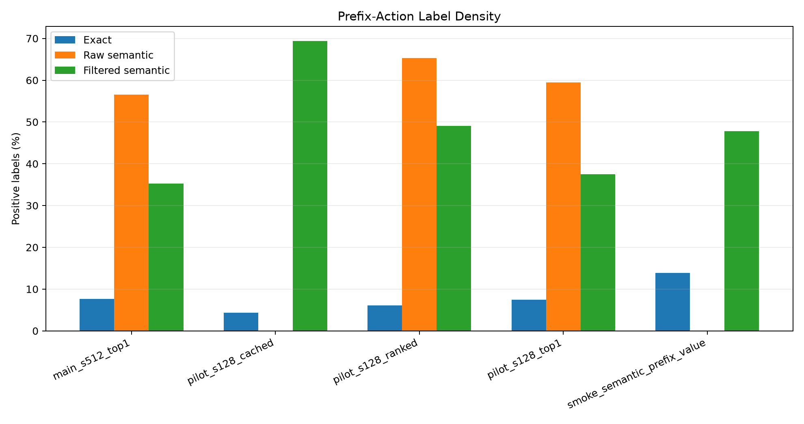
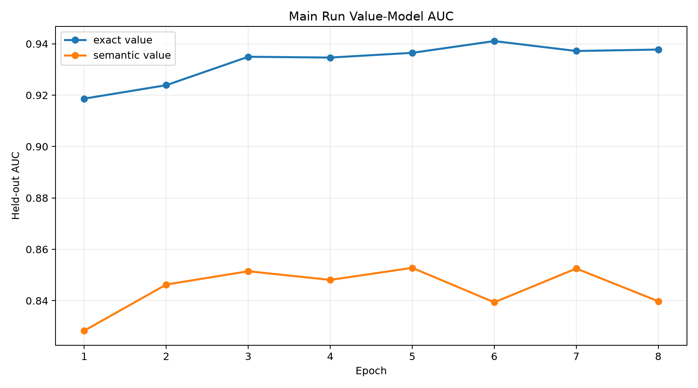
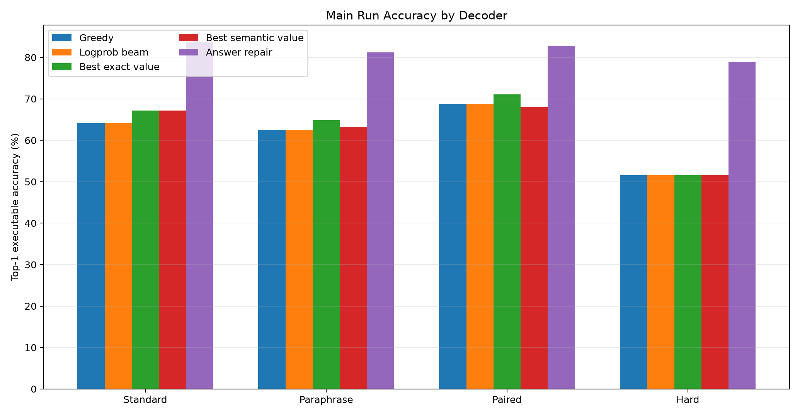
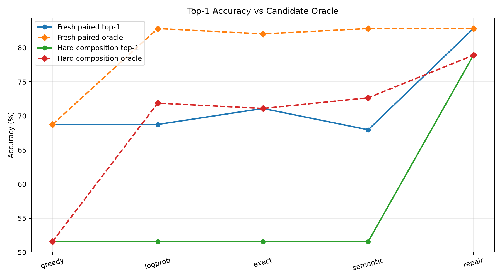
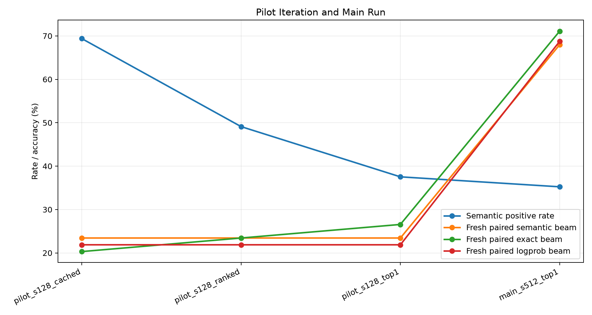

# Qwen Semantic Prefix Value Model

## Abstract

This experiment tests whether a value model trained on semantic reachability labels can guide no-answer bytecode search better than an exact-prefix verifier. A frozen Qwen 4B model encodes natural-language prompts. A trained compiler head emits typed stack-machine bytecode distributions. A value model then scores partial bytecode actions during constrained beam search.

The central target is not whether a partial program matches a canonical trace. Instead, the semantic label asks whether bounded executable completion from the post-action VM state can still reach the target answer. Raw reachability was too broad, so the final main run trained on the top-1 reachable action per prefix by compiler prior while preserving canonical exact positives.

The main result is negative but informative. Exact-prefix value supervision reached AUC 0.941 and improved fresh-paired top-1 accuracy from 68.8% greedy / 68.8% logprob beam to 71.1% with `beam_exact_w0.5`. Semantic value supervision reached AUC 0.853, but its best fresh-paired beam was 68.0% with `beam_semantic_w0.25`. On hard composition, semantic value matched the logprob top-1 result at 51.6%, while answer-verified repair reached 78.9%. The gap to repair remains mostly a ranking/calibration problem rather than a candidate-generation problem.

## Method

The task generator emits mixed natural-language tasks with executable bytecode over a compact stack VM. The opcode set includes arithmetic, comparison, min/max, modulus, and two lookup tables. Programs are normalized to a fixed length and executed invisibly for evaluation.

For each prompt, frozen Qwen hidden states are pooled by a trained compiler head. The head predicts opcode logits, argument logits, and an auxiliary answer head. Typed beam search expands only stack-valid actions. During training-data collection, every candidate action receives:

- `exact`: 1 if the action keeps the prefix equal to the canonical target program.
- `raw semantic`: 1 if bounded suffix search can still complete to the target answer from the post-action state.
- `filtered semantic`: 1 for canonical exact positives plus the top reachable action per prefix by compiler prior.

The value models do not see the final answer at decode time. Answer-verified local repair is included only as an upper-bound diagnostic because it chooses candidates by executing them against the known target answer.

## Runs

The experiment used a smoke run, three 128-example pilots, and one 512-example main run. The smoke run validated the full artifact path. The first pilot showed that raw semantic reachability was too dense. The second and third pilots introduced per-prefix rank filtering. The main run used the stricter top-1 semantic target.

Main run hardware: NVIDIA RTX 6000 Ada Generation.

## Label Density

*Exact labels are sparse; raw semantic reachability is broad; top-1 filtering reduces but does not eliminate semantic-only positives.*

| run_dir                                 |   prefix_samples | exact_positive_rate   | raw_semantic_positive_rate   | semantic_positive_rate   | semantic_extra_positive_rate   |
|:----------------------------------------|-----------------:|:----------------------|:-----------------------------|:-------------------------|:-------------------------------|
| main_semantic_prefix_value_s512_top1    |            37946 | 7.7%                  | 56.6%                        | 35.2%                    | 27.5%                          |
| pilot_semantic_prefix_value_s128_cached |            16930 | 4.4%                  | n/a                          | 69.4%                    | 65.0%                          |
| pilot_semantic_prefix_value_s128_ranked |            12071 | 6.1%                  | 65.3%                        | 49.1%                    | 43.0%                          |
| pilot_semantic_prefix_value_s128_top1   |             9835 | 7.5%                  | 59.5%                        | 37.5%                    | 30.0%                          |
| smoke_semantic_prefix_value             |             1288 | 13.9%                 | n/a                          | 47.8%                    | 33.9%                          |

## Value Training

*The exact-prefix value model reaches higher AUC than the semantic value model, but the semantic model is trained on a broader and noisier target.*

In the main run, exact-prefix positives were 7.7% of train prefix actions. Raw semantic positives were 56.6%, and filtered semantic positives were 35.2%.

## Decoder Results

*Exact-prefix value improves fresh paired accuracy; semantic value does not outperform exact-prefix value in the main run.*

| split            | decoder             | accuracy   | oracle   | program_exact   |
|:-----------------|:--------------------|:-----------|:---------|:----------------|
| fresh_standard   | greedy              | 64.1%      | 64.1%    | 46.1%           |
| fresh_standard   | beam_logprob        | 64.1%      | 82.8%    | 46.1%           |
| fresh_standard   | beam_exact_w0.25    | 67.2%      | 83.6%    | 46.9%           |
| fresh_standard   | beam_semantic_w4    | 67.2%      | 83.6%    | 44.5%           |
| fresh_standard   | local_answer        | 83.6%      | 83.6%    | 49.2%           |
| fresh_paraphrase | greedy              | 62.5%      | 62.5%    | 50.0%           |
| fresh_paraphrase | beam_logprob        | 62.5%      | 79.7%    | 50.0%           |
| fresh_paraphrase | beam_exact_w2       | 64.8%      | 81.2%    | 50.8%           |
| fresh_paraphrase | beam_semantic_w0.25 | 63.3%      | 79.7%    | 50.0%           |
| fresh_paraphrase | local_answer        | 81.2%      | 81.2%    | 53.1%           |
| fresh_paired     | greedy              | 68.8%      | 68.8%    | 50.0%           |
| fresh_paired     | beam_logprob        | 68.8%      | 82.8%    | 50.0%           |
| fresh_paired     | beam_exact_w0.5     | 71.1%      | 82.0%    | 50.0%           |
| fresh_paired     | beam_semantic_w0.25 | 68.0%      | 82.8%    | 50.0%           |
| fresh_paired     | local_answer        | 82.8%      | 82.8%    | 51.6%           |
| hard_composition | greedy              | 51.6%      | 51.6%    | 32.8%           |
| hard_composition | beam_logprob        | 51.6%      | 71.9%    | 32.8%           |
| hard_composition | beam_exact_w0.25    | 51.6%      | 71.1%    | 32.8%           |
| hard_composition | beam_semantic_w2    | 51.6%      | 72.7%    | 32.8%           |
| hard_composition | local_answer        | 78.9%      | 78.9%    | 35.2%           |

## Candidate Oracle Gap

*Beam oracle accuracy remains much higher than top-1 no-answer selection, especially before answer-verified repair.*

Fresh paired beam-logprob oracle accuracy was 82.8%, while top-1 logprob accuracy was 68.8%. Hard-composition beam-logprob oracle accuracy was 71.9%, while top-1 logprob accuracy was 51.6%. The value models did not reliably convert that oracle slack into top-1 gains.

## Iteration

*Pilot runs tightened semantic labels from raw reachability toward a top-1 reachable-action target before the main run.*

The iteration changed the semantic label from raw reachability to rank-filtered reachability because raw reachability made too many actions positive. This improved target sharpness, but did not make semantic value dominate exact-prefix value in the final main run.

## Conclusion

Bounded semantic reachability is a real, learnable signal: it creates many non-canonical positive actions and the semantic value model reaches held-out AUC above 0.85 during training. However, this form of semantic value supervision is not enough to close the no-answer beam-ranking gap. In the main run, exact-prefix value produced the best fresh-paired top-1 result, and semantic value was mostly neutral relative to logprob search.

The next useful step is not another binary reachability classifier. The result points toward a calibrated action-value target: predict the best achievable completion score or success probability under the remaining search budget, not merely whether any bounded completion exists.
