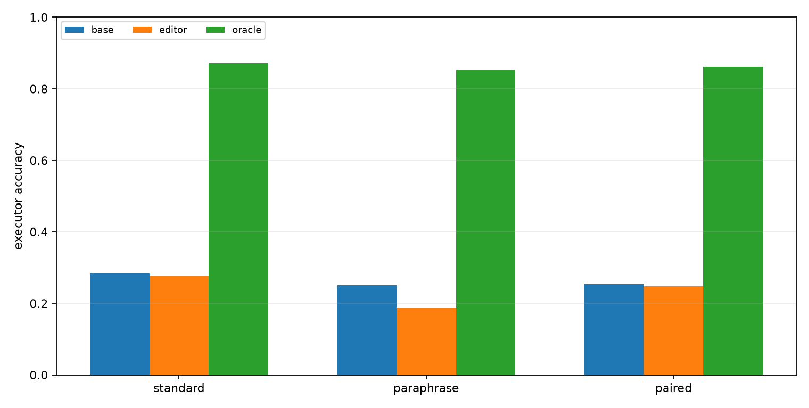
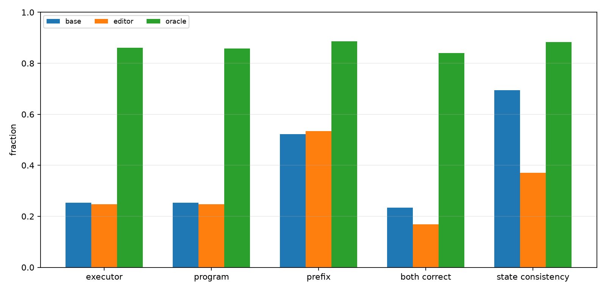
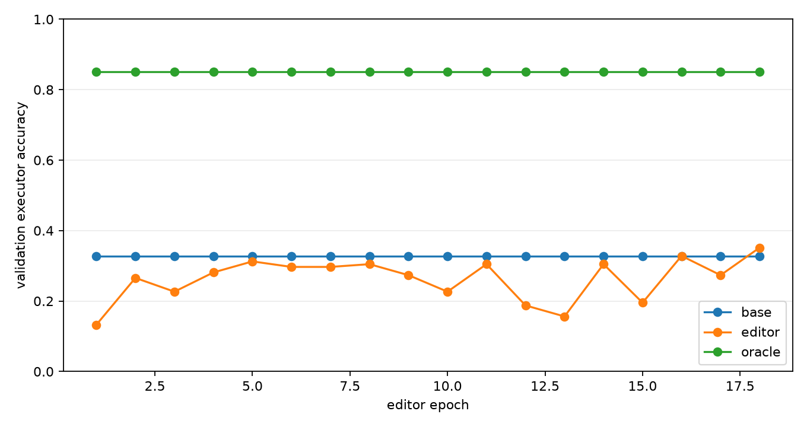
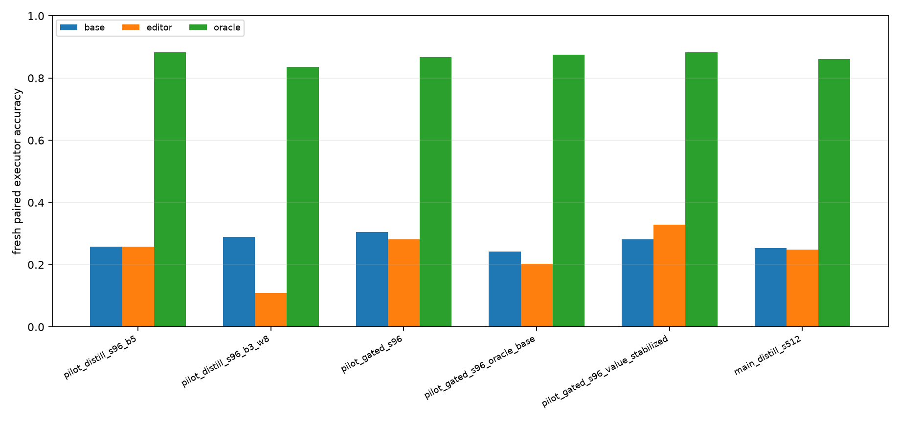

# Qwen Slot Repair Distillation

## Abstract

This experiment tests whether local repair headroom can be distilled into a gated slot editor for a frozen Qwen-attached numeric compiler. The compiler first emits an executable modular-arithmetic program. Offline candidate search identifies a corrected local program when one exists. A small transformer editor is then trained to decide which init/op/arg slots to edit and what replacement values to emit from the base compiler trace, without candidate enumeration at evaluation time.

## Setup

- Primary run: `main_slot_repair_distill_s512`
- Qwen substrate: `Qwen/Qwen3-4B`
- Modulus: `97`
- Max program length: `24`
- Best editor epoch: `18`
- Best validation threshold: `0.7`
- Editor target mode: `oracle_or_gold`
- Unchanged-slot value loss weight: `0.05`

Training labels come from exact offline trajectories. At evaluation time, the editor receives only the base compiler trace and predicts a single program. The oracle column is the local candidate-search ceiling, not an inference method.

## Results

### Fresh Splits

| Split | Base | Editor | Oracle | Gap recovered | Editor in candidates |
|---|---|---|---|---|---|
| fresh_standard_len24 | 28.5% | 27.7% | 87.1% | -1.3% | 49.6% |
| fresh_paraphrase_len24 | 25.0% | 18.8% | 85.2% | -10.4% | 34.8% |
| fresh_paired_len24 | 25.4% | 24.8% | 86.1% | -1.0% | 43.9% |



### Fresh Paired Details

| Metric | Base | Editor | Oracle |
|---|---|---|---|
| Executor accuracy | 25.4% | 24.8% | 86.1% |
| Program exact | 25.4% | 24.8% | 85.7% |
| State prefix fraction | 52.3% | 53.4% | 88.7% |
| Pair both-correct | 23.4% | 16.8% | 84.0% |
| Pair state consistency | 69.5% | 37.1% | 88.3% |

The final paired editor uses 1.17 edits per program on average. Against its training target definition, gate precision is 66.9% and gate recall is 59.7%.



### Training Dynamics

The training curve tracks validation accuracy after each editor epoch.



### Iteration Summary

The direct full-slot editor either copied the base program or damaged too many slots. The gated editor fixed that interface problem, and a small unchanged-slot value loss made one pilot improve fresh paired accuracy. The larger primary run did not preserve that fresh-split gain.

| Run | Validation | Fresh paired base | Fresh paired editor | Fresh paired oracle | Avg edits |
|---|---|---|---|---|---|
| pilot_slot_repair_distill_s96_b5 | 29.2%->29.2% | 25.8% | 25.8% | 88.3% | 0.00 |
| pilot_slot_repair_distill_s96_b3_w8 | 33.3%->18.8% | 28.9% | 10.9% | 83.6% | 2.40 |
| pilot_slot_repair_gated_s96 | 25.0%->31.2% | 30.5% | 28.1% | 86.7% | 0.18 |
| pilot_slot_repair_gated_s96_oracle_base | 20.8%->22.9% | 24.2% | 20.3% | 87.5% | 0.84 |
| pilot_slot_repair_gated_s96_value_stabilized | 20.8%->27.1% | 28.1% | 32.8% | 88.3% | 0.39 |
| main_slot_repair_distill_s512 | 32.8%->35.2% | 25.4% | 24.8% | 86.1% | 1.17 |



## Interpretation

On the fresh paired split, the editor moves exact execution from 25.4% to 24.8%. The local oracle ceiling is 86.1%, so the editor recovers -1.0% of the measured base-to-oracle gap.

The main result is therefore not a successful distillation of the local oracle. The editor learns a real validation signal, but its selected edits do not transfer robustly to fresh prompt distributions. The high oracle ceiling shows that nearby corrected programs usually exist; the failure is the one-shot policy's ability to choose the right sparse edits and values from the base trace alone.

## Limitations

- The task is synthetic modular arithmetic.
- Candidate labels use exact trajectories during training.
- The frozen compiler and deterministic runtime are specialized.
- The editor consumes engineered base-trace features, not only raw Qwen hidden states.
- The main result is one primary seed.
- The deployable editor emits one program and does not get to evaluate candidate executions at inference time.

## Artifacts

Small experiment files live in:

```text
experiments/qwen_slot_repair_distillation/
```

Large artifacts live in:

```text
large_artifacts/qwen_slot_repair_distillation/checkpoints/
```

Primary files:

- `analysis/summary.md`
- `analysis/final_metrics.csv`
- `analysis/all_final_metrics.csv`
- `analysis/figures/executor_accuracy.png`
- `analysis/figures/paired_details.png`
- `analysis/figures/training_curve.png`
- `analysis/figures/iteration_summary.png`
- `runs/main_slot_repair_distill_s512/metrics.csv`
- `runs/main_slot_repair_distill_s512/editor_train_log.csv`
- `reports/qwen_slot_repair_distillation_paper.md`
- `reports/qwen_slot_repair_distillation_paper.html`
- `checkpoint_manifest.csv`
