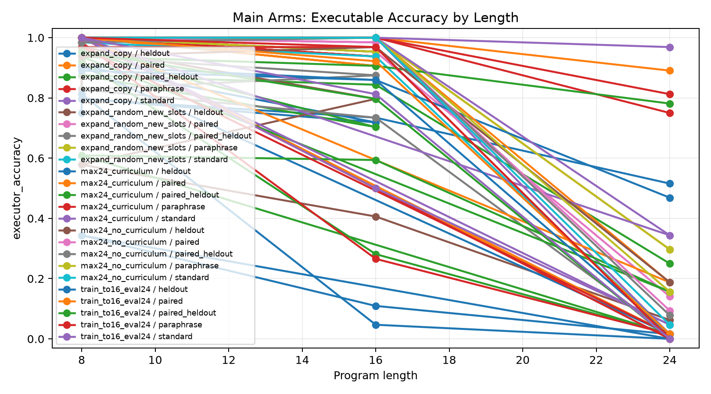
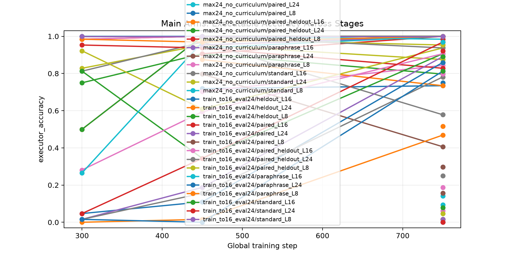
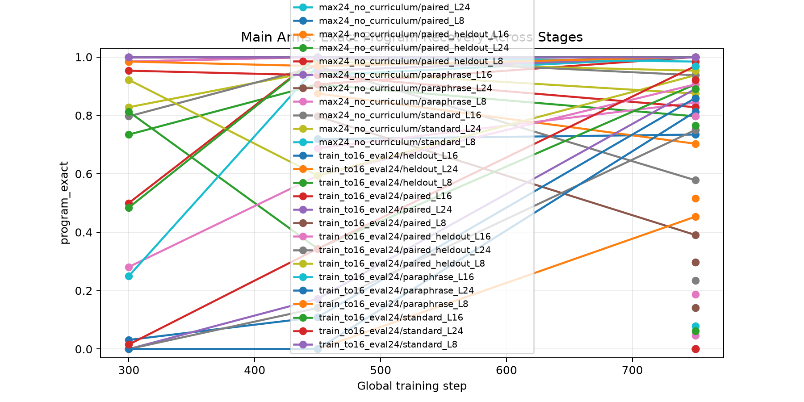
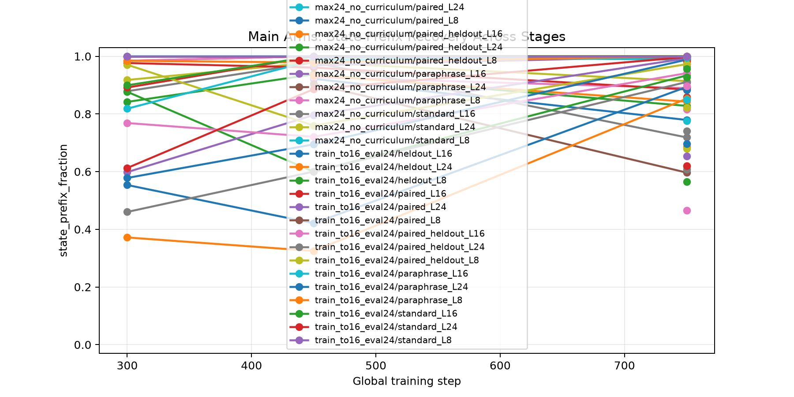
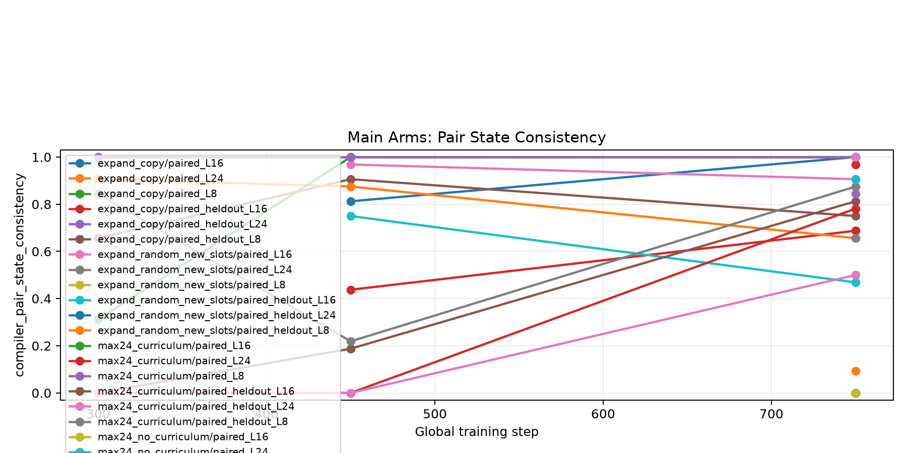
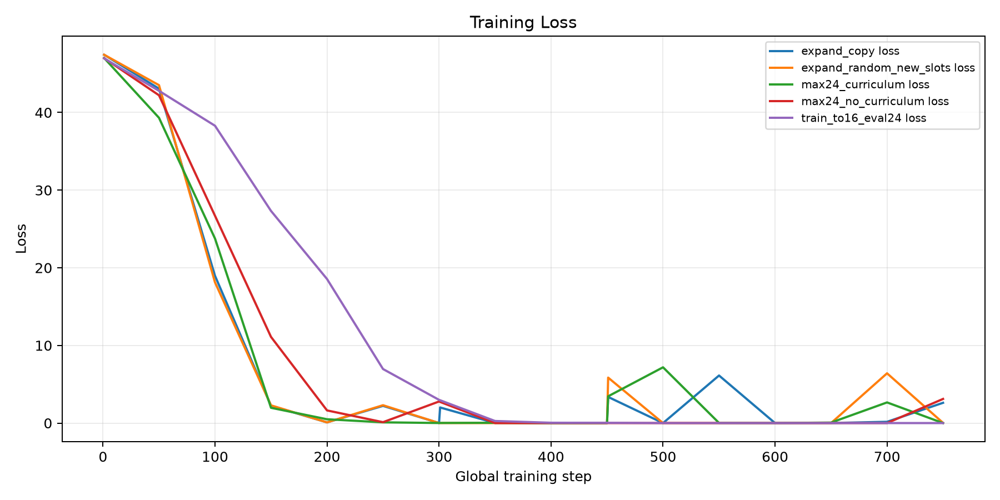
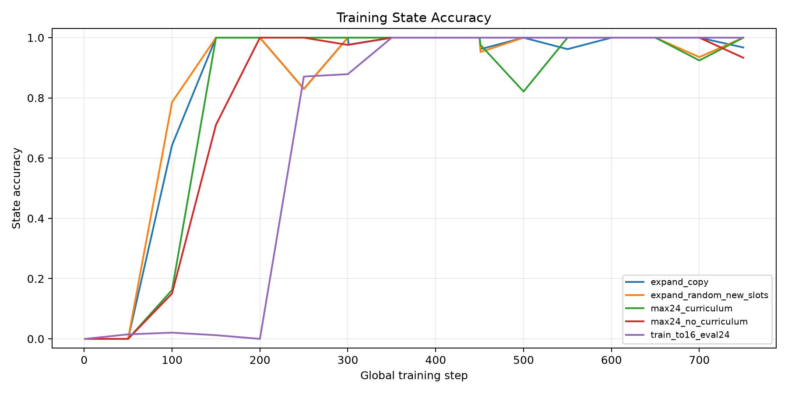

# Structural Compiler Attribution Ablation

## Question

Which factor causes a one-shot executable latent compiler to learn length-24 modular programs: copied structural expansion, curriculum alone, random-slot expansion, no-curriculum training, or length extrapolation?

## Method

- Every arm uses a Qwen causal LM plus a direct executable compiler head.
- The compiler predicts one initial value plus typed operation and argument slots.
- A differentiable modular executor supervises final answer probability and intermediate state traces.
- The main controls separate copied structural expansion from curriculum, random new slots, no-curriculum training, and length extrapolation.
- Evaluation includes standard templates, seen-family paraphrases, held-out wording templates, and paired consistency splits.

## Runs

| run                               | arm                     |   elapsed_sec | model         | stage_max_steps   | stage_steps   |   train_examples | gpu                            |
|:----------------------------------|:------------------------|--------------:|:--------------|:------------------|:--------------|-----------------:|:-------------------------------|
| main_expand_copy_s750             | expand_copy             |       1914    | Qwen/Qwen3-4B | 8,16,24           | 300,150,300   |              512 | NVIDIA RTX 6000 Ada Generation |
| main_expand_random_new_slots_s750 | expand_random_new_slots |       1915    | Qwen/Qwen3-4B | 8,16,24           | 300,150,300   |              512 | NVIDIA RTX 6000 Ada Generation |
| main_max24_curriculum_s750        | max24_curriculum        |       2726    | Qwen/Qwen3-4B | 24,24,24          | 300,150,300   |              512 | NVIDIA RTX 6000 Ada Generation |
| main_max24_no_curriculum_s750     | max24_no_curriculum     |       2697    | Qwen/Qwen3-4B | 24                | 750           |              512 | NVIDIA RTX 6000 Ada Generation |
| main_train_to16_eval24_s750       | train_to16_eval24       |       2442    | Qwen/Qwen3-4B | 24                | 750           |              512 | NVIDIA RTX 6000 Ada Generation |
| pilot_expand_copy                 | expand_copy             |        105.5  | Qwen/Qwen3-4B | 8,16,24           | 30,15,30      |               96 | NVIDIA RTX 6000 Ada Generation |
| pilot_expand_random_new_slots     | expand_random_new_slots |        106.3  | Qwen/Qwen3-4B | 8,16,24           | 30,15,30      |               96 | NVIDIA RTX 6000 Ada Generation |
| pilot_max24_curriculum            | max24_curriculum        |        157    | Qwen/Qwen3-4B | 24,24,24          | 30,15,30      |               96 | NVIDIA RTX 6000 Ada Generation |
| pilot_max24_no_curriculum         | max24_no_curriculum     |        134.7  | Qwen/Qwen3-4B | 24                | 75            |               96 | NVIDIA RTX 6000 Ada Generation |
| pilot_train_to16_eval24           | train_to16_eval24       |        125.3  | Qwen/Qwen3-4B | 24                | 75            |               96 | NVIDIA RTX 6000 Ada Generation |
| smoke_random_new_slots            | smoke_random_new_slots  |         10.16 | Qwen/Qwen3-4B | 8,16,24           | 1,1,1         |                4 | NVIDIA RTX 6000 Ada Generation |

## Results

Attribution summary, final length-24 executable accuracy:

| arm                     | run                               | standard_L24   | heldout_L24   | paired_L24   | paired_heldout_L24   |
|:------------------------|:----------------------------------|:---------------|:--------------|:-------------|:---------------------|
| max24_curriculum        | main_max24_curriculum_s750        | 96.9%          | 46.9%         | 89.1%        | 78.1%                |
| max24_no_curriculum     | main_max24_no_curriculum_s750     | 4.7%           | 18.8%         | 9.4%         | 7.8%                 |
| expand_copy             | main_expand_copy_s750             | 1.6%           | 51.6%         | 29.7%        | 25.0%                |
| expand_random_new_slots | main_expand_random_new_slots_s750 | 1.6%           | 6.2%          | 14.1%        | 1.6%                 |
| train_to16_eval24       | main_train_to16_eval24_s750       | 0.0%           | 1.6%          | 1.6%         | 0.0%                 |

The strongest arm is the max-24 compiler trained from the start with the staged length curriculum. Copied structural expansion is not the winning explanation in this run.

Final length-24 splits by arm:

| arm                     | run                               | split              | executor_accuracy   | program_exact   | state_prefix_fraction   | executor_pair_both_correct   | compiler_pair_state_consistency   |
|:------------------------|:----------------------------------|:-------------------|:--------------------|:----------------|:------------------------|:-----------------------------|:----------------------------------|
| expand_copy             | main_expand_copy_s750             | standard_L24       | 1.6%                | 0.0%            | 85.9%                   |                              |                                   |
| expand_copy             | main_expand_copy_s750             | paraphrase_L24     | 75.0%               | 75.0%           | 97.3%                   |                              |                                   |
| expand_copy             | main_expand_copy_s750             | heldout_L24        | 51.6%               | 51.6%           | 68.6%                   |                              |                                   |
| expand_copy             | main_expand_copy_s750             | paired_L24         | 29.7%               | 29.7%           | 91.0%                   | 0.0%                         | 9.4%                              |
| expand_copy             | main_expand_copy_s750             | paired_heldout_L24 | 25.0%               | 23.4%           | 74.1%                   | 3.1%                         | 0.0%                              |
| expand_random_new_slots | main_expand_random_new_slots_s750 | standard_L24       | 1.6%                | 0.0%            | 67.9%                   |                              |                                   |
| expand_random_new_slots | main_expand_random_new_slots_s750 | paraphrase_L24     | 29.7%               | 29.7%           | 85.6%                   |                              |                                   |
| expand_random_new_slots | main_expand_random_new_slots_s750 | heldout_L24        | 6.2%                | 4.7%            | 46.5%                   |                              |                                   |
| expand_random_new_slots | main_expand_random_new_slots_s750 | paired_L24         | 14.1%               | 14.1%           | 77.5%                   | 0.0%                         | 0.0%                              |
| expand_random_new_slots | main_expand_random_new_slots_s750 | paired_heldout_L24 | 1.6%                | 0.0%            | 56.6%                   | 0.0%                         | 0.0%                              |
| max24_curriculum        | main_max24_curriculum_s750        | standard_L24       | 96.9%               | 96.9%           | 99.7%                   |                              |                                   |
| max24_curriculum        | main_max24_curriculum_s750        | paraphrase_L24     | 81.2%               | 81.2%           | 98.8%                   |                              |                                   |
| max24_curriculum        | main_max24_curriculum_s750        | heldout_L24        | 46.9%               | 45.3%           | 85.3%                   |                              |                                   |
| max24_curriculum        | main_max24_curriculum_s750        | paired_L24         | 89.1%               | 89.1%           | 99.3%                   | 78.1%                        | 78.1%                             |
| max24_curriculum        | main_max24_curriculum_s750        | paired_heldout_L24 | 78.1%               | 75.0%           | 91.1%                   | 56.2%                        | 50.0%                             |
| max24_no_curriculum     | main_max24_no_curriculum_s750     | standard_L24       | 4.7%                | 0.0%            | 82.2%                   |                              |                                   |
| max24_no_curriculum     | main_max24_no_curriculum_s750     | paraphrase_L24     | 15.6%               | 14.1%           | 89.1%                   |                              |                                   |
| max24_no_curriculum     | main_max24_no_curriculum_s750     | heldout_L24        | 18.8%               | 18.8%           | 81.6%                   |                              |                                   |
| max24_no_curriculum     | main_max24_no_curriculum_s750     | paired_L24         | 9.4%                | 7.8%            | 84.9%                   | 0.0%                         | 0.0%                              |
| max24_no_curriculum     | main_max24_no_curriculum_s750     | paired_heldout_L24 | 7.8%                | 6.2%            | 82.4%                   | 0.0%                         | 0.0%                              |
| train_to16_eval24       | main_train_to16_eval24_s750       | standard_L24       | 0.0%                | 0.0%            | 62.0%                   |                              |                                   |
| train_to16_eval24       | main_train_to16_eval24_s750       | paraphrase_L24     | 0.0%                | 0.0%            | 69.6%                   |                              |                                   |
| train_to16_eval24       | main_train_to16_eval24_s750       | heldout_L24        | 1.6%                | 0.0%            | 61.9%                   |                              |                                   |
| train_to16_eval24       | main_train_to16_eval24_s750       | paired_L24         | 1.6%                | 0.0%            | 65.3%                   | 0.0%                         | 0.0%                              |
| train_to16_eval24       | main_train_to16_eval24_s750       | paired_heldout_L24 | 0.0%                | 0.0%            | 60.7%                   | 0.0%                         | 0.0%                              |

| arm                     | run                               | stage        | split              |   global_step |   max_steps | executor_accuracy   | program_exact   | state_prefix_fraction   |   state_all_exact | executor_pair_both_correct   | compiler_pair_state_consistency   |   length |
|:------------------------|:----------------------------------|:-------------|:-------------------|--------------:|------------:|:--------------------|:----------------|:------------------------|------------------:|:-----------------------------|:----------------------------------|---------:|
| expand_copy             | main_expand_copy_s750             | stage1_max8  | heldout_L8         |           300 |           8 | 75.0%               | 73.4%           | 84.2%                   |           0.7344  |                              |                                   |        8 |
| expand_copy             | main_expand_copy_s750             | stage1_max8  | paired_L8          |           300 |           8 | 100.0%              | 100.0%          | 100.0%                  |           1       | 100.0%                       | 100.0%                            |        8 |
| expand_copy             | main_expand_copy_s750             | stage1_max8  | paired_heldout_L8  |           300 |           8 | 82.8%               | 82.8%           | 91.8%                   |           0.8281  | 65.6%                        | 65.6%                             |        8 |
| expand_copy             | main_expand_copy_s750             | stage1_max8  | paraphrase_L8      |           300 |           8 | 98.4%               | 98.4%           | 98.4%                   |           0.9844  |                              |                                   |        8 |
| expand_copy             | main_expand_copy_s750             | stage1_max8  | standard_L8        |           300 |           8 | 100.0%              | 100.0%          | 100.0%                  |           1       |                              |                                   |        8 |
| expand_copy             | main_expand_copy_s750             | stage2_max16 | heldout_L8         |           450 |          16 | 90.6%               | 90.6%           | 93.8%                   |           0.9062  |                              |                                   |        8 |
| expand_copy             | main_expand_copy_s750             | stage2_max16 | paired_L8          |           450 |          16 | 100.0%              | 100.0%          | 100.0%                  |           1       | 100.0%                       | 100.0%                            |        8 |
| expand_copy             | main_expand_copy_s750             | stage2_max16 | paired_heldout_L8  |           450 |          16 | 95.3%               | 95.3%           | 97.9%                   |           0.9531  | 90.6%                        | 90.6%                             |        8 |
| expand_copy             | main_expand_copy_s750             | stage2_max16 | paraphrase_L8      |           450 |          16 | 100.0%              | 100.0%          | 100.0%                  |           1       |                              |                                   |        8 |
| expand_copy             | main_expand_copy_s750             | stage2_max16 | standard_L8        |           450 |          16 | 100.0%              | 100.0%          | 100.0%                  |           1       |                              |                                   |        8 |
| expand_copy             | main_expand_copy_s750             | stage2_max16 | heldout_L16        |           450 |          16 | 71.9%               | 71.9%           | 92.2%                   |           0.7188  |                              |                                   |       16 |
| expand_copy             | main_expand_copy_s750             | stage2_max16 | paired_L16         |           450 |          16 | 90.6%               | 90.6%           | 98.3%                   |           0.9062  | 81.2%                        | 81.2%                             |       16 |
| expand_copy             | main_expand_copy_s750             | stage2_max16 | paired_heldout_L16 |           450 |          16 | 70.3%               | 68.8%           | 92.8%                   |           0.6875  | 46.9%                        | 43.8%                             |       16 |
| expand_copy             | main_expand_copy_s750             | stage2_max16 | paraphrase_L16     |           450 |          16 | 93.8%               | 93.8%           | 99.5%                   |           0.9375  |                              |                                   |       16 |
| expand_copy             | main_expand_copy_s750             | stage2_max16 | standard_L16       |           450 |          16 | 95.3%               | 95.3%           | 98.5%                   |           0.9531  |                              |                                   |       16 |
| expand_copy             | main_expand_copy_s750             | stage3_max24 | heldout_L8         |           750 |          24 | 79.7%               | 79.7%           | 82.8%                   |           0.7969  |                              |                                   |        8 |
| expand_copy             | main_expand_copy_s750             | stage3_max24 | paired_L8          |           750 |          24 | 100.0%              | 100.0%          | 100.0%                  |           1       | 100.0%                       | 100.0%                            |        8 |
| expand_copy             | main_expand_copy_s750             | stage3_max24 | paired_heldout_L8  |           750 |          24 | 87.5%               | 87.5%           | 91.4%                   |           0.875   | 75.0%                        | 75.0%                             |        8 |
| expand_copy             | main_expand_copy_s750             | stage3_max24 | paraphrase_L8      |           750 |          24 | 100.0%              | 100.0%          | 100.0%                  |           1       |                              |                                   |        8 |
| expand_copy             | main_expand_copy_s750             | stage3_max24 | standard_L8        |           750 |          24 | 100.0%              | 100.0%          | 100.0%                  |           1       |                              |                                   |        8 |
| expand_copy             | main_expand_copy_s750             | stage3_max24 | heldout_L16        |           750 |          24 | 73.4%               | 73.4%           | 77.9%                   |           0.7344  |                              |                                   |       16 |
| expand_copy             | main_expand_copy_s750             | stage3_max24 | paired_L16         |           750 |          24 | 100.0%              | 100.0%          | 100.0%                  |           1       | 100.0%                       | 100.0%                            |       16 |
| expand_copy             | main_expand_copy_s750             | stage3_max24 | paired_heldout_L16 |           750 |          24 | 84.4%               | 84.4%           | 89.0%                   |           0.8438  | 68.8%                        | 68.8%                             |       16 |
| expand_copy             | main_expand_copy_s750             | stage3_max24 | paraphrase_L16     |           750 |          24 | 100.0%              | 100.0%          | 100.0%                  |           1       |                              |                                   |       16 |
| expand_copy             | main_expand_copy_s750             | stage3_max24 | standard_L16       |           750 |          24 | 100.0%              | 100.0%          | 100.0%                  |           1       |                              |                                   |       16 |
| expand_copy             | main_expand_copy_s750             | stage3_max24 | heldout_L24        |           750 |          24 | 51.6%               | 51.6%           | 68.6%                   |           0.5156  |                              |                                   |       24 |
| expand_copy             | main_expand_copy_s750             | stage3_max24 | paired_L24         |           750 |          24 | 29.7%               | 29.7%           | 91.0%                   |           0.2969  | 0.0%                         | 9.4%                              |       24 |
| expand_copy             | main_expand_copy_s750             | stage3_max24 | paired_heldout_L24 |           750 |          24 | 25.0%               | 23.4%           | 74.1%                   |           0.2344  | 3.1%                         | 0.0%                              |       24 |
| expand_copy             | main_expand_copy_s750             | stage3_max24 | paraphrase_L24     |           750 |          24 | 75.0%               | 75.0%           | 97.3%                   |           0.75    |                              |                                   |       24 |
| expand_copy             | main_expand_copy_s750             | stage3_max24 | standard_L24       |           750 |          24 | 1.6%                | 0.0%            | 85.9%                   |           0       |                              |                                   |       24 |
| expand_random_new_slots | main_expand_random_new_slots_s750 | stage1_max8  | heldout_L8         |           300 |           8 | 81.2%               | 79.7%           | 87.9%                   |           0.8125  |                              |                                   |        8 |
| expand_random_new_slots | main_expand_random_new_slots_s750 | stage1_max8  | paired_L8          |           300 |           8 | 100.0%              | 100.0%          | 100.0%                  |           1       | 100.0%                       | 100.0%                            |        8 |
| expand_random_new_slots | main_expand_random_new_slots_s750 | stage1_max8  | paired_heldout_L8  |           300 |           8 | 95.3%               | 95.3%           | 97.7%                   |           0.9531  | 90.6%                        | 90.6%                             |        8 |
| expand_random_new_slots | main_expand_random_new_slots_s750 | stage1_max8  | paraphrase_L8      |           300 |           8 | 98.4%               | 98.4%           | 98.4%                   |           0.9844  |                              |                                   |        8 |
| expand_random_new_slots | main_expand_random_new_slots_s750 | stage1_max8  | standard_L8        |           300 |           8 | 100.0%              | 100.0%          | 100.0%                  |           1       |                              |                                   |        8 |
| expand_random_new_slots | main_expand_random_new_slots_s750 | stage2_max16 | heldout_L8         |           450 |          16 | 96.9%               | 96.9%           | 97.9%                   |           0.9688  |                              |                                   |        8 |
| expand_random_new_slots | main_expand_random_new_slots_s750 | stage2_max16 | paired_L8          |           450 |          16 | 100.0%              | 100.0%          | 100.0%                  |           1       | 100.0%                       | 100.0%                            |        8 |
| expand_random_new_slots | main_expand_random_new_slots_s750 | stage2_max16 | paired_heldout_L8  |           450 |          16 | 93.8%               | 93.8%           | 96.1%                   |           0.9375  | 87.5%                        | 87.5%                             |        8 |
| expand_random_new_slots | main_expand_random_new_slots_s750 | stage2_max16 | paraphrase_L8      |           450 |          16 | 100.0%              | 100.0%          | 100.0%                  |           1       |                              |                                   |        8 |
| expand_random_new_slots | main_expand_random_new_slots_s750 | stage2_max16 | standard_L8        |           450 |          16 | 100.0%              | 100.0%          | 100.0%                  |           1       |                              |                                   |        8 |
| expand_random_new_slots | main_expand_random_new_slots_s750 | stage2_max16 | heldout_L16        |           450 |          16 | 79.7%               | 79.7%           | 90.4%                   |           0.7969  |                              |                                   |       16 |
| expand_random_new_slots | main_expand_random_new_slots_s750 | stage2_max16 | paired_L16         |           450 |          16 | 98.4%               | 98.4%           | 98.7%                   |           0.9844  | 96.9%                        | 96.9%                             |       16 |
| expand_random_new_slots | main_expand_random_new_slots_s750 | stage2_max16 | paired_heldout_L16 |           450 |          16 | 87.5%               | 87.5%           | 93.4%                   |           0.875   | 75.0%                        | 75.0%                             |       16 |
| expand_random_new_slots | main_expand_random_new_slots_s750 | stage2_max16 | paraphrase_L16     |           450 |          16 | 95.3%               | 95.3%           | 96.9%                   |           0.9531  |                              |                                   |       16 |
| expand_random_new_slots | main_expand_random_new_slots_s750 | stage2_max16 | standard_L16       |           450 |          16 | 100.0%              | 100.0%          | 100.0%                  |           1       |                              |                                   |       16 |
| expand_random_new_slots | main_expand_random_new_slots_s750 | stage3_max24 | heldout_L8         |           750 |          24 | 57.8%               | 57.8%           | 71.9%                   |           0.5781  |                              |                                   |        8 |
| expand_random_new_slots | main_expand_random_new_slots_s750 | stage3_max24 | paired_L8          |           750 |          24 | 100.0%              | 100.0%          | 100.0%                  |           1       | 100.0%                       | 100.0%                            |        8 |
| expand_random_new_slots | main_expand_random_new_slots_s750 | stage3_max24 | paired_heldout_L8  |           750 |          24 | 82.8%               | 82.8%           | 88.5%                   |           0.8281  | 65.6%                        | 65.6%                             |        8 |
| expand_random_new_slots | main_expand_random_new_slots_s750 | stage3_max24 | paraphrase_L8      |           750 |          24 | 100.0%              | 100.0%          | 100.0%                  |           1       |                              |                                   |        8 |
| expand_random_new_slots | main_expand_random_new_slots_s750 | stage3_max24 | standard_L8        |           750 |          24 | 98.4%               | 98.4%           | 98.8%                   |           0.9844  |                              |                                   |        8 |
| expand_random_new_slots | main_expand_random_new_slots_s750 | stage3_max24 | heldout_L16        |           750 |          24 | 40.6%               | 39.1%           | 59.7%                   |           0.4062  |                              |                                   |       16 |
| expand_random_new_slots | main_expand_random_new_slots_s750 | stage3_max24 | paired_L16         |           750 |          24 | 95.3%               | 95.3%           | 99.3%                   |           0.9531  | 90.6%                        | 90.6%                             |       16 |
| expand_random_new_slots | main_expand_random_new_slots_s750 | stage3_max24 | paired_heldout_L16 |           750 |          24 | 73.4%               | 70.3%           | 84.3%                   |           0.7188  | 50.0%                        | 46.9%                             |       16 |
| expand_random_new_slots | main_expand_random_new_slots_s750 | stage3_max24 | paraphrase_L16     |           750 |          24 | 100.0%              | 100.0%          | 100.0%                  |           1       |                              |                                   |       16 |
| expand_random_new_slots | main_expand_random_new_slots_s750 | stage3_max24 | standard_L16       |           750 |          24 | 93.8%               | 93.8%           | 99.1%                   |           0.9375  |                              |                                   |       16 |
| expand_random_new_slots | main_expand_random_new_slots_s750 | stage3_max24 | heldout_L24        |           750 |          24 | 6.2%                | 4.7%            | 46.5%                   |           0.04688 |                              |                                   |       24 |
| expand_random_new_slots | main_expand_random_new_slots_s750 | stage3_max24 | paired_L24         |           750 |          24 | 14.1%               | 14.1%           | 77.5%                   |           0.1406  | 0.0%                         | 0.0%                              |       24 |
| expand_random_new_slots | main_expand_random_new_slots_s750 | stage3_max24 | paired_heldout_L24 |           750 |          24 | 1.6%                | 0.0%            | 56.6%                   |           0       | 0.0%                         | 0.0%                              |       24 |
| expand_random_new_slots | main_expand_random_new_slots_s750 | stage3_max24 | paraphrase_L24     |           750 |          24 | 29.7%               | 29.7%           | 85.6%                   |           0.2969  |                              |                                   |       24 |
| expand_random_new_slots | main_expand_random_new_slots_s750 | stage3_max24 | standard_L24       |           750 |          24 | 1.6%                | 0.0%            | 67.9%                   |           0       |                              |                                   |       24 |
| max24_curriculum        | main_max24_curriculum_s750        | stage1_max24 | heldout_L8         |           300 |          24 | 81.2%               | 81.2%           | 87.7%                   |           0.8125  |                              |                                   |        8 |
| max24_curriculum        | main_max24_curriculum_s750        | stage1_max24 | paired_L8          |           300 |          24 | 100.0%              | 100.0%          | 100.0%                  |           1       | 100.0%                       | 100.0%                            |        8 |
| max24_curriculum        | main_max24_curriculum_s750        | stage1_max24 | paired_heldout_L8  |           300 |          24 | 92.2%               | 92.2%           | 97.1%                   |           0.9219  | 84.4%                        | 84.4%                             |        8 |
| max24_curriculum        | main_max24_curriculum_s750        | stage1_max24 | paraphrase_L8      |           300 |          24 | 98.4%               | 98.4%           | 98.4%                   |           0.9844  |                              |                                   |        8 |
| max24_curriculum        | main_max24_curriculum_s750        | stage1_max24 | standard_L8        |           300 |          24 | 100.0%              | 100.0%          | 100.0%                  |           1       |                              |                                   |        8 |
| max24_curriculum        | main_max24_curriculum_s750        | stage1_max24 | heldout_L16        |           300 |          24 | 4.7%                | 3.1%            | 55.4%                   |           0.03125 |                              |                                   |       16 |
| max24_curriculum        | main_max24_curriculum_s750        | stage1_max24 | paired_L16         |           300 |          24 | 50.0%               | 50.0%           | 89.2%                   |           0.5     | 31.2%                        | 31.2%                             |       16 |
| max24_curriculum        | main_max24_curriculum_s750        | stage1_max24 | paired_heldout_L16 |           300 |          24 | 28.1%               | 28.1%           | 76.9%                   |           0.2812  | 0.0%                         | 0.0%                              |       16 |
| max24_curriculum        | main_max24_curriculum_s750        | stage1_max24 | paraphrase_L16     |           300 |          24 | 26.6%               | 25.0%           | 81.8%                   |           0.25    |                              |                                   |       16 |
| max24_curriculum        | main_max24_curriculum_s750        | stage1_max24 | standard_L16       |           300 |          24 | 50.0%               | 48.4%           | 89.9%                   |           0.4844  |                              |                                   |       16 |
| max24_curriculum        | main_max24_curriculum_s750        | stage1_max24 | heldout_L24        |           300 |          24 | 0.0%                | 0.0%            | 37.2%                   |           0       |                              |                                   |       24 |
| max24_curriculum        | main_max24_curriculum_s750        | stage1_max24 | paired_L24         |           300 |          24 | 1.6%                | 0.0%            | 59.8%                   |           0       | 0.0%                         | 0.0%                              |       24 |
| max24_curriculum        | main_max24_curriculum_s750        | stage1_max24 | paired_heldout_L24 |           300 |          24 | 1.6%                | 0.0%            | 46.0%                   |           0       | 0.0%                         | 0.0%                              |       24 |
| max24_curriculum        | main_max24_curriculum_s750        | stage1_max24 | paraphrase_L24     |           300 |          24 | 1.6%                | 0.0%            | 57.8%                   |           0       |                              |                                   |       24 |
| max24_curriculum        | main_max24_curriculum_s750        | stage1_max24 | standard_L24       |           300 |          24 | 4.7%                | 1.6%            | 61.3%                   |           0.01562 |                              |                                   |       24 |
| max24_curriculum        | main_max24_curriculum_s750        | stage2_max24 | heldout_L8         |           450 |          24 | 34.4%               | 34.4%           | 60.0%                   |           0.3438  |                              |                                   |        8 |
| max24_curriculum        | main_max24_curriculum_s750        | stage2_max24 | paired_L8          |           450 |          24 | 100.0%              | 100.0%          | 100.0%                  |           1       | 100.0%                       | 100.0%                            |        8 |
| max24_curriculum        | main_max24_curriculum_s750        | stage2_max24 | paired_heldout_L8  |           450 |          24 | 60.9%               | 59.4%           | 76.0%                   |           0.6094  | 21.9%                        | 21.9%                             |        8 |
| max24_curriculum        | main_max24_curriculum_s750        | stage2_max24 | paraphrase_L8      |           450 |          24 | 96.9%               | 96.9%           | 97.9%                   |           0.9688  |                              |                                   |        8 |
| max24_curriculum        | main_max24_curriculum_s750        | stage2_max24 | standard_L8        |           450 |          24 | 100.0%              | 100.0%          | 100.0%                  |           1       |                              |                                   |        8 |
| max24_curriculum        | main_max24_curriculum_s750        | stage2_max24 | heldout_L16        |           450 |          24 | 10.9%               | 10.9%           | 42.1%                   |           0.1094  |                              |                                   |       16 |
| max24_curriculum        | main_max24_curriculum_s750        | stage2_max24 | paired_L16         |           450 |          24 | 100.0%              | 100.0%          | 100.0%                  |           1       | 100.0%                       | 100.0%                            |       16 |
| max24_curriculum        | main_max24_curriculum_s750        | stage2_max24 | paired_heldout_L16 |           450 |          24 | 59.4%               | 59.4%           | 72.1%                   |           0.5938  | 18.8%                        | 18.8%                             |       16 |
| max24_curriculum        | main_max24_curriculum_s750        | stage2_max24 | paraphrase_L16     |           450 |          24 | 96.9%               | 96.9%           | 98.6%                   |           0.9688  |                              |                                   |       16 |
| max24_curriculum        | main_max24_curriculum_s750        | stage2_max24 | standard_L16       |           450 |          24 | 100.0%              | 100.0%          | 100.0%                  |           1       |                              |                                   |       16 |
| max24_curriculum        | main_max24_curriculum_s750        | stage2_max24 | heldout_L24        |           450 |          24 | 1.6%                | 0.0%            | 32.5%                   |           0       |                              |                                   |       24 |
| max24_curriculum        | main_max24_curriculum_s750        | stage2_max24 | paired_L24         |           450 |          24 | 18.8%               | 17.2%           | 79.6%                   |           0.1719  | 0.0%                         | 0.0%                              |       24 |
| max24_curriculum        | main_max24_curriculum_s750        | stage2_max24 | paired_heldout_L24 |           450 |          24 | 15.6%               | 14.1%           | 60.0%                   |           0.1406  | 0.0%                         | 0.0%                              |       24 |
| max24_curriculum        | main_max24_curriculum_s750        | stage2_max24 | paraphrase_L24     |           450 |          24 | 0.0%                | 0.0%            | 69.5%                   |           0       |                              |                                   |       24 |
| max24_curriculum        | main_max24_curriculum_s750        | stage2_max24 | standard_L24       |           450 |          24 | 34.4%               | 34.4%           | 88.6%                   |           0.3438  |                              |                                   |       24 |
| max24_curriculum        | main_max24_curriculum_s750        | stage3_max24 | heldout_L8         |           750 |          24 | 90.6%               | 90.6%           | 93.4%                   |           0.9062  |                              |                                   |        8 |
| max24_curriculum        | main_max24_curriculum_s750        | stage3_max24 | paired_L8          |           750 |          24 | 100.0%              | 100.0%          | 100.0%                  |           1       | 100.0%                       | 100.0%                            |        8 |
| max24_curriculum        | main_max24_curriculum_s750        | stage3_max24 | paired_heldout_L8  |           750 |          24 | 93.8%               | 93.8%           | 97.3%                   |           0.9375  | 87.5%                        | 87.5%                             |        8 |
| max24_curriculum        | main_max24_curriculum_s750        | stage3_max24 | paraphrase_L8      |           750 |          24 | 100.0%              | 100.0%          | 100.0%                  |           1       |                              |                                   |        8 |
| max24_curriculum        | main_max24_curriculum_s750        | stage3_max24 | standard_L8        |           750 |          24 | 100.0%              | 100.0%          | 100.0%                  |           1       |                              |                                   |        8 |
| max24_curriculum        | main_max24_curriculum_s750        | stage3_max24 | heldout_L16        |           750 |          24 | 85.9%               | 85.9%           | 89.4%                   |           0.8594  |                              |                                   |       16 |
| max24_curriculum        | main_max24_curriculum_s750        | stage3_max24 | paired_L16         |           750 |          24 | 100.0%              | 100.0%          | 100.0%                  |           1       | 100.0%                       | 100.0%                            |       16 |
| max24_curriculum        | main_max24_curriculum_s750        | stage3_max24 | paired_heldout_L16 |           750 |          24 | 90.6%               | 90.6%           | 94.1%                   |           0.9062  | 81.2%                        | 81.2%                             |       16 |
| max24_curriculum        | main_max24_curriculum_s750        | stage3_max24 | paraphrase_L16     |           750 |          24 | 100.0%              | 100.0%          | 100.0%                  |           1       |                              |                                   |       16 |
| max24_curriculum        | main_max24_curriculum_s750        | stage3_max24 | standard_L16       |           750 |          24 | 100.0%              | 100.0%          | 100.0%                  |           1       |                              |                                   |       16 |
| max24_curriculum        | main_max24_curriculum_s750        | stage3_max24 | heldout_L24        |           750 |          24 | 46.9%               | 45.3%           | 85.3%                   |           0.4531  |                              |                                   |       24 |
| max24_curriculum        | main_max24_curriculum_s750        | stage3_max24 | paired_L24         |           750 |          24 | 89.1%               | 89.1%           | 99.3%                   |           0.8906  | 78.1%                        | 78.1%                             |       24 |
| max24_curriculum        | main_max24_curriculum_s750        | stage3_max24 | paired_heldout_L24 |           750 |          24 | 78.1%               | 75.0%           | 91.1%                   |           0.75    | 56.2%                        | 50.0%                             |       24 |
| max24_curriculum        | main_max24_curriculum_s750        | stage3_max24 | paraphrase_L24     |           750 |          24 | 81.2%               | 81.2%           | 98.8%                   |           0.8125  |                              |                                   |       24 |
| max24_curriculum        | main_max24_curriculum_s750        | stage3_max24 | standard_L24       |           750 |          24 | 96.9%               | 96.9%           | 99.7%                   |           0.9688  |                              |                                   |       24 |
| max24_no_curriculum     | main_max24_no_curriculum_s750     | stage1_max24 | heldout_L8         |           750 |          24 | 93.8%               | 93.8%           | 96.5%                   |           0.9375  |                              |                                   |        8 |
| max24_no_curriculum     | main_max24_no_curriculum_s750     | stage1_max24 | paired_L8          |           750 |          24 | 100.0%              | 100.0%          | 100.0%                  |           1       | 100.0%                       | 100.0%                            |        8 |
| max24_no_curriculum     | main_max24_no_curriculum_s750     | stage1_max24 | paired_heldout_L8  |           750 |          24 | 98.4%               | 98.4%           | 99.2%                   |           0.9844  | 96.9%                        | 96.9%                             |        8 |
| max24_no_curriculum     | main_max24_no_curriculum_s750     | stage1_max24 | paraphrase_L8      |           750 |          24 | 100.0%              | 100.0%          | 100.0%                  |           1       |                              |                                   |        8 |
| max24_no_curriculum     | main_max24_no_curriculum_s750     | stage1_max24 | standard_L8        |           750 |          24 | 100.0%              | 100.0%          | 100.0%                  |           1       |                              |                                   |        8 |
| max24_no_curriculum     | main_max24_no_curriculum_s750     | stage1_max24 | heldout_L16        |           750 |          24 | 96.9%               | 96.9%           | 98.5%                   |           0.9688  |                              |                                   |       16 |
| max24_no_curriculum     | main_max24_no_curriculum_s750     | stage1_max24 | paired_L16         |           750 |          24 | 100.0%              | 100.0%          | 100.0%                  |           1       | 100.0%                       | 100.0%                            |       16 |
| max24_no_curriculum     | main_max24_no_curriculum_s750     | stage1_max24 | paired_heldout_L16 |           750 |          24 | 100.0%              | 100.0%          | 100.0%                  |           1       | 100.0%                       | 100.0%                            |       16 |
| max24_no_curriculum     | main_max24_no_curriculum_s750     | stage1_max24 | paraphrase_L16     |           750 |          24 | 100.0%              | 100.0%          | 100.0%                  |           1       |                              |                                   |       16 |
| max24_no_curriculum     | main_max24_no_curriculum_s750     | stage1_max24 | standard_L16       |           750 |          24 | 100.0%              | 100.0%          | 100.0%                  |           1       |                              |                                   |       16 |
| max24_no_curriculum     | main_max24_no_curriculum_s750     | stage1_max24 | heldout_L24        |           750 |          24 | 18.8%               | 18.8%           | 81.6%                   |           0.1875  |                              |                                   |       24 |
| max24_no_curriculum     | main_max24_no_curriculum_s750     | stage1_max24 | paired_L24         |           750 |          24 | 9.4%                | 7.8%            | 84.9%                   |           0.07812 | 0.0%                         | 0.0%                              |       24 |
| max24_no_curriculum     | main_max24_no_curriculum_s750     | stage1_max24 | paired_heldout_L24 |           750 |          24 | 7.8%                | 6.2%            | 82.4%                   |           0.0625  | 0.0%                         | 0.0%                              |       24 |
| max24_no_curriculum     | main_max24_no_curriculum_s750     | stage1_max24 | paraphrase_L24     |           750 |          24 | 15.6%               | 14.1%           | 89.1%                   |           0.1406  |                              |                                   |       24 |
| max24_no_curriculum     | main_max24_no_curriculum_s750     | stage1_max24 | standard_L24       |           750 |          24 | 4.7%                | 0.0%            | 82.2%                   |           0       |                              |                                   |       24 |

## Figures

## Interpretation

This report is intentionally standalone. The key readout is whether the copied-expansion arm beats same-budget max-24 curriculum and random-new-slot controls on length-24 standard, held-out wording, and paired consistency splits.

## Artifacts

- Run outputs: `experiments/qwen_structural_compiler_attribution_ablation/runs/`
- Reports and figures: `experiments/qwen_structural_compiler_attribution_ablation/reports/`
- Large checkpoints: `large_artifacts/qwen_structural_compiler_attribution_ablation/checkpoints/`
