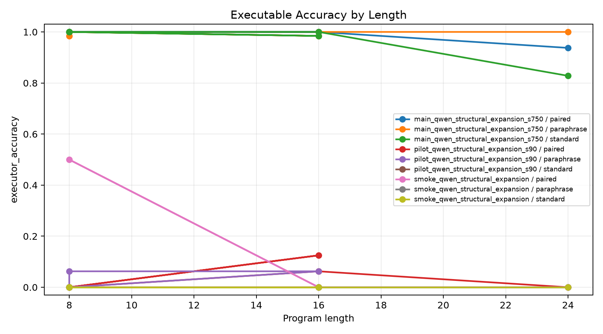
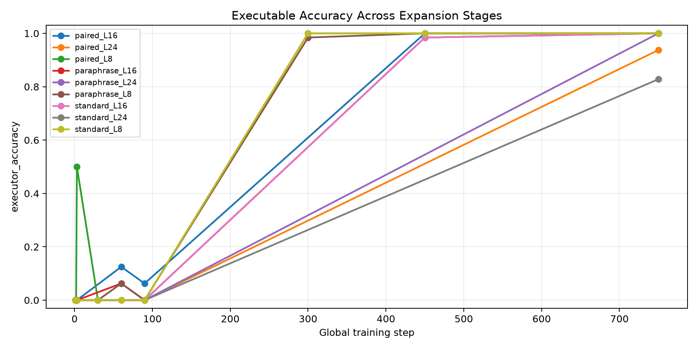
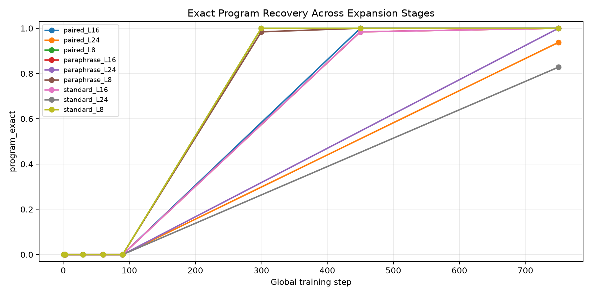
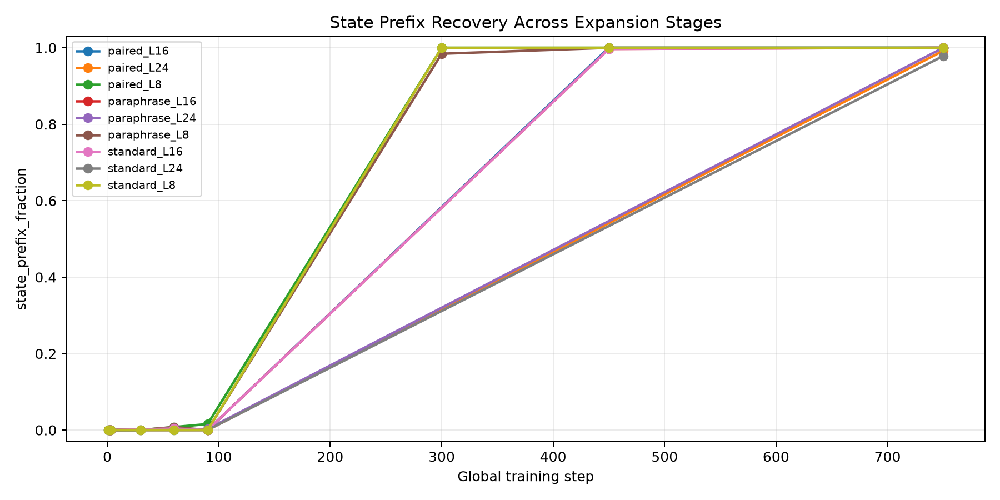
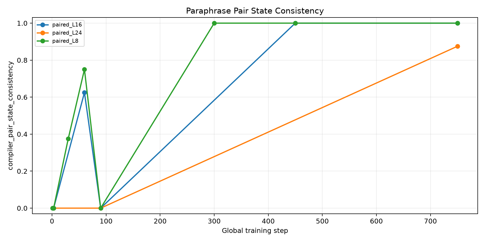
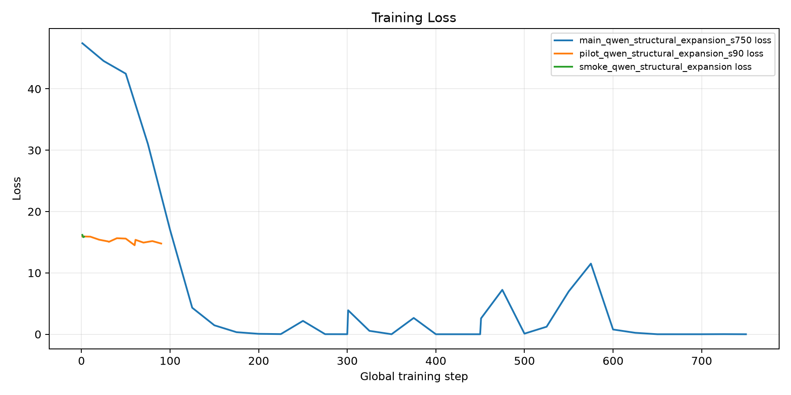
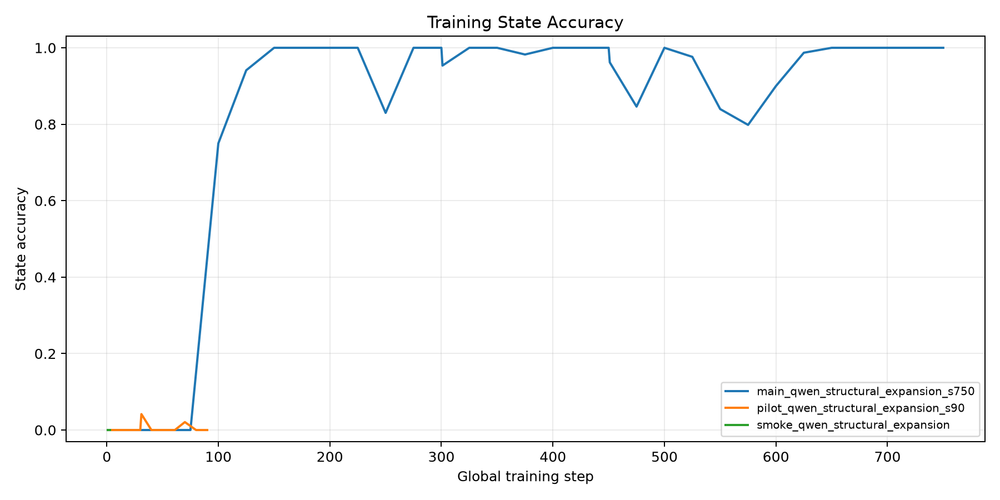

# Structural Latent Compiler Expansion

## Question

Can a Qwen-attached executable latent compiler be expanded from short modular programs to longer modular programs while preserving direct executable accuracy, without beam search, candidate reranking, or tokenized program output?

## Method

- A Qwen causal LM reads the arithmetic prompt and fixed latent register markers.
- A structural compiler head predicts one initial value plus typed operation and argument slots.
- A differentiable modular executor supervises final answer probability and intermediate state traces.
- The compiler is expanded by copying learned short-slot parameters into longer slot structures, then continuing training.
- The run reports argmax executable accuracy, exact program recovery, state prefix recovery, and paraphrase-pair consistency.

## Runs

| run                                 |   elapsed_sec | model         | stage_max_steps   | stage_steps   |   train_examples | gpu                            |
|:------------------------------------|--------------:|:--------------|:------------------|:--------------|-----------------:|:-------------------------------|
| main_qwen_structural_expansion_s750 |      1833     | Qwen/Qwen3-4B | 8,16,24           | 300,150,300   |              512 | NVIDIA RTX 6000 Ada Generation |
| pilot_qwen_structural_expansion_s90 |        84.14  | Qwen/Qwen3-4B | 8,16,24           | 30,30,30      |               64 | NVIDIA RTX 6000 Ada Generation |
| smoke_qwen_structural_expansion     |         6.944 | Qwen/Qwen3-4B | 8,16,24           | 1,1,1         |                4 | NVIDIA RTX 6000 Ada Generation |

## Results

Final expanded 24-slot compiler, length-24 splits:

| split          | executor_accuracy   | program_exact   | state_prefix_fraction   | executor_pair_both_correct   | compiler_pair_state_consistency   |
|:---------------|:--------------------|:----------------|:------------------------|:-----------------------------|:----------------------------------|
| standard_L24   | 82.8%               | 82.8%           | 97.9%                   |                              |                                   |
| paraphrase_L24 | 100.0%              | 100.0%          | 100.0%                  |                              |                                   |
| paired_L24     | 93.8%               | 93.8%           | 99.2%                   | 87.5%                        | 87.5%                             |

Best single split executable accuracy was 100.0%; the length-24 table above is the main result.

| run                                 | stage        | split          |   global_step |   max_steps | executor_accuracy   | program_exact   | state_prefix_fraction   |   state_all_exact | executor_pair_both_correct   | compiler_pair_state_consistency   |   length |
|:------------------------------------|:-------------|:---------------|--------------:|------------:|:--------------------|:----------------|:------------------------|------------------:|:-----------------------------|:----------------------------------|---------:|
| main_qwen_structural_expansion_s750 | stage1_max8  | paired_L8      |           300 |           8 | 100.0%              | 100.0%          | 100.0%                  |            1      | 100.0%                       | 100.0%                            |        8 |
| main_qwen_structural_expansion_s750 | stage1_max8  | paraphrase_L8  |           300 |           8 | 98.4%               | 98.4%           | 98.4%                   |            0.9844 |                              |                                   |        8 |
| main_qwen_structural_expansion_s750 | stage1_max8  | standard_L8    |           300 |           8 | 100.0%              | 100.0%          | 100.0%                  |            1      |                              |                                   |        8 |
| main_qwen_structural_expansion_s750 | stage2_max16 | paired_L8      |           450 |          16 | 100.0%              | 100.0%          | 100.0%                  |            1      | 100.0%                       | 100.0%                            |        8 |
| main_qwen_structural_expansion_s750 | stage2_max16 | paraphrase_L8  |           450 |          16 | 100.0%              | 100.0%          | 100.0%                  |            1      |                              |                                   |        8 |
| main_qwen_structural_expansion_s750 | stage2_max16 | standard_L8    |           450 |          16 | 100.0%              | 100.0%          | 100.0%                  |            1      |                              |                                   |        8 |
| main_qwen_structural_expansion_s750 | stage2_max16 | paired_L16     |           450 |          16 | 100.0%              | 100.0%          | 100.0%                  |            1      | 100.0%                       | 100.0%                            |       16 |
| main_qwen_structural_expansion_s750 | stage2_max16 | paraphrase_L16 |           450 |          16 | 98.4%               | 98.4%           | 99.7%                   |            0.9844 |                              |                                   |       16 |
| main_qwen_structural_expansion_s750 | stage2_max16 | standard_L16   |           450 |          16 | 98.4%               | 98.4%           | 99.7%                   |            0.9844 |                              |                                   |       16 |
| main_qwen_structural_expansion_s750 | stage3_max24 | paired_L8      |           750 |          24 | 100.0%              | 100.0%          | 100.0%                  |            1      | 100.0%                       | 100.0%                            |        8 |
| main_qwen_structural_expansion_s750 | stage3_max24 | paraphrase_L8  |           750 |          24 | 100.0%              | 100.0%          | 100.0%                  |            1      |                              |                                   |        8 |
| main_qwen_structural_expansion_s750 | stage3_max24 | standard_L8    |           750 |          24 | 100.0%              | 100.0%          | 100.0%                  |            1      |                              |                                   |        8 |
| main_qwen_structural_expansion_s750 | stage3_max24 | paired_L16     |           750 |          24 | 100.0%              | 100.0%          | 100.0%                  |            1      | 100.0%                       | 100.0%                            |       16 |
| main_qwen_structural_expansion_s750 | stage3_max24 | paraphrase_L16 |           750 |          24 | 100.0%              | 100.0%          | 100.0%                  |            1      |                              |                                   |       16 |
| main_qwen_structural_expansion_s750 | stage3_max24 | standard_L16   |           750 |          24 | 100.0%              | 100.0%          | 100.0%                  |            1      |                              |                                   |       16 |
| main_qwen_structural_expansion_s750 | stage3_max24 | paired_L24     |           750 |          24 | 93.8%               | 93.8%           | 99.2%                   |            0.9375 | 87.5%                        | 87.5%                             |       24 |
| main_qwen_structural_expansion_s750 | stage3_max24 | paraphrase_L24 |           750 |          24 | 100.0%              | 100.0%          | 100.0%                  |            1      |                              |                                   |       24 |
| main_qwen_structural_expansion_s750 | stage3_max24 | standard_L24   |           750 |          24 | 82.8%               | 82.8%           | 97.9%                   |            0.8281 |                              |                                   |       24 |
| pilot_qwen_structural_expansion_s90 | stage1_max8  | paired_L8      |            30 |           8 | 0.0%                | 0.0%            | 0.0%                    |            0      | 0.0%                         | 37.5%                             |        8 |
| pilot_qwen_structural_expansion_s90 | stage1_max8  | paraphrase_L8  |            30 |           8 | 0.0%                | 0.0%            | 0.0%                    |            0      |                              |                                   |        8 |
| pilot_qwen_structural_expansion_s90 | stage1_max8  | standard_L8    |            30 |           8 | 0.0%                | 0.0%            | 0.0%                    |            0      |                              |                                   |        8 |
| pilot_qwen_structural_expansion_s90 | stage2_max16 | paired_L8      |            60 |          16 | 0.0%                | 0.0%            | 0.8%                    |            0      | 0.0%                         | 75.0%                             |        8 |
| pilot_qwen_structural_expansion_s90 | stage2_max16 | paraphrase_L8  |            60 |          16 | 6.2%                | 0.0%            | 0.8%                    |            0      |                              |                                   |        8 |
| pilot_qwen_structural_expansion_s90 | stage2_max16 | standard_L8    |            60 |          16 | 0.0%                | 0.0%            | 0.0%                    |            0      |                              |                                   |        8 |
| pilot_qwen_structural_expansion_s90 | stage2_max16 | paired_L16     |            60 |          16 | 12.5%               | 0.0%            | 0.0%                    |            0      | 12.5%                        | 62.5%                             |       16 |
| pilot_qwen_structural_expansion_s90 | stage2_max16 | paraphrase_L16 |            60 |          16 | 6.2%                | 0.0%            | 0.4%                    |            0      |                              |                                   |       16 |
| pilot_qwen_structural_expansion_s90 | stage2_max16 | standard_L16   |            60 |          16 | 0.0%                | 0.0%            | 0.4%                    |            0      |                              |                                   |       16 |
| pilot_qwen_structural_expansion_s90 | stage3_max24 | paired_L8      |            90 |          24 | 0.0%                | 0.0%            | 1.6%                    |            0      | 0.0%                         | 0.0%                              |        8 |
| pilot_qwen_structural_expansion_s90 | stage3_max24 | paraphrase_L8  |            90 |          24 | 0.0%                | 0.0%            | 0.0%                    |            0      |                              |                                   |        8 |
| pilot_qwen_structural_expansion_s90 | stage3_max24 | standard_L8    |            90 |          24 | 0.0%                | 0.0%            | 0.0%                    |            0      |                              |                                   |        8 |
| pilot_qwen_structural_expansion_s90 | stage3_max24 | paired_L16     |            90 |          24 | 6.2%                | 0.0%            | 0.0%                    |            0      | 0.0%                         | 0.0%                              |       16 |
| pilot_qwen_structural_expansion_s90 | stage3_max24 | paraphrase_L16 |            90 |          24 | 0.0%                | 0.0%            | 0.0%                    |            0      |                              |                                   |       16 |
| pilot_qwen_structural_expansion_s90 | stage3_max24 | standard_L16   |            90 |          24 | 0.0%                | 0.0%            | 0.0%                    |            0      |                              |                                   |       16 |
| pilot_qwen_structural_expansion_s90 | stage3_max24 | paired_L24     |            90 |          24 | 0.0%                | 0.0%            | 0.0%                    |            0      | 0.0%                         | 0.0%                              |       24 |
| pilot_qwen_structural_expansion_s90 | stage3_max24 | paraphrase_L24 |            90 |          24 | 0.0%                | 0.0%            | 0.3%                    |            0      |                              |                                   |       24 |
| pilot_qwen_structural_expansion_s90 | stage3_max24 | standard_L24   |            90 |          24 | 0.0%                | 0.0%            | 0.0%                    |            0      |                              |                                   |       24 |
| smoke_qwen_structural_expansion     | stage1_max8  | paired_L8      |             1 |           8 | 0.0%                | 0.0%            | 0.0%                    |            0      | 0.0%                         | 0.0%                              |        8 |
| smoke_qwen_structural_expansion     | stage1_max8  | paraphrase_L8  |             1 |           8 | 0.0%                | 0.0%            | 0.0%                    |            0      |                              |                                   |        8 |
| smoke_qwen_structural_expansion     | stage1_max8  | standard_L8    |             1 |           8 | 0.0%                | 0.0%            | 0.0%                    |            0      |                              |                                   |        8 |
| smoke_qwen_structural_expansion     | stage2_max16 | paired_L8      |             2 |          16 | 0.0%                | 0.0%            | 0.0%                    |            0      | 0.0%                         | 0.0%                              |        8 |
| smoke_qwen_structural_expansion     | stage2_max16 | paraphrase_L8  |             2 |          16 | 0.0%                | 0.0%            | 0.0%                    |            0      |                              |                                   |        8 |
| smoke_qwen_structural_expansion     | stage2_max16 | standard_L8    |             2 |          16 | 0.0%                | 0.0%            | 0.0%                    |            0      |                              |                                   |        8 |
| smoke_qwen_structural_expansion     | stage2_max16 | paired_L16     |             2 |          16 | 0.0%                | 0.0%            | 0.0%                    |            0      | 0.0%                         | 0.0%                              |       16 |
| smoke_qwen_structural_expansion     | stage2_max16 | paraphrase_L16 |             2 |          16 | 0.0%                | 0.0%            | 0.0%                    |            0      |                              |                                   |       16 |
| smoke_qwen_structural_expansion     | stage2_max16 | standard_L16   |             2 |          16 | 0.0%                | 0.0%            | 0.0%                    |            0      |                              |                                   |       16 |
| smoke_qwen_structural_expansion     | stage3_max24 | paired_L8      |             3 |          24 | 50.0%               | 0.0%            | 0.0%                    |            0      | 0.0%                         | 0.0%                              |        8 |
| smoke_qwen_structural_expansion     | stage3_max24 | paraphrase_L8  |             3 |          24 | 0.0%                | 0.0%            | 0.0%                    |            0      |                              |                                   |        8 |
| smoke_qwen_structural_expansion     | stage3_max24 | standard_L8    |             3 |          24 | 0.0%                | 0.0%            | 0.0%                    |            0      |                              |                                   |        8 |
| smoke_qwen_structural_expansion     | stage3_max24 | paired_L16     |             3 |          24 | 0.0%                | 0.0%            | 0.0%                    |            0      | 0.0%                         | 0.0%                              |       16 |
| smoke_qwen_structural_expansion     | stage3_max24 | paraphrase_L16 |             3 |          24 | 0.0%                | 0.0%            | 0.0%                    |            0      |                              |                                   |       16 |
| smoke_qwen_structural_expansion     | stage3_max24 | standard_L16   |             3 |          24 | 0.0%                | 0.0%            | 0.0%                    |            0      |                              |                                   |       16 |
| smoke_qwen_structural_expansion     | stage3_max24 | paired_L24     |             3 |          24 | 0.0%                | 0.0%            | 0.0%                    |            0      | 0.0%                         | 0.0%                              |       24 |
| smoke_qwen_structural_expansion     | stage3_max24 | paraphrase_L24 |             3 |          24 | 0.0%                | 0.0%            | 0.0%                    |            0      |                              |                                   |       24 |
| smoke_qwen_structural_expansion     | stage3_max24 | standard_L24   |             3 |          24 | 0.0%                | 0.0%            | 0.0%                    |            0      |                              |                                   |       24 |

## Figures

## Interpretation

This report is intentionally standalone. The key readout is whether expansion improves or preserves executable accuracy at longer lengths, and whether paraphrase-paired programs compile to the same latent execution trace.

## Artifacts

- Run outputs: `experiments/qwen_structural_latent_compiler_expansion/runs/`
- Reports and figures: `experiments/qwen_structural_latent_compiler_expansion/reports/`
- Large checkpoints: `large_artifacts/qwen_structural_latent_compiler_expansion/checkpoints/`
