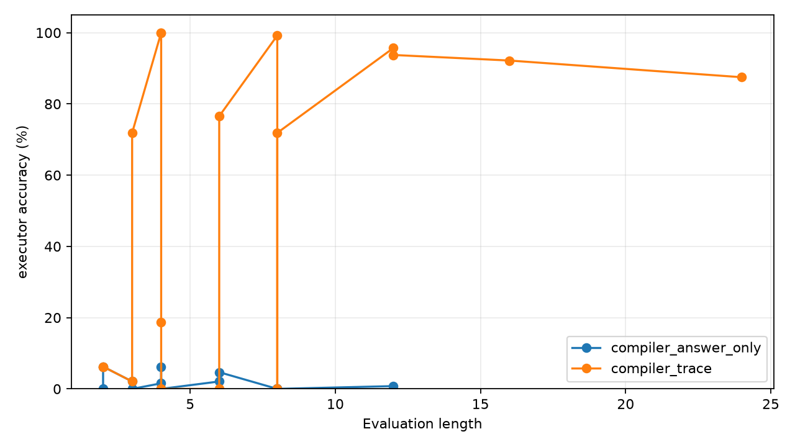
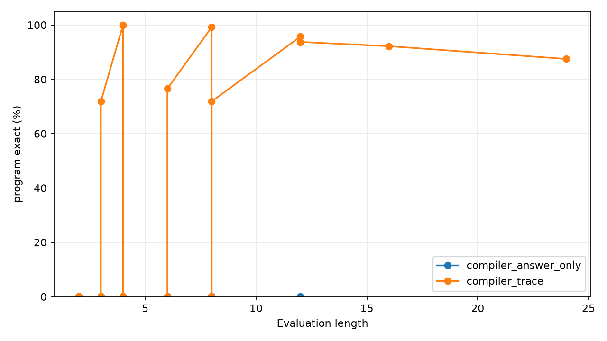

# Qwen Structured Bridge

## Abstract

This experiment tests a frozen Qwen3.5-4B encoder attached to a trainable
structured latent executor. The prompt describes a modular arithmetic program.
The bridge reads selected Qwen hidden states, compiles them into an initial
value and per-step program symbols, and an invisible executor runs the program
to produce the answer.

With trace supervision, the bridge learns a reliable latent program interface.
Training on 1-4 step programs and evaluating on held-out 97-way answers, the
compiled executor reaches 100.0% accuracy at length 4, 99.2% at length 8, and
95.7% at length 12. A length-24 scale check reaches 87.5%. A direct answer
classifier trained on the same frozen Qwen features stays at chance, and an
answer-only latent compiler also stays at chance.

## Task

Each prompt specifies a value `x` modulo 97 and a sequence of operations:

```text
Initial x = 42.
Step: add 17.
Step: multiply by 3.
Step: subtract 5.
```

The target is the final value of `x`. The executor supports three operations:

- `ADD a`: set `x = x + a (mod 97)`.
- `SUB a`: set `x = x - a (mod 97)`.
- `MUL a`: set `x = x * a (mod 97)`.

Training examples contain 1-4 steps. Evaluation uses longer held-out step
counts.

## Model

Qwen3.5-4B is loaded in 4-bit and kept frozen. The bridge reads hidden states
at standardized prompt spans:

- the numeric token span for the initial value,
- the operation line prefix for each step,
- the numeric token span for each operation argument,
- the answer line for the direct-answer control.

The structured compiler predicts:

- initial value logits over 97 residues,
- operation logits over `ADD`, `SUB`, and `MUL`,
- argument logits over 97 residues.

A differentiable executor composes the predicted distributions during
training. For strict evaluation, the compiled symbols are argmaxed and executed
exactly.

## Controls

The main controls are:

- `direct`: an answer classifier trained on the same frozen Qwen answer-line
  feature.
- `compiler_trace`: the structured compiler trained with symbol trace
  supervision plus executor answer loss.
- `compiler_answer_only`: the structured compiler trained only from final
  answer loss through the soft executor.

These controls separate three questions: whether the frozen features support
direct answer prediction, whether they support executable compilation when the
latent interface is supervised, and whether final-answer reward alone discovers
that interface.

## Main Results

The main run uses 1024 training examples with lengths 1-4 and evaluates on
lengths 4, 8, and 12.

| Variant | L=4 accuracy | L=8 accuracy | L=12 accuracy | L=12 target mass | L=12 init | L=12 op | L=12 arg | L=12 program exact |
|---|---:|---:|---:|---:|---:|---:|---:|---:|
| `direct` | 0.0% | 1.2% | 0.4% | n/a | n/a | n/a | n/a | n/a |
| `compiler_trace` | 100.0% | 99.2% | 95.7% | 94.1% | 100.0% | 99.6% | 100.0% | 95.7% |
| `compiler_answer_only` | 1.6% | 0.0% | 0.8% | 1.0% | 1.2% | 33.5% | 3.1% | 0.0% |





## Length Scale Check

The scale check trains the trace-supervised compiler on lengths 1-4 and
evaluates lengths 4, 12, 16, and 24.

| Length | Executor accuracy | Target mass | Init acc | Op acc | Arg acc | Program exact |
|---:|---:|---:|---:|---:|---:|---:|
| 4 | 100.0% | 99.9% | 100.0% | 100.0% | 100.0% | 100.0% |
| 12 | 93.8% | 93.6% | 100.0% | 99.5% | 100.0% | 93.8% |
| 16 | 92.2% | 91.5% | 100.0% | 99.6% | 100.0% | 92.2% |
| 24 | 87.5% | 82.7% | 100.0% | 99.5% | 100.0% | 87.5% |

## Interpretation

The result supports a specific claim: frozen Qwen hidden states can drive a
small structured bridge that configures and runs an invisible latent executor.
The executor is not merely an answer head. It compiles text into program
symbols, and strict accuracy tracks whether the whole compiled program is
correct.

The direct control is important. It uses the same frozen Qwen backbone and the
same task distribution, but it stays at 97-way chance. The structured bridge
wins because the output space is decomposed into reusable program symbols that
the executor can compose.

The answer-only control is also important. It does not learn the latent
program interface under this budget. The trace-supervised condition shows that
the interface is usable; the answer-only condition shows that discovering it
from sparse final reward remains a separate training problem.

At long lengths, the remaining error is not numeric parsing. Initial value and
argument accuracy are 100.0% at length 24. The error comes from rare operation
misclassification, which compounds over more steps.

## Limitations

The task is synthetic modular arithmetic with standardized text templates. The
executor operation set is fixed in advance. The bridge receives direct symbol
trace supervision in the successful condition. Qwen is frozen, so this is an
attachment experiment rather than full model posttraining.

The result therefore does not show broad intelligence improvement. It shows a
concrete mechanism by which a 4B-class model can configure a latent structured
runtime and gain large length-generalization benefits on a serial symbolic
task.

## Artifact Layout

Lightweight code, metrics, figures, and reports live in:

```text
experiments/qwen_structured_bridge/
```

Saved bridge checkpoints live separately in:

```text
large_artifacts/qwen_structured_bridge/checkpoints/
```

The checkpoint manifest is:

```text
experiments/qwen_structured_bridge/checkpoint_manifest.csv
```
