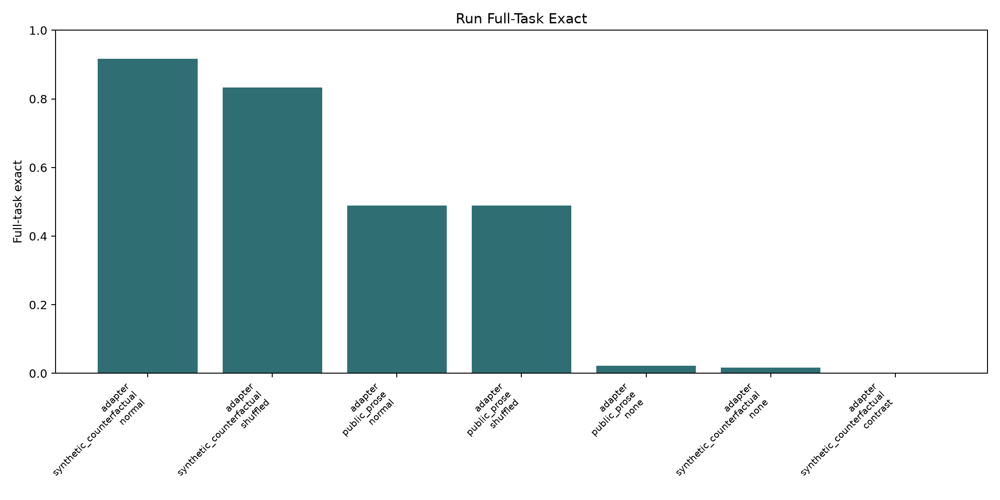
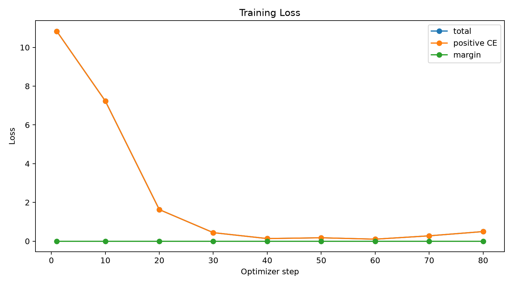

# Support-Contrastive Meta-ICL Run Report

## Setup

- Run: `main_ce_shuffled_labels_s1`
- Objective: `ce`
- Train mode: `shuffled_labels`
- Train steps: `80`
- Elapsed seconds: `397.1`

## Metrics

| method   | split                    | support_mode   |   tasks |   rows | row_exact   | full_task_exact   |
|:---------|:-------------------------|:---------------|--------:|-------:|:------------|:------------------|
| adapter  | public_prose             | none           |      45 |    135 | 8.1%        | 2.2%              |
| adapter  | public_prose             | normal         |      45 |    135 | 68.9%       | 48.9%             |
| adapter  | public_prose             | shuffled       |      45 |    135 | 63.0%       | 48.9%             |
| adapter  | synthetic_counterfactual | contrast       |      60 |    120 | 0.0%        | 0.0%              |
| adapter  | synthetic_counterfactual | none           |      60 |    120 | 5.0%        | 1.7%              |
| adapter  | synthetic_counterfactual | normal         |      60 |    120 | 95.8%       | 91.7%             |
| adapter  | synthetic_counterfactual | shuffled       |      60 |    120 | 90.8%       | 83.3%             |

## Charts

## Artifacts

- Run directory: `/workspace/experiments/qwen_support_contrastive_meta_icl/runs/main_ce_shuffled_labels_s1`
- Checkpoint: `/workspace/large_artifacts/qwen_support_contrastive_meta_icl/checkpoints/main_ce_shuffled_labels_s1/adapter`