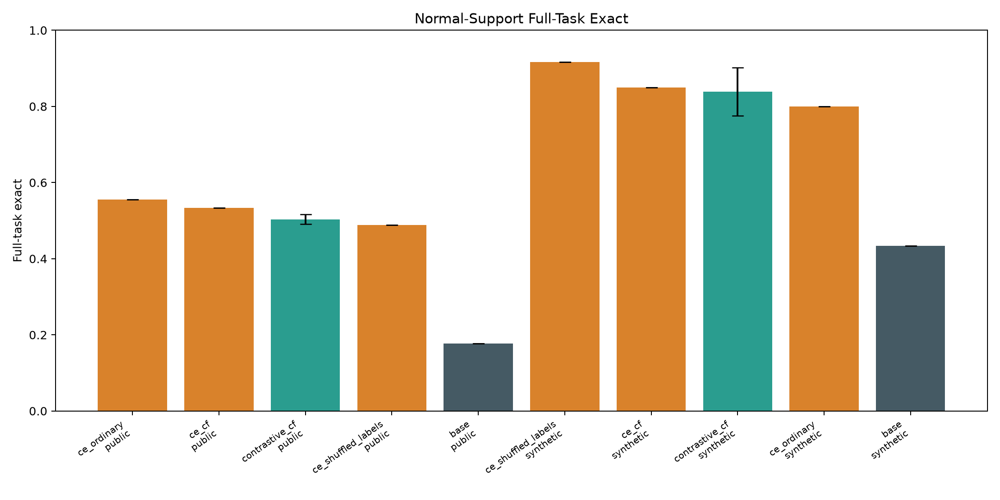
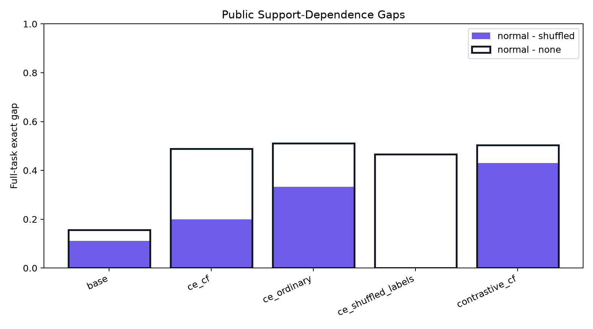
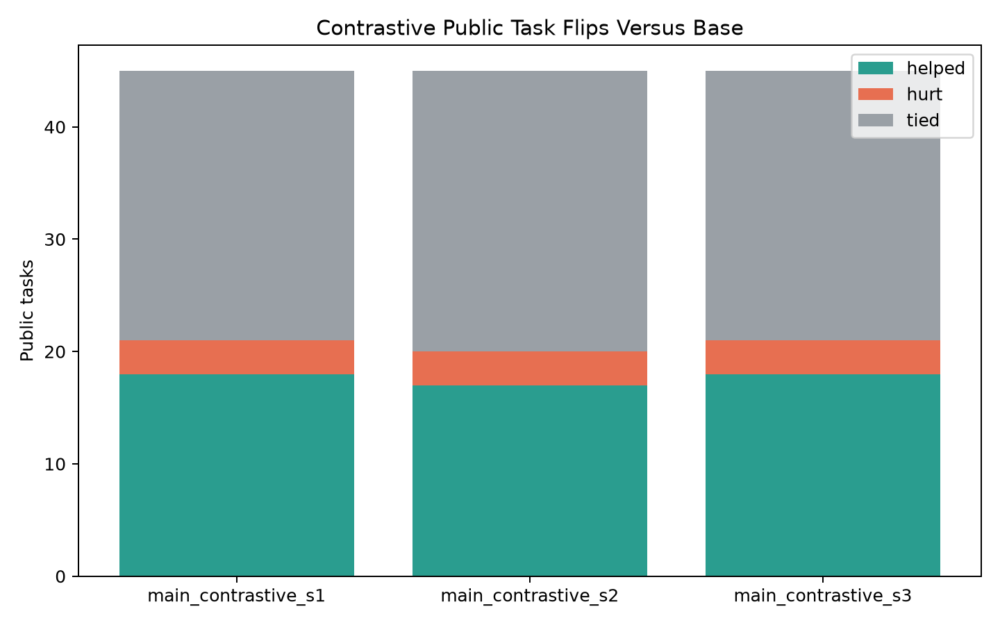
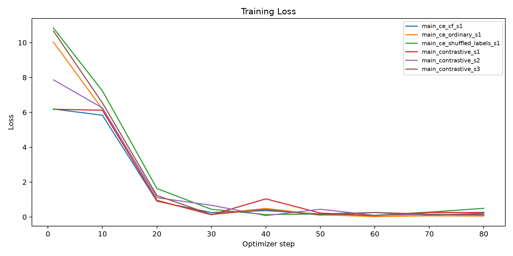

# Support-Contrastive Meta-ICL

## Question

Can a support-contrastive LoRA objective make Qwen3-4B answer public text-transformation tasks better while making the answer depend more strongly on intact support examples?

The contrastive arm trains on synthetic few-shot transformations. For each target answer, the positive prompt contains intact support examples, while negative prompts contain shuffled support labels, no support examples, or a counterfactual support set from an incompatible rule. Public benchmark labels are used only for evaluation.

## Headline

- Public full-task exact: base `17.8%`; contrastive arm `50.4%` with seed spread `1.3%`.
- Contrastive public support controls: normal `50.4%`, shuffled `7.4%`, no support `0.0%`.
- CE-only counterfactual control: `53.3%`.
- CE-only ordinary control: `55.6%`.
- CE-only shuffled-label control: `48.9%`.

## Aggregate Metrics

| arm                | split                    | support_mode   |   runs |   tasks |   rows | row_exact_mean   | row_exact_std   | full_task_exact_mean   | full_task_exact_std   |
|:-------------------|:-------------------------|:---------------|-------:|--------:|-------:|:-----------------|:----------------|:-----------------------|:----------------------|
| base               | public_prose             | none           |      1 |      45 |    135 | 5.9%             | 0.0%            | 2.2%                   | 0.0%                  |
| base               | public_prose             | normal         |      1 |      45 |    135 | 36.3%            | 0.0%            | 17.8%                  | 0.0%                  |
| base               | public_prose             | shuffled       |      1 |      45 |    135 | 14.1%            | 0.0%            | 6.7%                   | 0.0%                  |
| ce_cf              | public_prose             | none           |      1 |      45 |    135 | 8.9%             | 0.0%            | 4.4%                   | 0.0%                  |
| ce_cf              | public_prose             | normal         |      1 |      45 |    135 | 68.1%            | 0.0%            | 53.3%                  | 0.0%                  |
| ce_cf              | public_prose             | shuffled       |      1 |      45 |    135 | 51.1%            | 0.0%            | 33.3%                  | 0.0%                  |
| ce_ordinary        | public_prose             | none           |      1 |      45 |    135 | 7.4%             | 0.0%            | 4.4%                   | 0.0%                  |
| ce_ordinary        | public_prose             | normal         |      1 |      45 |    135 | 71.9%            | 0.0%            | 55.6%                  | 0.0%                  |
| ce_ordinary        | public_prose             | shuffled       |      1 |      45 |    135 | 43.0%            | 0.0%            | 22.2%                  | 0.0%                  |
| ce_shuffled_labels | public_prose             | none           |      1 |      45 |    135 | 8.1%             | 0.0%            | 2.2%                   | 0.0%                  |
| ce_shuffled_labels | public_prose             | normal         |      1 |      45 |    135 | 68.9%            | 0.0%            | 48.9%                  | 0.0%                  |
| ce_shuffled_labels | public_prose             | shuffled       |      1 |      45 |    135 | 63.0%            | 0.0%            | 48.9%                  | 0.0%                  |
| contrastive_cf     | public_prose             | none           |      3 |      45 |    135 | 0.0%             | 0.0%            | 0.0%                   | 0.0%                  |
| contrastive_cf     | public_prose             | normal         |      3 |      45 |    135 | 67.4%            | 2.0%            | 50.4%                  | 1.3%                  |
| contrastive_cf     | public_prose             | shuffled       |      3 |      45 |    135 | 12.6%            | 1.3%            | 7.4%                   | 1.3%                  |
| base               | synthetic_counterfactual | contrast       |      1 |      60 |    120 | 0.0%             | 0.0%            | 0.0%                   | 0.0%                  |
| base               | synthetic_counterfactual | none           |      1 |      60 |    120 | 5.8%             | 0.0%            | 1.7%                   | 0.0%                  |
| base               | synthetic_counterfactual | normal         |      1 |      60 |    120 | 56.7%            | 0.0%            | 43.3%                  | 0.0%                  |
| base               | synthetic_counterfactual | shuffled       |      1 |      60 |    120 | 25.0%            | 0.0%            | 21.7%                  | 0.0%                  |
| ce_cf              | synthetic_counterfactual | contrast       |      1 |      60 |    120 | 0.0%             | 0.0%            | 0.0%                   | 0.0%                  |
| ce_cf              | synthetic_counterfactual | none           |      1 |      60 |    120 | 1.7%             | 0.0%            | 0.0%                   | 0.0%                  |
| ce_cf              | synthetic_counterfactual | normal         |      1 |      60 |    120 | 92.5%            | 0.0%            | 85.0%                  | 0.0%                  |
| ce_cf              | synthetic_counterfactual | shuffled       |      1 |      60 |    120 | 59.2%            | 0.0%            | 46.7%                  | 0.0%                  |
| ce_ordinary        | synthetic_counterfactual | contrast       |      1 |      60 |    120 | 0.0%             | 0.0%            | 0.0%                   | 0.0%                  |
| ce_ordinary        | synthetic_counterfactual | none           |      1 |      60 |    120 | 0.8%             | 0.0%            | 0.0%                   | 0.0%                  |
| ce_ordinary        | synthetic_counterfactual | normal         |      1 |      60 |    120 | 88.3%            | 0.0%            | 80.0%                  | 0.0%                  |
| ce_ordinary        | synthetic_counterfactual | shuffled       |      1 |      60 |    120 | 47.5%            | 0.0%            | 36.7%                  | 0.0%                  |
| ce_shuffled_labels | synthetic_counterfactual | contrast       |      1 |      60 |    120 | 0.0%             | 0.0%            | 0.0%                   | 0.0%                  |
| ce_shuffled_labels | synthetic_counterfactual | none           |      1 |      60 |    120 | 5.0%             | 0.0%            | 1.7%                   | 0.0%                  |
| ce_shuffled_labels | synthetic_counterfactual | normal         |      1 |      60 |    120 | 95.8%            | 0.0%            | 91.7%                  | 0.0%                  |
| ce_shuffled_labels | synthetic_counterfactual | shuffled       |      1 |      60 |    120 | 90.8%            | 0.0%            | 83.3%                  | 0.0%                  |
| contrastive_cf     | synthetic_counterfactual | contrast       |      3 |      60 |    120 | 0.0%             | 0.0%            | 0.0%                   | 0.0%                  |
| contrastive_cf     | synthetic_counterfactual | none           |      3 |      60 |    120 | 0.0%             | 0.0%            | 0.0%                   | 0.0%                  |
| contrastive_cf     | synthetic_counterfactual | normal         |      3 |      60 |    120 | 89.7%            | 3.8%            | 83.9%                  | 6.3%                  |
| contrastive_cf     | synthetic_counterfactual | shuffled       |      3 |      60 |    120 | 8.9%             | 1.7%            | 6.7%                   | 0.0%                  |

## Support-Dependence Gaps

| arm                | split                    | normal   | shuffled   | none   | contrast   | normal_minus_shuffled_gap   | normal_minus_none_gap   | normal_minus_contrast_gap   |
|:-------------------|:-------------------------|:---------|:-----------|:-------|:-----------|:----------------------------|:------------------------|:----------------------------|
| base               | public_prose             | 17.8%    | 6.7%       | 2.2%   |            | 11.1%                       | 15.6%                   |                             |
| ce_cf              | public_prose             | 53.3%    | 33.3%      | 4.4%   |            | 20.0%                       | 48.9%                   |                             |
| ce_ordinary        | public_prose             | 55.6%    | 22.2%      | 4.4%   |            | 33.3%                       | 51.1%                   |                             |
| ce_shuffled_labels | public_prose             | 48.9%    | 48.9%      | 2.2%   |            | 0.0%                        | 46.7%                   |                             |
| contrastive_cf     | public_prose             | 50.4%    | 7.4%       | 0.0%   |            | 43.0%                       | 50.4%                   |                             |
| base               | synthetic_counterfactual | 43.3%    | 21.7%      | 1.7%   | 0.0%       | 21.7%                       | 41.7%                   | 43.3%                       |
| ce_cf              | synthetic_counterfactual | 85.0%    | 46.7%      | 0.0%   | 0.0%       | 38.3%                       | 85.0%                   | 85.0%                       |
| ce_ordinary        | synthetic_counterfactual | 80.0%    | 36.7%      | 0.0%   | 0.0%       | 43.3%                       | 80.0%                   | 80.0%                       |
| ce_shuffled_labels | synthetic_counterfactual | 91.7%    | 83.3%      | 1.7%   | 0.0%       | 8.3%                        | 90.0%                   | 91.7%                       |
| contrastive_cf     | synthetic_counterfactual | 83.9%    | 6.7%       | 0.0%   | 0.0%       | 77.2%                       | 83.9%                   | 83.9%                       |

## Seed-Level Normal-Support Metrics

| run_name                   |     seed | arm                | split                    |   tasks |   rows | row_exact   | full_task_exact   |
|:---------------------------|---------:|:-------------------|:-------------------------|--------:|-------:|:------------|:------------------|
| main_contrastive_s1        | 20260628 | base               | public_prose             |      45 |    135 | 36.3%       | 17.8%             |
| main_contrastive_s1        | 20260628 | base               | synthetic_counterfactual |      60 |    120 | 56.7%       | 43.3%             |
| main_ce_cf_s1              | 20260628 | ce_cf              | public_prose             |      45 |    135 | 68.1%       | 53.3%             |
| main_ce_cf_s1              | 20260628 | ce_cf              | synthetic_counterfactual |      60 |    120 | 92.5%       | 85.0%             |
| main_ce_ordinary_s1        | 20260628 | ce_ordinary        | public_prose             |      45 |    135 | 71.9%       | 55.6%             |
| main_ce_ordinary_s1        | 20260628 | ce_ordinary        | synthetic_counterfactual |      60 |    120 | 88.3%       | 80.0%             |
| main_ce_shuffled_labels_s1 | 20260628 | ce_shuffled_labels | public_prose             |      45 |    135 | 68.9%       | 48.9%             |
| main_ce_shuffled_labels_s1 | 20260628 | ce_shuffled_labels | synthetic_counterfactual |      60 |    120 | 95.8%       | 91.7%             |
| main_contrastive_s1        | 20260628 | contrastive_cf     | public_prose             |      45 |    135 | 66.7%       | 51.1%             |
| main_contrastive_s1        | 20260628 | contrastive_cf     | synthetic_counterfactual |      60 |    120 | 93.3%       | 88.3%             |
| main_contrastive_s2        | 20260629 | contrastive_cf     | public_prose             |      45 |    135 | 65.9%       | 48.9%             |
| main_contrastive_s2        | 20260629 | contrastive_cf     | synthetic_counterfactual |      60 |    120 | 90.0%       | 86.7%             |
| main_contrastive_s3        | 20260630 | contrastive_cf     | public_prose             |      45 |    135 | 69.6%       | 51.1%             |
| main_contrastive_s3        | 20260630 | contrastive_cf     | synthetic_counterfactual |      60 |    120 | 85.8%       | 76.7%             |

## Interpretation

The support-contrastive arm improves public strict task consistency over the frozen base model.
The contrastive arm is strongly support-sensitive at evaluation time.
A CE-only control beats the support-contrastive arm, so this objective is not the current best recipe.

## Charts

## Contrastive Public Task Flips Versus Base

| run_name            |     seed |   helped |   hurt |   tied |   tasks |
|:--------------------|---------:|---------:|-------:|-------:|--------:|
| main_contrastive_s1 | 20260628 |       18 |      3 |     24 |      45 |
| main_contrastive_s2 | 20260629 |       17 |      3 |     25 |      45 |
| main_contrastive_s3 | 20260630 |       18 |      3 |     24 |      45 |

## Public Family Breakdown

| family       |   tasks_base |   tasks_contrastive_cf | row_exact_base   | row_exact_contrastive_cf   | full_task_exact_base   | full_task_exact_contrastive_cf   | delta   |
|:-------------|-------------:|-----------------------:|:-----------------|:---------------------------|:-----------------------|:---------------------------------|:--------|
| ShippingCode |            1 |                      1 | 0.0%             | 100.0%                     | 0.0%                   | 100.0%                           | 100.0%  |
| Log          |            2 |                      2 | 0.0%             | 100.0%                     | 0.0%                   | 100.0%                           | 100.0%  |
| Name         |            3 |                      3 | 33.3%            | 92.6%                      | 0.0%                   | 77.8%                            | 77.8%   |
| Email        |            4 |                      4 | 66.7%            | 80.6%                      | 25.0%                  | 66.7%                            | 41.7%   |
| DateTime     |           16 |                     16 | 27.1%            | 59.0%                      | 6.2%                   | 39.6%                            | 33.3%   |
| Number       |           12 |                     12 | 33.3%            | 68.5%                      | 25.0%                  | 47.2%                            | 22.2%   |
| Phone        |            4 |                      4 | 58.3%            | 50.0%                      | 25.0%                  | 41.7%                            | 16.7%   |
| BillingCode  |            1 |                      1 | 0.0%             | 0.0%                       | 0.0%                   | 0.0%                             | 0.0%    |
| ZipCode      |            1 |                      1 | 100.0%           | 100.0%                     | 100.0%                 | 100.0%                           | 0.0%    |
| Address      |            1 |                      1 | 100.0%           | 66.7%                      | 100.0%                 | 0.0%                             | -100.0% |

## Public Error Sample

| run_name            | task_id            | family      | input                                                              | target                     | prediction                 |
|:--------------------|:-------------------|:------------|:-------------------------------------------------------------------|:---------------------------|:---------------------------|
| main_contrastive_s1 | Address.000013     | Address     | One Main Parkway, Allentown, ND 41230                              | nan                        | 1                          |
| main_contrastive_s1 | BillingCode.000001 | BillingCode | [CPT-115]                                                          | [CPT-115]]                 | [CPT-115]                  |
| main_contrastive_s1 | BillingCode.000001 | BillingCode | [CPT-1153622]                                                      | [CPT-1153622]]             | [CPT-1153622]              |
| main_contrastive_s1 | BillingCode.000001 | BillingCode | [CPT-00340]                                                        | [CPT-00340]]               | [CPT-00340]                |
| main_contrastive_s1 | DateTime.000014    | DateTime    | 1 Feb 2013                                                         | Friday #1 February 2013    | Saturday #1 February 2013  |
| main_contrastive_s1 | DateTime.000014    | DateTime    | 12 Dec 2002                                                        | Thursday #2 December 2002  | Thursday #3 December 2002  |
| main_contrastive_s1 | DateTime.000014    | DateTime    | 01 Sep 2012                                                        | Saturday #1 September 2012 | Thursday #1 September 2012 |
| main_contrastive_s1 | DateTime.000027    | DateTime    | 3302241                                                            | Q1 '2241                   | Q4 '241                    |
| main_contrastive_s1 | DateTime.000027    | DateTime    | 8022160                                                            | Q3 '2160                   | Q2 '2160                   |
| main_contrastive_s1 | DateTime.000028    | DateTime    | 11 May 2215                                                        | W19                        | W17                        |
| main_contrastive_s1 | DateTime.000028    | DateTime    | Oct 17 1892                                                        | W42                        | W07                        |
| main_contrastive_s1 | DateTime.000028    | DateTime    | Tue wk 42 in 2222                                                  | W42                        | 18-Oct-2222                |
| main_contrastive_s1 | DateTime.000030    | DateTime    | 03302241                                                           | Tuesday, March 30, 2241    | Monday, March 30, 2241     |
| main_contrastive_s1 | DateTime.000030    | DateTime    | 02-Aug-2160                                                        | Saturday, August 2, 2160   | Monday, August 2, 2160     |
| main_contrastive_s1 | DateTime.000030    | DateTime    | 23 May 1984                                                        | Wednesday, May 23, 1984    | Monday, May 23, 1984       |
| main_contrastive_s1 | DateTime.000073    | DateTime    | 10:24PM                                                            | 10:00PM-10:30PM            | 10:15PM-10:45PM            |
| main_contrastive_s1 | DateTime.000082    | DateTime    | 1953-04-22 23:34:17                                                | 1953-04-22 23:30           | 1953-04-22 23:25           |
| main_contrastive_s1 | DateTime.000082    | DateTime    | 1868-06-22 19:36:20                                                | 1868-06-22 19:30           | 1868-06-22 19:25           |
| main_contrastive_s1 | DateTime.000088    | DateTime    | 16:15:08                                                           | 4:00PM                     | 3:00PM                     |
| main_contrastive_s1 | DateTime.000088    | DateTime    | 22:24:59                                                           | 10:00PM                    | 9:00PM                     |
| main_contrastive_s1 | DateTime.000096    | DateTime    | 8/7/2237                                                           | 8                          | 2237                       |
| main_contrastive_s1 | DateTime.000096    | DateTime    | 6.30.2220                                                          | 30                         | 2220                       |
| main_contrastive_s1 | DateTime.000114    | DateTime    | 16-Aug-1985 01:11:56                                               | 0-15                       | 30-45                      |
| main_contrastive_s1 | Email.000009       | Email       | blanditiis ratione @ contososuites.com porro dolorum corrupti      | nan                        | contososuites.com          |
| main_contrastive_s1 | Email.000009       | Email       | repellat deleniti @ northwindtraders.com consequatur aut qui porro | nan                        | northwindtraders.com       |
| main_contrastive_s1 | Name.000024        | Name        | Milica Zujovic                                                     | m.z.                       | m.z                        |
| main_contrastive_s1 | Number.000005      | Number      | 47641887866                                                        | 7866                       | 8786                       |
| main_contrastive_s1 | Number.000005      | Number      | 88081682946                                                        | 2946                       | 8294                       |
| main_contrastive_s1 | Number.000008      | Number      | -13578                                                             | -135.78                    | -13.578                    |
| main_contrastive_s1 | Number.000008      | Number      | -1961.1180                                                         | -19.611180                 | -19.61118                  |
| main_contrastive_s1 | Number.000015      | Number      | -22630                                                             | -22600                     | -22550                     |
| main_contrastive_s1 | Number.000052      | Number      | 124                                                                | 125                        | 126                        |
| main_contrastive_s1 | Number.000052      | Number      | 605                                                                | 605                        | 607                        |
| main_contrastive_s1 | Number.000052      | Number      | 842                                                                | 840                        | 844                        |
| main_contrastive_s1 | Number.000056      | Number      | 13.24                                                              | 13.24                      | 3.24                       |
| main_contrastive_s1 | Number.000056      | Number      | 200.0                                                              | 200.0                      | 0.0                        |
| main_contrastive_s1 | Number.000056      | Number      | 4.62                                                               | 4.62                       | 62                         |
| main_contrastive_s1 | Number.000060      | Number      | +43                                                                | +0043                      | +043                       |
| main_contrastive_s1 | Number.000061      | Number      | 1.252 | 8.2                                                        | 1.3 * 8.2                  | 1.2 * 8.2                  |
| main_contrastive_s1 | Phone.000009       | Phone       | 247-641-8878                                                       | 247-641-8878               | 425-247-6418               |
| main_contrastive_s1 | Phone.000009       | Phone       | 880-816-8294                                                       | 880-816-8294               | 425-880-8168               |
| main_contrastive_s1 | Phone.000009       | Phone       | (177) 191 4536                                                     | 177-191-4536               | 425-177-1914536            |
| main_contrastive_s1 | Phone.000012       | Phone       | 247-641-8878                                                       | 425-641-8878               | 425-247-6418878            |
| main_contrastive_s1 | Phone.000012       | Phone       | 880-816-8294                                                       | 425-816-8294               | 425-880-8168294            |
| main_contrastive_s1 | Phone.000012       | Phone       | (177) 191 4536                                                     | 177-191-4536               | 425-177-1914536            |
| main_contrastive_s2 | Address.000013     | Address     | One Main Parkway, Allentown, ND 41230                              | nan                        | One                        |
| main_contrastive_s2 | BillingCode.000001 | BillingCode | [CPT-115]                                                          | [CPT-115]]                 | [CPT-115]                  |
| main_contrastive_s2 | BillingCode.000001 | BillingCode | [CPT-1153622]                                                      | [CPT-1153622]]             | [CPT-1153622]              |
| main_contrastive_s2 | BillingCode.000001 | BillingCode | [CPT-00340]                                                        | [CPT-00340]]               | [CPT-00340]                |
| main_contrastive_s2 | DateTime.000014    | DateTime    | 1 Feb 2013                                                         | Friday #1 February 2013    | Saturday #2 February 2013  |
| main_contrastive_s2 | DateTime.000014    | DateTime    | 12 Dec 2002                                                        | Thursday #2 December 2002  | Thursday #3 December 2002  |
| main_contrastive_s2 | DateTime.000014    | DateTime    | 01 Sep 2012                                                        | Saturday #1 September 2012 | Tuesday #1 September 2012  |
| main_contrastive_s2 | DateTime.000018    | DateTime    | 02-Aug-2160                                                        | 2 Aug 2160                 | 02 Aug 2160                |
| main_contrastive_s2 | DateTime.000027    | DateTime    | 3302241                                                            | Q1 '2241                   | Q1 '241                    |
| main_contrastive_s2 | DateTime.000027    | DateTime    | 8022160                                                            | Q3 '2160                   | Q2 '160                    |
| main_contrastive_s2 | DateTime.000028    | DateTime    | 11 May 2215                                                        | W19                        | W37                        |
| main_contrastive_s2 | DateTime.000028    | DateTime    | Oct 17 1892                                                        | W42                        | W03                        |
| main_contrastive_s2 | DateTime.000028    | DateTime    | Tue wk 42 in 2222                                                  | W42                        | W04                        |
| main_contrastive_s2 | DateTime.000030    | DateTime    | 03302241                                                           | Tuesday, March 30, 2241    | Monday, March 30, 2241     |
| main_contrastive_s2 | DateTime.000030    | DateTime    | 02-Aug-2160                                                        | Saturday, August 2, 2160   | Monday, August 2, 2160     |

## Artifacts

- Experiment root: `/workspace/experiments/qwen_support_contrastive_meta_icl`
- Large artifacts root: `/workspace/large_artifacts/qwen_support_contrastive_meta_icl`
- Runs: `/workspace/experiments/qwen_support_contrastive_meta_icl/runs`
- Checkpoints: `/workspace/large_artifacts/qwen_support_contrastive_meta_icl/checkpoints`
- Aggregate summary CSV: `/workspace/experiments/qwen_support_contrastive_meta_icl/analysis/aggregate_summary.csv`
- Combined task metrics: `/workspace/experiments/qwen_support_contrastive_meta_icl/analysis/aggregate_task_metrics.csv`
- Combined row predictions: `/workspace/experiments/qwen_support_contrastive_meta_icl/analysis/aggregate_row_predictions.csv`

## Limitations

The public evaluation is capped for runtime. Exact-match scoring is strict. The main contrastive arm is multiseed; CE controls may be single-seed depending on the completed run matrix. The synthetic task generator covers a limited set of text transformations.