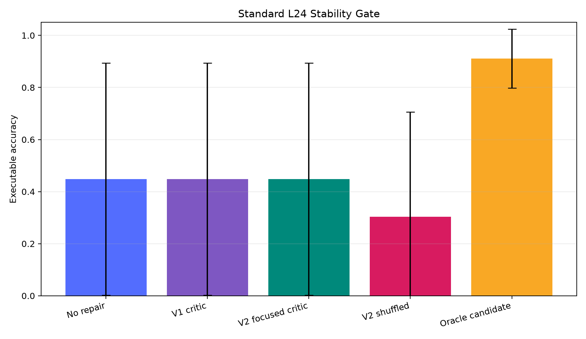
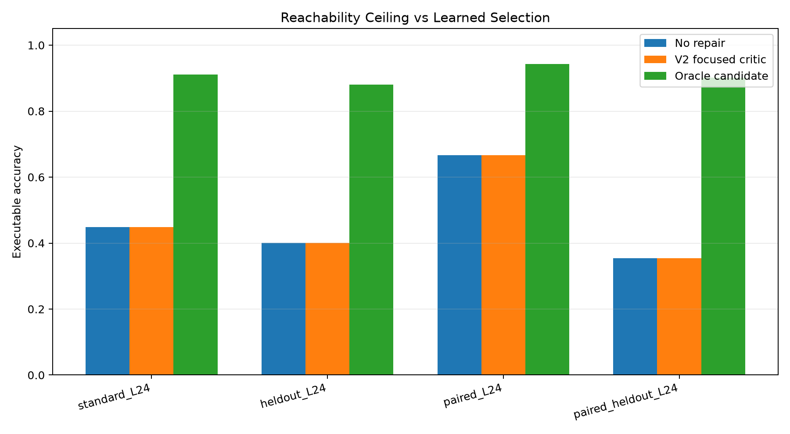
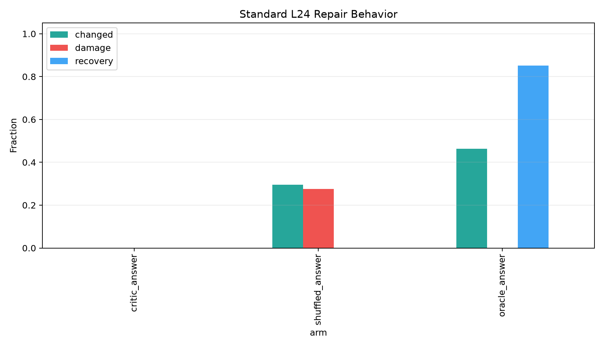
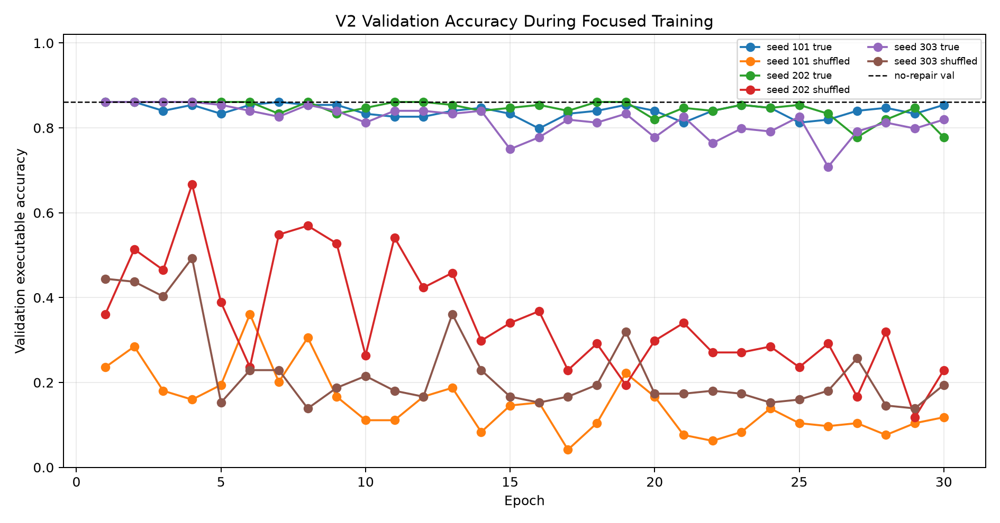

# Qwen Tail Repair Stability Critic Report

## Summary

This standalone experiment tested whether a learned tail-repair critic can stabilize length-24 executable modular programs. The result is a clear negative for the tested critic class.

The candidate set had a large oracle ceiling: on `standard_L24`, no repair achieved 44.8%, while the best answer-oracle candidate reached 91.1%. However, both learned critic variants selected the no-repair base program on every standard example selected by their best validation checkpoint. The stability gate failed: mean accuracy stayed at 44.8% and source-seed standard deviation stayed at 44.6%.

## Experimental Setup

Three frozen source compiler snapshots generated length-24 modular programs under modulus `97`. For each generated program, the experiment enumerated local edits in the last eight slots. Candidate labels were computed offline by exact execution, but learned critics could only use non-target features at selection time.

Two learned critic iterations were run:

- `v1_unweighted`: aggregate candidate features plus frozen Qwen context, trained on all groups with answer and state labels.
- `v2_focused`: adds explicit tail-slot candidate details and trains only the answer critic on a recovery-balanced subset, with checkpoint selection penalizing damage.

Controls:

- `base`: no repair.
- `oracle_answer`: highest-prior candidate that executes to the correct final answer.
- `oracle_state`: highest-prior candidate with exact state trajectory.
- `shuffled_answer` / `shuffled_state`: same training pipeline with randomized labels.

## Candidate Coverage

| split              |   groups |   avg_candidates | answer_positive_fraction   | state_positive_fraction   | base_executor_accuracy   |
|:-------------------|---------:|-----------------:|:---------------------------|:--------------------------|:-------------------------|
| heldout_L24        |      192 |              177 | 88.0%                      | 46.9%                     | 40.1%                    |
| paired_L24         |      192 |              177 | 94.3%                      | 67.7%                     | 66.7%                    |
| paired_heldout_L24 |      192 |              177 | 90.1%                      | 42.2%                     | 35.4%                    |
| paraphrase_L24     |      192 |              177 | 99.0%                      | 85.4%                     | 85.4%                    |
| standard_L24       |      192 |              177 | 91.1%                      | 50.0%                     | 44.8%                    |
| train_mixed_L24    |      480 |              177 | 98.8%                      | 89.2%                     | 88.5%                    |
| val_mixed_L24      |      144 |              177 | 97.2%                      | 86.1%                     | 86.1%                    |

The key fact is that coverage is not the bottleneck for final-answer repair: `standard_L24` has answer-positive candidates for 91.1% of groups. State-exact repair is harder at 50.0%, but still nontrivial.

## Stability Gate

| run_key       | arm             |   critic_seed |   source_seed_count | mean_executor_accuracy   | std_executor_accuracy   | min_executor_accuracy   | max_executor_accuracy   | mean_changed_fraction   | mean_damage_rate   | mean_recovery_rate   |
|:--------------|:----------------|--------------:|--------------------:|:-------------------------|:------------------------|:------------------------|:------------------------|:------------------------|:-------------------|:---------------------|
| v1_unweighted | base            |            -1 |                   3 | 44.8%                    | 44.6%                   | 1.6%                    | 90.6%                   | 0.0%                    | 0.0%               | 0.0%                 |
| v1_unweighted | critic_answer   |           101 |                   3 | 44.8%                    | 44.6%                   | 1.6%                    | 90.6%                   | 0.0%                    | 0.0%               | 0.0%                 |
| v1_unweighted | critic_answer   |           202 |                   3 | 44.8%                    | 44.6%                   | 1.6%                    | 90.6%                   | 0.0%                    | 0.0%               | 0.0%                 |
| v1_unweighted | critic_answer   |           303 |                   3 | 44.8%                    | 44.6%                   | 1.6%                    | 90.6%                   | 0.0%                    | 0.0%               | 0.0%                 |
| v1_unweighted | critic_state    |           101 |                   3 | 44.8%                    | 44.6%                   | 1.6%                    | 90.6%                   | 0.0%                    | 0.0%               | 0.0%                 |
| v1_unweighted | critic_state    |           202 |                   3 | 44.8%                    | 44.6%                   | 1.6%                    | 90.6%                   | 0.0%                    | 0.0%               | 0.0%                 |
| v1_unweighted | critic_state    |           303 |                   3 | 44.8%                    | 44.6%                   | 1.6%                    | 90.6%                   | 0.0%                    | 0.0%               | 0.0%                 |
| v1_unweighted | oracle_answer   |            -1 |                   3 | 91.1%                    | 11.3%                   | 78.1%                   | 98.4%                   | 46.4%                   | 0.0%               | 85.2%                |
| v1_unweighted | oracle_state    |            -1 |                   3 | 50.5%                    | 47.7%                   | 1.6%                    | 96.9%                   | 5.7%                    | 0.0%               | 28.5%                |
| v2_focused    | critic_answer   |           101 |                   3 | 44.8%                    | 44.6%                   | 1.6%                    | 90.6%                   | 0.0%                    | 0.0%               | 0.0%                 |
| v2_focused    | critic_answer   |           202 |                   3 | 44.8%                    | 44.6%                   | 1.6%                    | 90.6%                   | 0.0%                    | 0.0%               | 0.0%                 |
| v2_focused    | critic_answer   |           303 |                   3 | 44.8%                    | 44.6%                   | 1.6%                    | 90.6%                   | 0.0%                    | 0.0%               | 0.0%                 |
| v2_focused    | shuffled_answer |           101 |                   3 | 29.2%                    | 49.2%                   | 0.0%                    | 85.9%                   | 38.5%                   | 35.1%              | 0.0%                 |
| v2_focused    | shuffled_answer |           202 |                   3 | 44.8%                    | 44.6%                   | 1.6%                    | 90.6%                   | 0.0%                    | 0.0%               | 0.0%                 |
| v2_focused    | shuffled_answer |           303 |                   3 | 17.2%                    | 27.1%                   | 1.6%                    | 48.4%                   | 50.0%                   | 47.6%              | 0.0%                 |

The learned true-label critics did not improve mean accuracy or reduce spread. In v1, the selected true critics made zero changes. In v2, focused training learned to make edits during training, but the best validation checkpoint was still the no-change checkpoint for all three true critic seeds.

## Split Results

| split              | run_key       | arm             | mean_executor_accuracy   | std_executor_accuracy   | mean_changed_fraction   | mean_damage_rate   | mean_recovery_rate   |
|:-------------------|:--------------|:----------------|:-------------------------|:------------------------|:------------------------|:-------------------|:---------------------|
| standard_L24       | v1_unweighted | base            | 44.8%                    | 44.6%                   | 0.0%                    | 0.0%               | 0.0%                 |
| standard_L24       | v2_focused    | critic_answer   | 44.8%                    | 44.6%                   | 0.0%                    | 0.0%               | 0.0%                 |
| standard_L24       | v2_focused    | shuffled_answer | 30.4%                    | 40.3%                   | 29.5%                   | 27.6%              | 0.0%                 |
| standard_L24       | v1_unweighted | oracle_answer   | 91.1%                    | 11.3%                   | 46.4%                   | 0.0%               | 85.2%                |
| heldout_L24        | v1_unweighted | base            | 40.1%                    | 38.5%                   | 0.0%                    | 0.0%               | 0.0%                 |
| heldout_L24        | v2_focused    | critic_answer   | 40.1%                    | 38.5%                   | 0.0%                    | 0.0%               | 0.0%                 |
| heldout_L24        | v2_focused    | shuffled_answer | 31.2%                    | 35.5%                   | 43.2%                   | 36.6%              | 0.4%                 |
| heldout_L24        | v1_unweighted | oracle_answer   | 88.0%                    | 10.2%                   | 47.9%                   | 0.0%               | 82.5%                |
| paired_L24         | v1_unweighted | base            | 66.7%                    | 28.2%                   | 0.0%                    | 0.0%               | 0.0%                 |
| paired_L24         | v2_focused    | critic_answer   | 66.7%                    | 28.2%                   | 0.0%                    | 0.0%               | 0.0%                 |
| paired_L24         | v2_focused    | shuffled_answer | 41.3%                    | 37.7%                   | 36.6%                   | 42.2%              | 0.0%                 |
| paired_L24         | v1_unweighted | oracle_answer   | 94.3%                    | 7.4%                    | 27.6%                   | 0.0%               | 89.2%                |
| paired_heldout_L24 | v1_unweighted | base            | 35.4%                    | 34.0%                   | 0.0%                    | 0.0%               | 0.0%                 |
| paired_heldout_L24 | v2_focused    | critic_answer   | 35.4%                    | 34.0%                   | 0.0%                    | 0.0%               | 0.0%                 |
| paired_heldout_L24 | v2_focused    | shuffled_answer | 25.0%                    | 31.9%                   | 38.7%                   | 37.9%              | 0.2%                 |
| paired_heldout_L24 | v1_unweighted | oracle_answer   | 90.1%                    | 7.4%                    | 54.7%                   | 0.0%               | 86.6%                |

The oracle gap is large on every split. The learned focused critic does not close it.

## Repair Behavior

The v2 shuffled control is destructive, which confirms that the control is active. The true focused critic avoids that collapse, but it does so by falling back to no repair rather than by learning safe recovery. Later epochs make more edits, but validation accuracy falls because damage outpaces recovery.

## Interpretation

The experiment separates reachability from selection. Tail-local candidate enumeration can often recover the right final answer, especially on the weak source seeds. The learned critic tested here cannot reliably identify those recoveries from frozen context plus candidate features.

The failure is not that the tail-repair idea has no ceiling. The failure is that this critic is not grounded enough in the prompt-program relation. Aggregate features were insufficient, and even explicit tail-slot details plus recovery-focused training did not produce a deployable selector.

## Next Diagnostic

The next version should score each candidate with a real candidate-conditioned forward pass: prompt plus dense candidate program/trace representation into Qwen, then a scalar value head. The scorer needs to compare the concrete candidate program against the prompt, not infer correctness from summary statistics around the source compiler logits.

## Artifacts

- Experiment root: `/workspace/experiments/qwen_tail_repair_stability_critic/`
- Large artifacts: `/workspace/large_artifacts/qwen_tail_repair_stability_critic/`
- Main v1 run: `/workspace/experiments/qwen_tail_repair_stability_critic/runs/main_tail_repair_critic_v1/`
- Main v2 run: `/workspace/experiments/qwen_tail_repair_stability_critic/runs/main_tail_repair_critic_focus_v2/`
- Combined summary CSV: `/workspace/experiments/qwen_tail_repair_stability_critic/reports/combined_summary_by_source_seed.csv`
