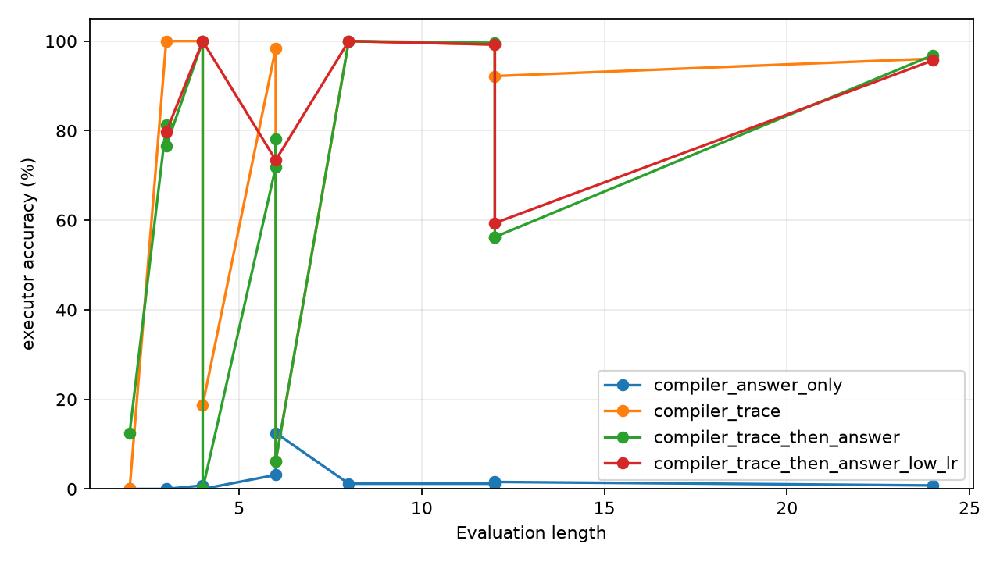
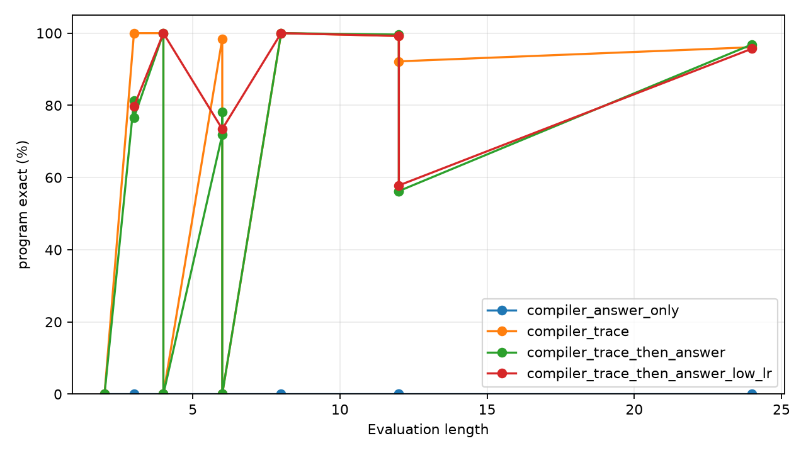

# Qwen Trace Bootstrap Retention

## Abstract

This experiment tests whether a structured latent program interface can be
installed with symbol-trace supervision and then retained when training
continues using only final-answer supervision. A frozen Qwen3.5-4B encoder
provides hidden states from modular arithmetic prompts. A small compiler reads
those hidden states, emits an initial value and per-step program symbols, and a
latent executor computes the final answer.

The main result is positive. After trace bootstrap on 1-4 step programs,
answer-only continuation on 1-8 step programs reaches 96.9% exact execution at
held-out length 24. A compiler trained from final answers only stays at 0.8%
at length 24, and a direct answer head stays at 0.4%. The result shows that
final-answer training can preserve and refine an already-installed latent
program interface, but does not discover that interface from scratch under this
setup.

## Task

Each prompt describes a value `x` modulo 97 and a sequence of operations:

```text
Initial x = 42.
Step: add 17.
Step: multiply by 3.
Step: subtract 5.
```

The target is the final value of `x`. The executor supports three operations:

- `ADD a`: set `x = x + a (mod 97)`.
- `SUB a`: set `x = x - a (mod 97)`.
- `MUL a`: set `x = x * a (mod 97)`.

Bootstrap training uses 1-4 step programs. Answer-only continuation uses 1-8
step programs. Evaluation uses held-out lengths 4, 8, 12, and 24.

## Model

Qwen3.5-4B is loaded in 4-bit and kept frozen. The trainable bridge reads
selected hidden states:

- the numeric token span for the initial value,
- the operation line prefix for each step,
- the numeric token span for each operation argument,
- the answer line for the direct-answer control.

The compiler predicts initial value logits over 97 residues, operation logits
over `ADD`, `SUB`, and `MUL`, and argument logits over 97 residues. During
training, a differentiable executor composes the predicted distributions. For
strict evaluation, the compiler output is argmaxed and executed exactly.

## Variants

- `direct`: direct answer classifier from frozen Qwen features.
- `compiler_answer_only`: latent compiler trained from final answer loss only.
- `compiler_trace`: latent compiler trained with trace supervision throughout.
- `compiler_trace_then_answer`: trace bootstrap followed by answer-only
  continuation.
- `compiler_trace_then_answer_low_lr`: same schedule with a lower learning
  rate during answer-only continuation.

## Results

The main run uses 1024 bootstrap examples and 1024 answer-continuation
examples. The answer-continuation stage removes all symbol-trace losses.

| Variant | L=4 exec | L=8 exec | L=12 exec | L=24 exec | L=24 mass | L=24 init | L=24 op | L=24 arg | L=24 program exact |
|---|---:|---:|---:|---:|---:|---:|---:|---:|---:|
| `direct` | 0.8% | 0.8% | 1.2% | 0.4% | n/a | n/a | n/a | n/a | n/a |
| `compiler_trace` | 100.0% | 100.0% | 99.2% | 96.1% | 94.2% | 100.0% | 99.8% | 100.0% | 96.1% |
| `compiler_answer_only` | 0.8% | 1.2% | 1.2% | 0.8% | 1.0% | 0.8% | 33.7% | 0.0% | 0.0% |
| `compiler_trace_then_answer` | 100.0% | 100.0% | 99.6% | 96.9% | 95.3% | 100.0% | 99.9% | 100.0% | 96.9% |
| `compiler_trace_then_answer_low_lr` | 100.0% | 100.0% | 99.2% | 95.7% | 92.8% | 100.0% | 99.8% | 100.0% | 95.7% |





## Retention Dynamics

The staged log shows what happens immediately after trace loss is removed.

| Variant | Stage | Step | L=24 exec | L=24 mass | L=24 op | L=24 arg |
|---|---|---:|---:|---:|---:|---:|
| `compiler_trace` | trace bootstrap | 800 | 85.2% | 82.4% | 99.3% | 100.0% |
| `compiler_trace` | trace continuation | 1600 | 96.1% | 94.2% | 99.8% | 100.0% |
| `compiler_trace_then_answer` | trace bootstrap | 800 | 87.1% | 83.5% | 99.4% | 100.0% |
| `compiler_trace_then_answer` | answer retention | 801 | 75.4% | 71.5% | 99.0% | 100.0% |
| `compiler_trace_then_answer` | answer retention | 1600 | 96.9% | 95.3% | 99.9% | 100.0% |
| `compiler_trace_then_answer_low_lr` | trace bootstrap | 800 | 87.1% | 83.5% | 99.4% | 100.0% |
| `compiler_trace_then_answer_low_lr` | answer retention | 801 | 89.8% | 85.5% | 99.6% | 100.0% |
| `compiler_trace_then_answer_low_lr` | answer retention | 1600 | 95.7% | 92.8% | 99.8% | 100.0% |

Normal-rate answer-only continuation causes an immediate long-chain drop, but
then recovers and finishes slightly above trace-throughout training at length
24. Low-rate continuation avoids the immediate drop and also retains the
interface, but finishes slightly lower.

## Interpretation

The central result is that final-answer supervision can maintain and refine a
latent executor interface once trace supervision has installed it. This is
different from discovering the interface from scratch: the answer-only compiler
does not learn initial values, arguments, or executable programs.

The comparison is also not explained by direct answer learning. The direct
answer head uses the same frozen Qwen features and remains at 97-way chance.
The gain comes from decomposing the task into compiled symbols and executing
those symbols with a fixed latent runtime.

At length 24, initial value and argument accuracy are exact in the successful
rows. Remaining errors are rare operation mistakes compounded over long
programs.

## Limitations

The task is synthetic modular arithmetic with standardized text templates. The
executor operation set is fixed in advance. The successful recipe uses direct
symbol traces during bootstrap. Qwen is frozen, so this experiment tests an
attached runtime and bridge rather than full language-model posttraining.

The result does not show broad intelligence improvement. It shows a concrete
training recipe: install a latent program interface with traces, then continue
training through final-answer supervision while preserving that interface.

## Artifact Layout

Lightweight code, metrics, figures, and reports live in:

```text
experiments/qwen_trace_bootstrap_retention/
```

Saved bridge checkpoints live separately in:

```text
large_artifacts/qwen_trace_bootstrap_retention/checkpoints/
```

The checkpoint manifest is:

```text
experiments/qwen_trace_bootstrap_retention/checkpoint_manifest.csv
```
