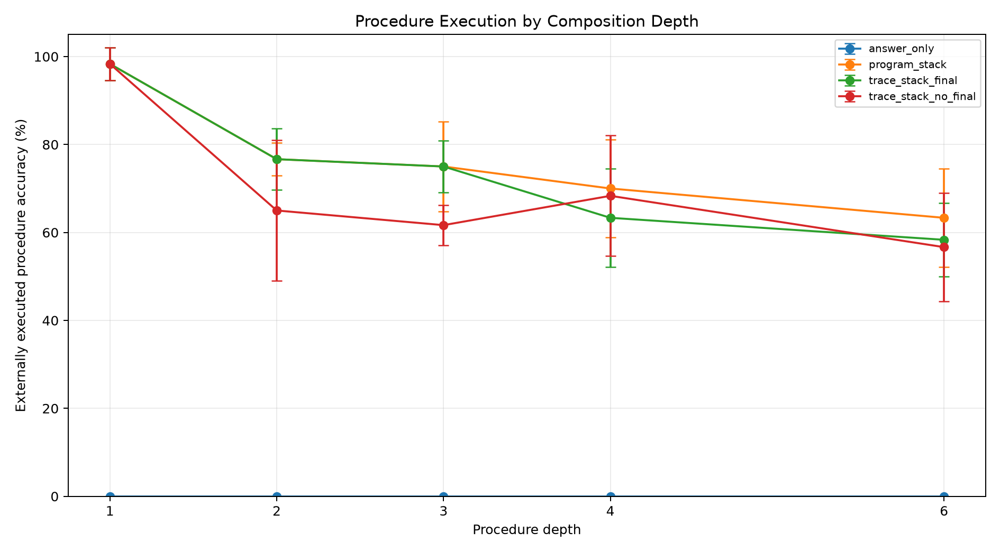
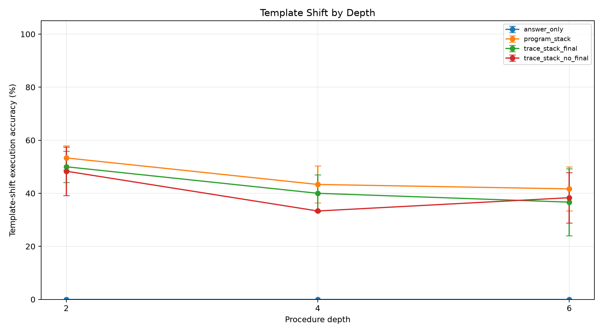
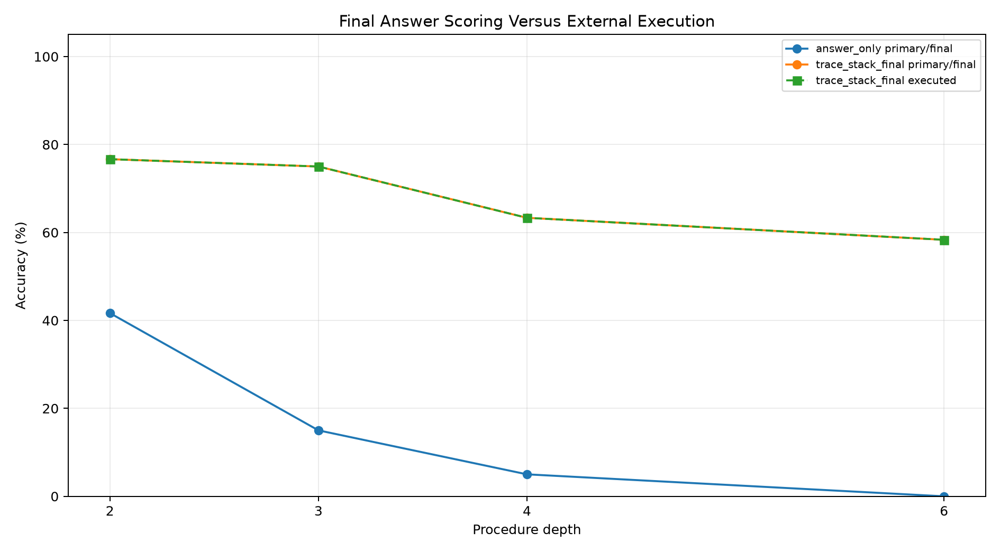
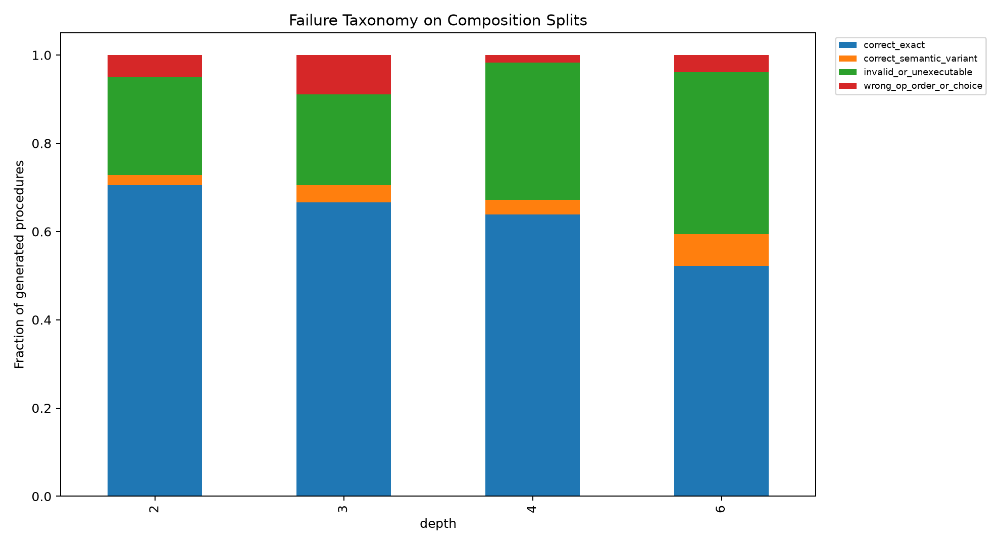
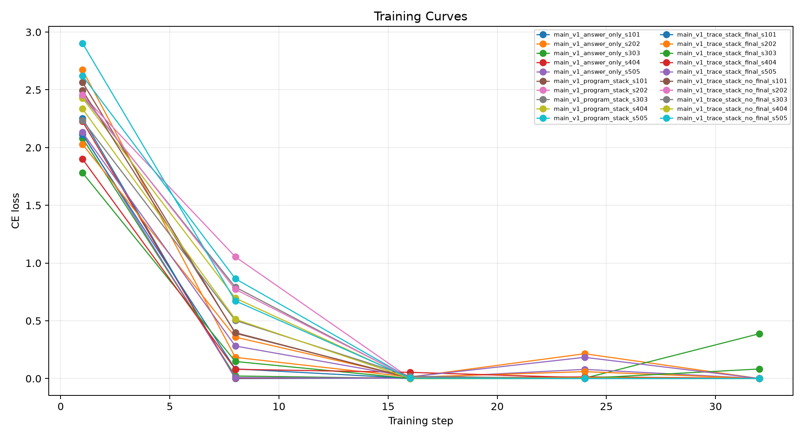

# Qwen Trace Procedure Depth Stress

## Abstract

This standalone experiment tests whether a local 4B model composes known primitives into executable procedures when trained only on atomic procedures. The primary score for procedure arms is external execution of the emitted stack program, not the model's own final answer.

## Method

Training examples contain one primitive operation. Evaluation sweeps held-out procedure depths 2, 3, 4, and 6, plus template-shifted prompts at depths 2, 4, and 6. The task families are string, number, table, date, list, and path transformations. Four arms are compared: `answer_only`, `trace_stack_final`, `trace_stack_no_final`, and `program_stack`.

The load-bearing distinction is compilation versus self-execution. `trace_stack_final` may emit a `FINAL` line, but its procedure is also parsed and executed by the interpreter. `trace_stack_no_final` tests the same numbered procedure format without answer supervision. `program_stack` tests compact raw instructions.

## Run Configuration

- Primary suite: `main`.
- Seeds: `101,202,303,404,505`.
- Evaluation examples across trained arms: `1920`.
- QLoRA update steps per adapter: `32`.
- Large adapters are stored outside the experiment tree.

## Primary Results

- Best held-out composition execution row: `program_stack` depth `2` at 76.7%.
- Compact program execution at depth 6: `program_stack` 63.3% with seed std 11.2%, versus `answer_only` final accuracy 0.0%.
- `trace_stack_final` depth-6 composition execution: 58.3% with seed std 8.3%.
- `trace_stack_final` depth-6 template-shift execution: 36.7%.
- Final-answer supervision comparison at depth 4: `trace_stack_final` execution 63.3%; `trace_stack_no_final` execution 68.3%.
- Template-shift depth-6 execution for `program_stack`: 41.7%, a 21.7% absolute drop from standard depth-6 composition.

|arm|split|depth|runs|n_total|primary_accuracy_mean|primary_accuracy_std|exec_accuracy_mean|exec_accuracy_std|valid_exec_rate_mean|final_accuracy_mean|no_final_rate_mean|exact_program_rate_mean|
|---|---|---|---|---|---|---|---|---|---|---|---|---|
|answer_only|eval_comp_d2|2|5|60|41.7%|10.2%|0.0%|0.0%|0.0%|41.7%|0.0%|0.0%|
|program_stack|eval_comp_d2|2|5|60|76.7%|3.7%|76.7%|3.7%|78.3%|0.0%|100.0%|75.0%|
|trace_stack_final|eval_comp_d2|2|5|60|76.7%|7.0%|76.7%|7.0%|80.0%|30.0%|0.0%|73.3%|
|trace_stack_no_final|eval_comp_d2|2|5|60|65.0%|16.0%|65.0%|16.0%|75.0%|0.0%|100.0%|63.3%|
|answer_only|eval_comp_d3|3|5|60|15.0%|7.0%|0.0%|0.0%|0.0%|15.0%|0.0%|0.0%|
|program_stack|eval_comp_d3|3|5|60|75.0%|10.2%|75.0%|10.2%|81.7%|0.0%|100.0%|68.3%|
|trace_stack_final|eval_comp_d3|3|5|60|75.0%|5.9%|75.0%|5.9%|83.3%|18.3%|0.0%|70.0%|
|trace_stack_no_final|eval_comp_d3|3|5|60|61.7%|4.6%|61.7%|4.6%|73.3%|0.0%|100.0%|61.7%|
|answer_only|eval_comp_d4|4|5|60|5.0%|7.5%|0.0%|0.0%|0.0%|5.0%|0.0%|0.0%|
|program_stack|eval_comp_d4|4|5|60|70.0%|11.2%|70.0%|11.2%|71.7%|0.0%|100.0%|63.3%|
|trace_stack_final|eval_comp_d4|4|5|60|63.3%|11.2%|63.3%|11.2%|63.3%|3.3%|0.0%|63.3%|
|trace_stack_no_final|eval_comp_d4|4|5|60|68.3%|13.7%|68.3%|13.7%|71.7%|0.0%|100.0%|65.0%|
|answer_only|eval_comp_d6|6|5|60|0.0%|0.0%|0.0%|0.0%|0.0%|0.0%|0.0%|0.0%|
|program_stack|eval_comp_d6|6|5|60|63.3%|11.2%|63.3%|11.2%|65.0%|0.0%|100.0%|60.0%|
|trace_stack_final|eval_comp_d6|6|5|60|58.3%|8.3%|58.3%|8.3%|63.3%|0.0%|0.0%|48.3%|
|trace_stack_no_final|eval_comp_d6|6|5|60|56.7%|12.4%|56.7%|12.4%|61.7%|0.0%|100.0%|48.3%|
|answer_only|eval_indist_d1|1|5|60|86.7%|12.6%|0.0%|0.0%|0.0%|86.7%|0.0%|0.0%|
|program_stack|eval_indist_d1|1|5|60|98.3%|3.7%|98.3%|3.7%|98.3%|0.0%|100.0%|98.3%|
|trace_stack_final|eval_indist_d1|1|5|60|98.3%|3.7%|98.3%|3.7%|100.0%|91.7%|0.0%|98.3%|
|trace_stack_no_final|eval_indist_d1|1|5|60|98.3%|3.7%|98.3%|3.7%|98.3%|0.0%|100.0%|96.7%|
|answer_only|eval_template_d2|2|5|60|45.0%|12.6%|0.0%|0.0%|0.0%|45.0%|0.0%|0.0%|
|program_stack|eval_template_d2|2|5|60|53.3%|4.6%|53.3%|4.6%|56.7%|0.0%|100.0%|46.7%|
|trace_stack_final|eval_template_d2|2|5|60|50.0%|5.9%|50.0%|5.9%|53.3%|40.0%|0.0%|43.3%|
|trace_stack_no_final|eval_template_d2|2|5|60|48.3%|9.1%|48.3%|9.1%|58.3%|0.0%|100.0%|43.3%|
|answer_only|eval_template_d4|4|5|60|3.3%|7.5%|0.0%|0.0%|0.0%|3.3%|0.0%|0.0%|
|program_stack|eval_template_d4|4|5|60|43.3%|7.0%|43.3%|7.0%|45.0%|0.0%|100.0%|40.0%|
|trace_stack_final|eval_template_d4|4|5|60|40.0%|7.0%|40.0%|7.0%|41.7%|8.3%|1.7%|35.0%|
|trace_stack_no_final|eval_template_d4|4|5|60|33.3%|0.0%|33.3%|0.0%|43.3%|0.0%|100.0%|31.7%|
|answer_only|eval_template_d6|6|5|60|1.7%|3.7%|0.0%|0.0%|0.0%|1.7%|0.0%|0.0%|
|program_stack|eval_template_d6|6|5|60|41.7%|8.3%|41.7%|8.3%|41.7%|0.0%|100.0%|36.7%|
|trace_stack_final|eval_template_d6|6|5|60|36.7%|12.6%|36.7%|12.6%|38.3%|0.0%|11.7%|30.0%|
|trace_stack_no_final|eval_template_d6|6|5|60|38.3%|9.5%|38.3%|9.5%|41.7%|0.0%|100.0%|33.3%|

## Interpretation

A real compiler result should degrade gradually with depth rather than collapse immediately once procedure length exceeds the atomic training distribution. A gap between `trace_stack_final` execution and final-answer accuracy means the model can emit a correct procedure while failing to self-execute it. A gap between standard composition and template-shift composition localizes the remaining problem to language grounding rather than procedure sequencing.
The main result is positive: training only on atomic procedures still produced executable depth-6 compositions at 63.3% for the compact raw stack ABI, while answer-only scoring was 0.0%. This is not a self-execution win; it is a compiler win, because the deterministic interpreter supplies the execution.
The final-answer confound persists at the hardest standard composition split: `trace_stack_final` executed correctly at 58.3% but its emitted final answer was correct at 0.0%.
Removing the final-answer line did not kill procedure learning: `trace_stack_no_final` reached 56.7% at depth 6. Final-answer supervision is therefore not required for the basic compiler effect, though arm ranking varies by depth and template split.
The remaining major weakness is prompt wording. `program_stack` falls from 63.3% on standard depth-6 composition to 41.7% under template shift, so the next bottleneck is language grounding into the ABI, not deterministic execution.
For `trace_stack_final` on composition splits, generated procedures break down as: correct_exact 58.0%, invalid_or_unexecutable 33.7%, wrong_op_order_or_choice 4.5%, correct_semantic_variant 3.8%.

## Limitations

This experiment tests composition over a fixed known primitive library. It does not test invention of new operations outside the ABI. The families are synthetic but selected to cover several common deterministic task shapes.

## Artifacts

- Metrics: `analysis/summary_by_arm.csv` and `analysis/all_metrics.csv`
- Details: `analysis/all_details.csv`
- Training logs: `analysis/all_train_logs.csv`
- Checkpoints: `/workspace/large_artifacts/qwen_trace_procedure_depth_stress/checkpoints`
