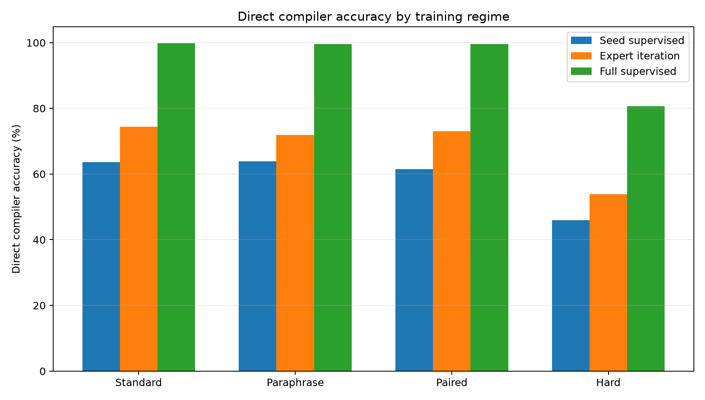
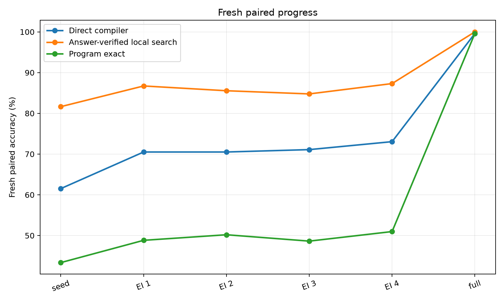
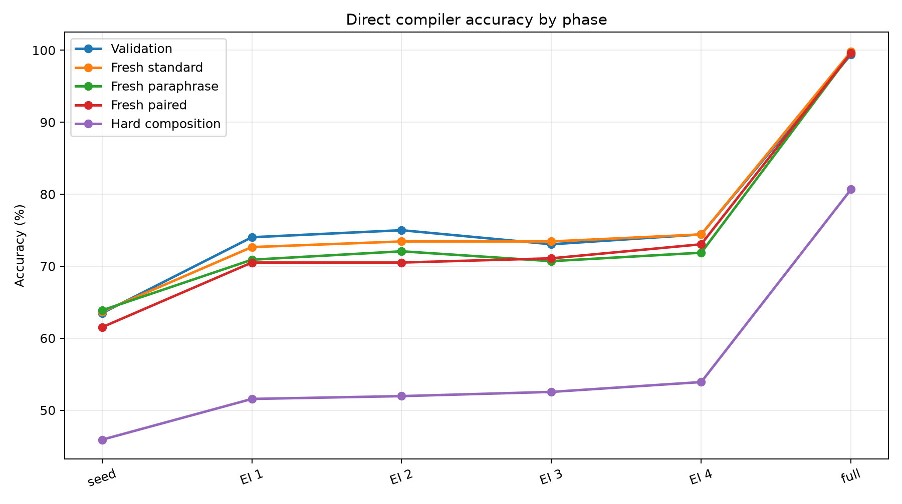
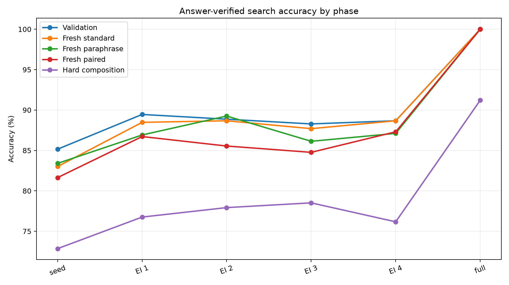
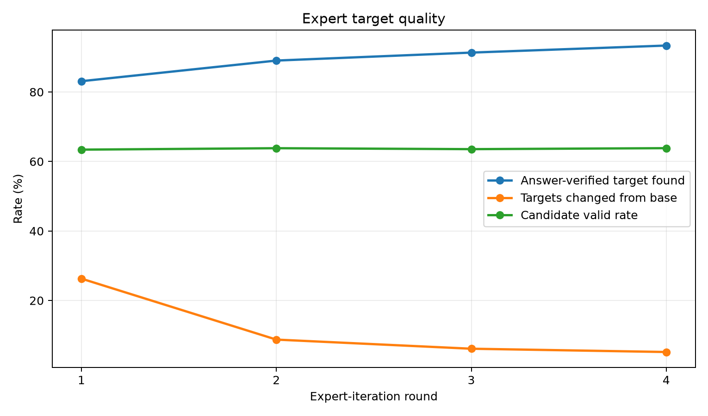
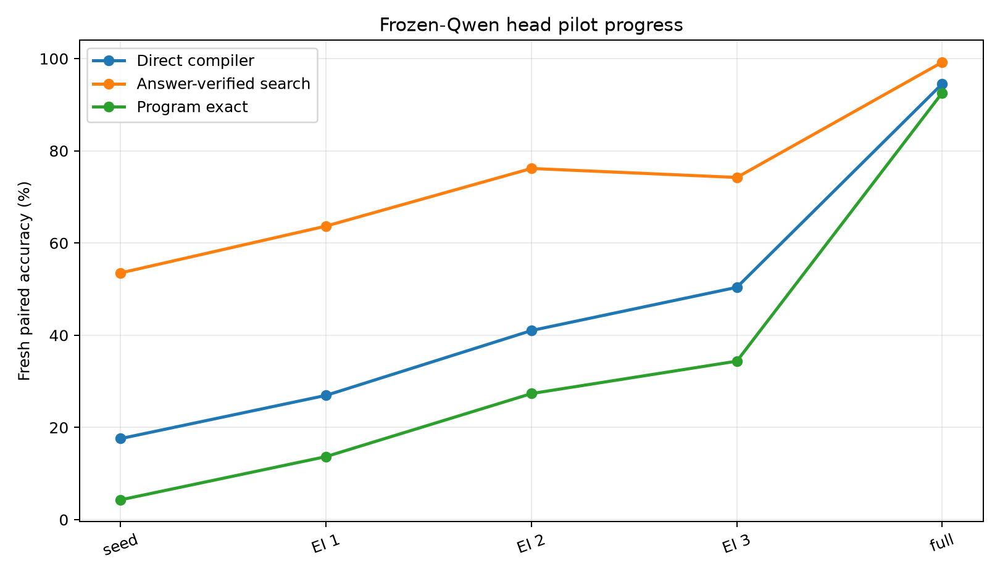

# Qwen Typed Bytecode Expert Iteration

## Abstract

This experiment tests a typed-bytecode posttraining recipe in a controlled text-to-program compiler. A compact transformer reads natural-language prompts and emits a fixed-length typed stack-machine program. The bytecode is validated and executed by an exact interpreter. The main question is whether answer-verified local search can create useful expert-iteration targets, and how that compares with dense supervised bytecode traces.

The primary run trained a seed compiler on 384 gold bytecode traces, then ran four rounds of answer-verified expert iteration over 4,096 generated training prompts. A separate full-supervised ceiling trained on 4,096 gold traces. On fresh paired prompts, the seed compiler reached 61.5%; expert iteration reached 73.0%; dense full supervision reached 99.6%.

## Setup

- Runtime: exact typed stack-machine bytecode over bounded i32 values modulo 97.
- Opcodes: `PUSH`, arithmetic, comparisons, min/max, two lookup host calls, `END`, and `PAD`.
- Domains: modular arithmetic, calendar offsets, unit scaling, list aggregation, boolean thresholds, and table lookup.
- Compiler: compact transformer encoder/decoder over tokenized prompts and fixed program slots.
- Qwen-attached pilot: frozen `Qwen/Qwen3-4B` hidden states with a trainable bytecode compiler head.
- Expert iteration: local candidates are generated from compiler logits, executed, and accepted as training targets when their final answer matches the task answer.
- Primary run: `main_typed_bytecode_ei_s384_u4096`.

## Main Results

| Training regime | Split | Direct | Search | Program exact | Target found |
| --- | --- | --- | --- | --- | --- |
| Seed supervised | Fresh standard | 63.7% | 83.0% | 49.8% | 83.0% |
| Seed supervised | Fresh paraphrase | 63.9% | 83.4% | 50.4% | 83.4% |
| Seed supervised | Fresh paired | 61.5% | 81.6% | 43.4% | 81.6% |
| Seed supervised | Hard composition | 45.9% | 72.9% | 35.5% | 72.9% |
| Expert iteration R4 | Fresh standard | 74.4% | 88.7% | 56.2% | 88.7% |
| Expert iteration R4 | Fresh paraphrase | 71.9% | 87.1% | 56.1% | 87.1% |
| Expert iteration R4 | Fresh paired | 73.0% | 87.3% | 51.0% | 87.3% |
| Expert iteration R4 | Hard composition | 53.9% | 76.2% | 39.5% | 76.2% |
| Full supervised | Fresh standard | 99.8% | 100.0% | 99.6% | 100.0% |
| Full supervised | Fresh paraphrase | 99.6% | 100.0% | 99.6% | 100.0% |
| Full supervised | Fresh paired | 99.6% | 100.0% | 99.6% | 100.0% |
| Full supervised | Hard composition | 80.7% | 91.2% | 72.3% | 91.2% |

## Expert-Iteration Curve

Answer-verified expert iteration produced a real deployable improvement, not just a search-time improvement. The same trained compiler is evaluated directly after each round.

## Search Headroom

Local answer-verified search remained substantially stronger than direct decoding through the expert-iteration rounds, which means the compiler still leaves repairable mistakes on the table.

## Target Quality

| Round | Targets | Found | Changed | Candidates | Valid candidates |
| --- | --- | --- | --- | --- | --- |
| 1 | 3404 | 83.1% | 26.3% | 241.0 | 63.4% |
| 2 | 3647 | 89.0% | 8.7% | 241.0 | 63.8% |
| 3 | 3741 | 91.3% | 6.1% | 240.9 | 63.5% |
| 4 | 3824 | 93.4% | 5.2% | 240.9 | 63.8% |

## Frozen-Qwen Attached Pilot

A companion pilot attached the same bytecode head to frozen `Qwen/Qwen3-4B` token hidden states. Only the bytecode head was trained; Qwen itself was not LoRA-tuned in this run. This checks whether the method still has signal when the text front end is a real 4B model representation.

| Training regime | Split | Direct | Search | Program exact | Target found |
| --- | --- | --- | --- | --- | --- |
| Qwen seed | Fresh standard | 21.9% | 56.2% | 6.6% | 56.2% |
| Qwen seed | Fresh paraphrase | 16.0% | 53.1% | 3.5% | 53.1% |
| Qwen seed | Fresh paired | 17.6% | 53.5% | 4.3% | 53.5% |
| Qwen seed | Hard composition | 16.4% | 57.4% | 5.5% | 57.4% |
| Qwen expert iteration R3 | Fresh standard | 48.8% | 77.7% | 30.9% | 77.7% |
| Qwen expert iteration R3 | Fresh paraphrase | 43.8% | 76.2% | 27.7% | 76.2% |
| Qwen expert iteration R3 | Fresh paired | 50.4% | 74.2% | 34.4% | 74.2% |
| Qwen expert iteration R3 | Hard composition | 40.6% | 75.4% | 26.6% | 75.4% |
| Qwen full supervised | Fresh standard | 94.1% | 98.0% | 92.2% | 98.0% |
| Qwen full supervised | Fresh paraphrase | 96.1% | 99.6% | 94.5% | 99.6% |
| Qwen full supervised | Fresh paired | 94.5% | 99.2% | 92.6% | 99.2% |
| Qwen full supervised | Hard composition | 75.8% | 91.4% | 63.7% | 91.4% |

Qwen-head target quality:

| Round | Targets | Found | Changed | Candidates | Valid candidates |
| --- | --- | --- | --- | --- | --- |
| 1 | 1103 | 53.9% | 66.4% | 241.0 | 64.0% |
| 2 | 1365 | 66.7% | 50.5% | 241.0 | 63.9% |
| 3 | 1621 | 79.2% | 34.6% | 241.0 | 64.4% |

## Interpretation

The result is positive for the typed-bytecode substrate and mixed for answer-only expert iteration. Dense bytecode traces are extremely effective: full supervision nearly saturates fresh standard, paraphrase, and paired splits. Expert iteration also helps, moving the seed compiler upward on every fresh split, but it does not approach the dense-trace ceiling. The frozen-Qwen pilot shows the same qualitative pattern: expert iteration improves the trainable Qwen-attached head, while dense bytecode supervision remains much stronger. This suggests that the next method improvement should focus on stronger process verification, multi-input consistency, or prefix-level search targets rather than merely increasing the number of final-answer-verified candidates.

The hard-composition split is the useful warning. Full supervision reached high but not saturated hard accuracy, while expert iteration improved less. This means the bytecode ABI is learnable, but longer or more compositional programs still need either more trace coverage or a better search/value loop.

## Limitations

- The primary controlled run uses a compact transformer compiler; the separate Qwen-attached pilot trains only a head on frozen Qwen hidden states, not Qwen LoRA weights.
- The tasks are generated and bounded; they are not open-ended natural language reasoning tasks.
- Answer verification uses known task answers during training-target construction.
- Local search is slot-neighborhood search, not full program synthesis.
- Final-answer verification can accept accidental programs that compute the right scalar answer without matching the intended program.

## Artifacts

Small files:

- `experiments/qwen_typed_bytecode_expert_iteration/runs/main_typed_bytecode_ei_s384_u4096/metrics.csv`
- `experiments/qwen_typed_bytecode_expert_iteration/runs/main_typed_bytecode_ei_s384_u4096/train_log.csv`
- `experiments/qwen_typed_bytecode_expert_iteration/runs/main_typed_bytecode_ei_s384_u4096/expert_targets.csv`
- `experiments/qwen_typed_bytecode_expert_iteration/runs/qwen_head_pilot_s384_u2048/metrics.csv`
- `experiments/qwen_typed_bytecode_expert_iteration/runs/qwen_head_pilot_s384_u2048/expert_targets.csv`
- `experiments/qwen_typed_bytecode_expert_iteration/analysis/final_metrics.csv`
- `experiments/qwen_typed_bytecode_expert_iteration/analysis/summary.md`
- `experiments/qwen_typed_bytecode_expert_iteration/reports/qwen_typed_bytecode_expert_iteration_paper.md`
- `experiments/qwen_typed_bytecode_expert_iteration/reports/qwen_typed_bytecode_expert_iteration_paper.html`

Large files:

- `large_artifacts/qwen_typed_bytecode_expert_iteration/checkpoints/main_typed_bytecode_ei_s384_u4096/`
- `large_artifacts/qwen_typed_bytecode_expert_iteration/checkpoints/qwen_head_pilot_s384_u2048/`
