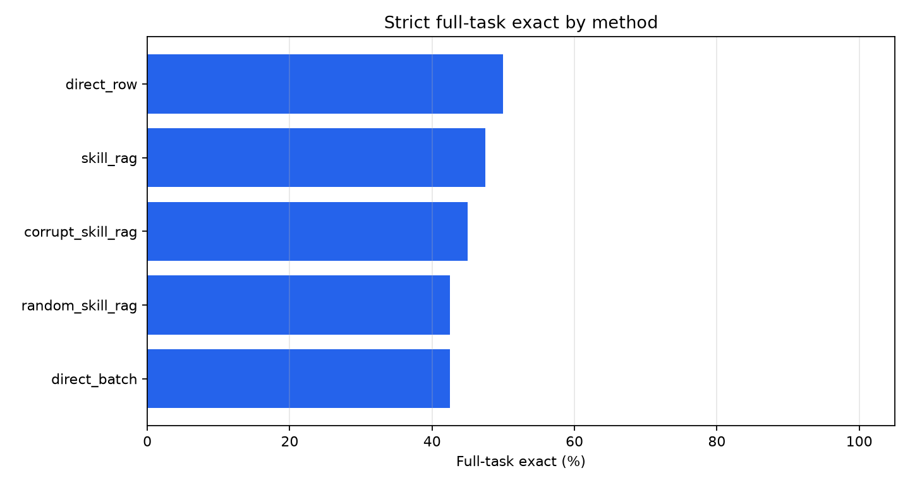
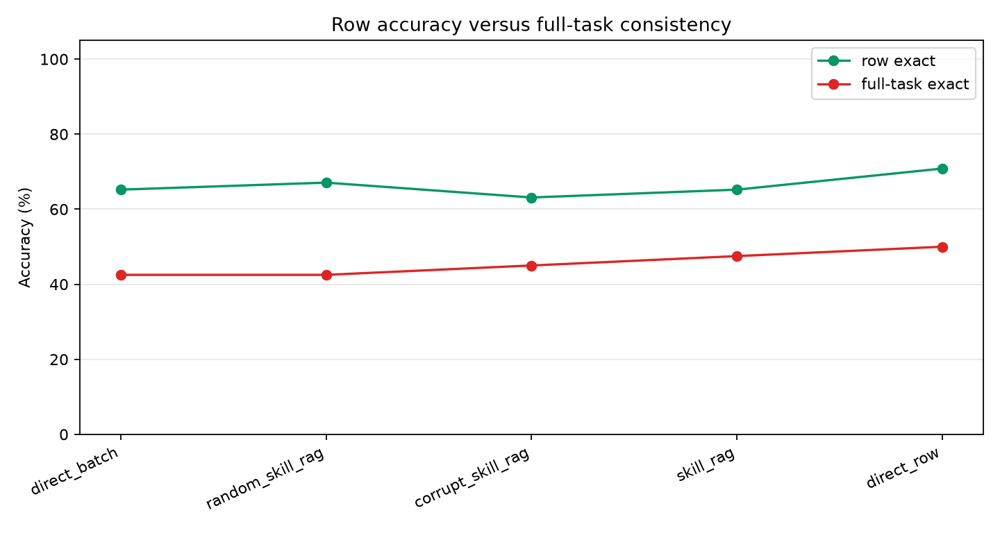
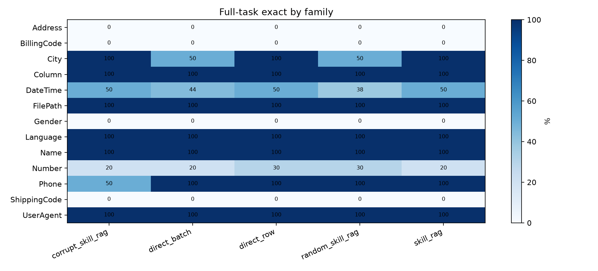
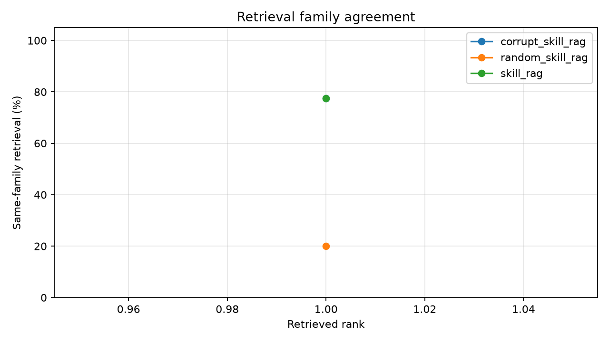
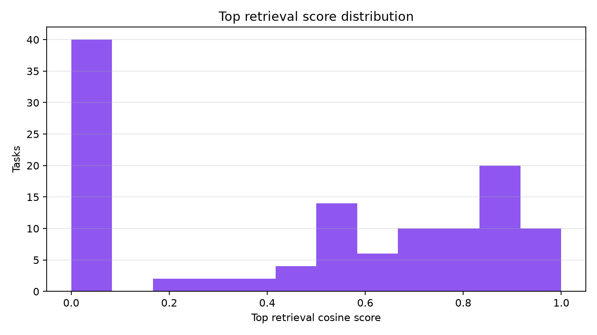
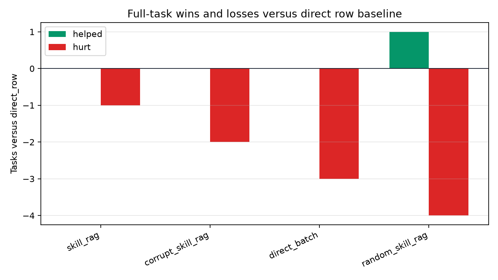

# Verified Skill Memory RAG

## Question

Can a frozen language model solve text-transformation tasks more consistently when it retrieves analogous verified transformation skills from a train-only memory?

The experiment evaluates strict full-task exact: a task is correct only if every held-out row is exactly correct.

## Setup

- Dataset root: `/workspace/large_artifacts/qwen_verified_skill_memory_rag/prose-benchmarks`
- Run: `main_qwen_skill_memory_40_top1`
- Model: `Qwen/Qwen3-4B`
- Evaluation tasks: 40
- Memory tasks: 269
- Retrieved skills per task: 1
- Skill-card examples: 4
- Train examples per target task: 4
- Held-out cap per task: 6
- Generation rows: 364

## Main Result

|method|tasks|row_exact|full_task_exact|parse_ok|avg_outputs|
|---|---|---|---|---|---|
|direct_row|40|70.8%|50.0%|100.0%|5.100|
|skill_rag|40|65.2%|47.5%|100.0%|5.100|
|corrupt_skill_rag|40|63.1%|45.0%|100.0%|5.100|
|direct_batch|40|65.2%|42.5%|95.0%|5.100|
|random_skill_rag|40|67.1%|42.5%|100.0%|5.100|

## Interpretation

The retrieved-skill method changes strict full-task exact by -2.5 points relative to row-by-row direct inference and by 5.0 points relative to direct batched inference.

The random-skill control scores 42.5% full-task exact and the corrupted-skill control scores 45.0%. A retrieval-memory gain is only meaningful if `skill_rag` beats both controls and the direct baselines.

This run is negative for the tested retrieval-memory mechanism. Top-1 retrieval found a same-family verified skill 77.5% of the time, so the retriever was not random, but `skill_rag` helped 0 tasks and hurt 1 task relative to row-by-row direct inference. The failure is therefore not retrieval failure alone; adding a verified analogous skill card did not reliably improve the model's target transformation.

## Charts

## Deltas Versus Direct Row Baseline

|method|tasks|full_task_delta|row_exact_delta|tasks_helped|tasks_hurt|tasks_tied|
|---|---|---|---|---|---|---|
|skill_rag|40|-2.5%|-5.6%|0|1|39|
|corrupt_skill_rag|40|-5.0%|-7.7%|0|2|38|
|direct_batch|40|-7.5%|-5.6%|0|3|37|
|random_skill_rag|40|-7.5%|-3.7%|1|4|35|

## Retrieval Diagnostics

|method|rank|mean_score|same_family|
|---|---|---|---|
|corrupt_skill_rag|1|0.714|77.5%|
|random_skill_rag|1|0.000|20.0%|
|skill_rag|1|0.714|77.5%|

## Task Details

|task_id|family|method|row_exact|full_task_exact|parse_ok|parse_status|output_count|
|---|---|---|---|---|---|---|---|
|Address.000002|Address|corrupt_skill_rag|33.3%|False|True|ok|3|
|Address.000013|Address|corrupt_skill_rag|66.7%|False|True|ok|6|
|BillingCode.000007|BillingCode|corrupt_skill_rag|0.0%|False|True|ok|3|
|City.000010|City|corrupt_skill_rag|100.0%|True|True|ok|3|
|City.000011|City|corrupt_skill_rag|100.0%|True|True|ok|4|
|Column.000001|Column|corrupt_skill_rag|100.0%|True|True|ok|6|
|DateTime.000004|DateTime|corrupt_skill_rag|100.0%|True|True|ok|6|
|DateTime.000007|DateTime|corrupt_skill_rag|100.0%|True|True|ok|6|
|DateTime.000017|DateTime|corrupt_skill_rag|66.7%|False|True|ok|6|
|DateTime.000025|DateTime|corrupt_skill_rag|100.0%|True|True|ok|6|
|DateTime.000027|DateTime|corrupt_skill_rag|66.7%|False|True|ok|6|
|DateTime.000034|DateTime|corrupt_skill_rag|100.0%|True|True|ok|6|
|DateTime.000051|DateTime|corrupt_skill_rag|0.0%|False|True|ok|3|
|DateTime.000076|DateTime|corrupt_skill_rag|83.3%|False|True|ok|6|
|DateTime.000081|DateTime|corrupt_skill_rag|66.7%|False|True|ok|6|
|DateTime.000094|DateTime|corrupt_skill_rag|100.0%|True|True|ok|4|
|DateTime.000104|DateTime|corrupt_skill_rag|100.0%|True|True|ok|6|
|DateTime.000108|DateTime|corrupt_skill_rag|100.0%|True|True|ok|6|
|DateTime.000111|DateTime|corrupt_skill_rag|100.0%|True|True|ok|6|
|DateTime.000114|DateTime|corrupt_skill_rag|0.0%|False|True|ok|6|
|DateTime.000115|DateTime|corrupt_skill_rag|0.0%|False|True|ok|6|
|DateTime.000116|DateTime|corrupt_skill_rag|50.0%|False|True|ok|6|
|FilePath.000001|FilePath|corrupt_skill_rag|100.0%|True|True|ok|6|
|Gender.000001|Gender|corrupt_skill_rag|0.0%|False|True|ok|3|
|Language.000002|Language|corrupt_skill_rag|100.0%|True|True|ok|6|
|Name.000028|Name|corrupt_skill_rag|100.0%|True|True|ok|6|
|Number.000008|Number|corrupt_skill_rag|16.7%|False|True|ok|6|
|Number.000015|Number|corrupt_skill_rag|0.0%|False|True|ok|6|
|Number.000016|Number|corrupt_skill_rag|33.3%|False|True|ok|6|
|Number.000022|Number|corrupt_skill_rag|33.3%|False|True|ok|6|
|Number.000028|Number|corrupt_skill_rag|100.0%|True|True|ok|3|
|Number.000029|Number|corrupt_skill_rag|66.7%|False|True|ok|3|
|Number.000043|Number|corrupt_skill_rag|100.0%|True|True|ok|6|
|Number.000049|Number|corrupt_skill_rag|25.0%|False|True|ok|4|
|Number.000075|Number|corrupt_skill_rag|50.0%|False|True|ok|6|
|Number.000077|Number|corrupt_skill_rag|0.0%|False|True|ok|3|
|Phone.000008|Phone|corrupt_skill_rag|100.0%|True|True|ok|6|
|Phone.000011|Phone|corrupt_skill_rag|66.7%|False|True|ok|3|
|ShippingCode.000008|ShippingCode|corrupt_skill_rag|0.0%|False|True|ok|3|
|UserAgent.000003|UserAgent|corrupt_skill_rag|100.0%|True|True|ok|6|
|Address.000002|Address|direct_batch|33.3%|False|True|ok|3|
|Address.000013|Address|direct_batch|66.7%|False|True|ok|6|
|BillingCode.000007|BillingCode|direct_batch|0.0%|False|True|ok|3|
|City.000010|City|direct_batch|100.0%|True|True|ok|3|
|City.000011|City|direct_batch|75.0%|False|True|ok|4|
|Column.000001|Column|direct_batch|100.0%|True|True|ok|6|
|DateTime.000004|DateTime|direct_batch|100.0%|True|True|ok|6|
|DateTime.000007|DateTime|direct_batch|100.0%|True|True|ok|6|
|DateTime.000017|DateTime|direct_batch|83.3%|False|True|ok|6|
|DateTime.000025|DateTime|direct_batch|100.0%|True|True|ok|6|
|DateTime.000027|DateTime|direct_batch|66.7%|False|True|ok|6|
|DateTime.000034|DateTime|direct_batch|100.0%|True|True|ok|6|
|DateTime.000051|DateTime|direct_batch|0.0%|False|True|ok|3|
|DateTime.000076|DateTime|direct_batch|66.7%|False|True|ok|6|
|DateTime.000081|DateTime|direct_batch|0.0%|False|True|ok|6|
|DateTime.000094|DateTime|direct_batch|100.0%|True|True|ok|4|
|DateTime.000104|DateTime|direct_batch|100.0%|True|True|ok|6|
|DateTime.000108|DateTime|direct_batch|100.0%|True|True|ok|6|
|DateTime.000111|DateTime|direct_batch|83.3%|False|True|ok|6|
|DateTime.000114|DateTime|direct_batch|33.3%|False|True|ok|6|
|DateTime.000115|DateTime|direct_batch|0.0%|False|True|ok|6|
|DateTime.000116|DateTime|direct_batch|50.0%|False|True|ok|6|
|FilePath.000001|FilePath|direct_batch|100.0%|True|True|ok|6|
|Gender.000001|Gender|direct_batch|66.7%|False|True|ok|3|
|Language.000002|Language|direct_batch|100.0%|True|True|ok|6|
|Name.000028|Name|direct_batch|100.0%|True|True|ok|6|
|Number.000008|Number|direct_batch|16.7%|False|True|ok|6|
|Number.000015|Number|direct_batch|66.7%|False|True|ok|6|
|Number.000016|Number|direct_batch|0.0%|False|False|parse_fail|6|
|Number.000022|Number|direct_batch|33.3%|False|True|ok|6|
|Number.000028|Number|direct_batch|100.0%|True|True|ok|3|
|Number.000029|Number|direct_batch|0.0%|False|True|ok|3|
|Number.000043|Number|direct_batch|100.0%|True|True|ok|6|
|Number.000049|Number|direct_batch|0.0%|False|False|parse_fail|4|
|Number.000075|Number|direct_batch|66.7%|False|True|ok|6|
|Number.000077|Number|direct_batch|66.7%|False|True|ok|3|
|Phone.000008|Phone|direct_batch|100.0%|True|True|ok|6|
|Phone.000011|Phone|direct_batch|100.0%|True|True|ok|3|
|ShippingCode.000008|ShippingCode|direct_batch|33.3%|False|True|ok|3|
|UserAgent.000003|UserAgent|direct_batch|100.0%|True|True|ok|6|
|Address.000002|Address|direct_row|33.3%|False|True|row_clean|3|
|Address.000013|Address|direct_row|66.7%|False|True|row_clean|6|
|BillingCode.000007|BillingCode|direct_row|33.3%|False|True|row_clean|3|
|City.000010|City|direct_row|100.0%|True|True|row_clean|3|
|City.000011|City|direct_row|100.0%|True|True|row_clean|4|
|Column.000001|Column|direct_row|100.0%|True|True|row_clean|6|
|DateTime.000004|DateTime|direct_row|100.0%|True|True|row_clean|6|
|DateTime.000007|DateTime|direct_row|100.0%|True|True|row_clean|6|
|DateTime.000017|DateTime|direct_row|66.7%|False|True|row_clean|6|
|DateTime.000025|DateTime|direct_row|100.0%|True|True|row_clean|6|
|DateTime.000027|DateTime|direct_row|33.3%|False|True|row_clean|6|
|DateTime.000034|DateTime|direct_row|100.0%|True|True|row_clean|6|
|DateTime.000051|DateTime|direct_row|33.3%|False|True|row_clean|3|
|DateTime.000076|DateTime|direct_row|50.0%|False|True|row_clean|6|
|DateTime.000081|DateTime|direct_row|50.0%|False|True|row_clean|6|
|DateTime.000094|DateTime|direct_row|100.0%|True|True|row_clean|4|
|DateTime.000104|DateTime|direct_row|100.0%|True|True|row_clean|6|
|DateTime.000108|DateTime|direct_row|100.0%|True|True|row_clean|6|
|DateTime.000111|DateTime|direct_row|100.0%|True|True|row_clean|6|
|DateTime.000114|DateTime|direct_row|0.0%|False|True|row_clean|6|
|DateTime.000115|DateTime|direct_row|0.0%|False|True|row_clean|6|
|DateTime.000116|DateTime|direct_row|50.0%|False|True|row_clean|6|
|FilePath.000001|FilePath|direct_row|100.0%|True|True|row_clean|6|
|Gender.000001|Gender|direct_row|66.7%|False|True|row_clean|3|
|Language.000002|Language|direct_row|100.0%|True|True|row_clean|6|
|Name.000028|Name|direct_row|100.0%|True|True|row_clean|6|
|Number.000008|Number|direct_row|33.3%|False|True|row_clean|6|
|Number.000015|Number|direct_row|33.3%|False|True|row_clean|6|
|Number.000016|Number|direct_row|66.7%|False|True|row_clean|6|
|Number.000022|Number|direct_row|100.0%|True|True|row_clean|6|
|Number.000028|Number|direct_row|100.0%|True|True|row_clean|3|
|Number.000029|Number|direct_row|33.3%|False|True|row_clean|3|
|Number.000043|Number|direct_row|100.0%|True|True|row_clean|6|
|Number.000049|Number|direct_row|50.0%|False|True|row_clean|4|
|Number.000075|Number|direct_row|66.7%|False|True|row_clean|6|
|Number.000077|Number|direct_row|33.3%|False|True|row_clean|3|
|Phone.000008|Phone|direct_row|100.0%|True|True|row_clean|6|
|Phone.000011|Phone|direct_row|100.0%|True|True|row_clean|3|
|ShippingCode.000008|ShippingCode|direct_row|33.3%|False|True|row_clean|3|
|UserAgent.000003|UserAgent|direct_row|100.0%|True|True|row_clean|6|
|Address.000002|Address|random_skill_rag|33.3%|False|True|ok|3|
|Address.000013|Address|random_skill_rag|66.7%|False|True|ok|6|
|BillingCode.000007|BillingCode|random_skill_rag|33.3%|False|True|ok|3|
|City.000010|City|random_skill_rag|100.0%|True|True|ok|3|
|City.000011|City|random_skill_rag|50.0%|False|True|ok|4|
|Column.000001|Column|random_skill_rag|100.0%|True|True|ok|6|
|DateTime.000004|DateTime|random_skill_rag|100.0%|True|True|ok|6|
|DateTime.000007|DateTime|random_skill_rag|100.0%|True|True|ok|6|
|DateTime.000017|DateTime|random_skill_rag|83.3%|False|True|ok|6|
|DateTime.000025|DateTime|random_skill_rag|83.3%|False|True|ok|6|
|DateTime.000027|DateTime|random_skill_rag|66.7%|False|True|ok|6|
|DateTime.000034|DateTime|random_skill_rag|100.0%|True|True|ok|6|
|DateTime.000051|DateTime|random_skill_rag|33.3%|False|True|ok|3|
|DateTime.000076|DateTime|random_skill_rag|66.7%|False|True|ok|6|
|DateTime.000081|DateTime|random_skill_rag|66.7%|False|True|ok|6|
|DateTime.000094|DateTime|random_skill_rag|100.0%|True|True|ok|4|
|DateTime.000104|DateTime|random_skill_rag|100.0%|True|True|ok|6|
|DateTime.000108|DateTime|random_skill_rag|100.0%|True|True|ok|6|
|DateTime.000111|DateTime|random_skill_rag|83.3%|False|True|ok|6|
|DateTime.000114|DateTime|random_skill_rag|50.0%|False|True|ok|6|
|DateTime.000115|DateTime|random_skill_rag|0.0%|False|True|ok|6|
|DateTime.000116|DateTime|random_skill_rag|50.0%|False|True|ok|6|
|FilePath.000001|FilePath|random_skill_rag|100.0%|True|True|ok|6|
|Gender.000001|Gender|random_skill_rag|66.7%|False|True|ok|3|
|Language.000002|Language|random_skill_rag|100.0%|True|True|ok|6|
|Name.000028|Name|random_skill_rag|100.0%|True|True|ok|6|
|Number.000008|Number|random_skill_rag|16.7%|False|True|ok|6|
|Number.000015|Number|random_skill_rag|0.0%|False|True|ok|6|
|Number.000016|Number|random_skill_rag|16.7%|False|True|ok|6|
|Number.000022|Number|random_skill_rag|33.3%|False|True|ok|6|
|Number.000028|Number|random_skill_rag|100.0%|True|True|ok|3|
|Number.000029|Number|random_skill_rag|100.0%|True|True|ok|3|
|Number.000043|Number|random_skill_rag|100.0%|True|True|ok|6|
|Number.000049|Number|random_skill_rag|0.0%|False|True|ok|4|
|Number.000075|Number|random_skill_rag|50.0%|False|True|ok|6|
|Number.000077|Number|random_skill_rag|0.0%|False|True|ok|3|
|Phone.000008|Phone|random_skill_rag|100.0%|True|True|ok|6|
|Phone.000011|Phone|random_skill_rag|100.0%|True|True|ok|3|
|ShippingCode.000008|ShippingCode|random_skill_rag|33.3%|False|True|ok|3|
|UserAgent.000003|UserAgent|random_skill_rag|100.0%|True|True|ok|6|
|Address.000002|Address|skill_rag|33.3%|False|True|ok|3|
|Address.000013|Address|skill_rag|66.7%|False|True|ok|6|
|BillingCode.000007|BillingCode|skill_rag|0.0%|False|True|ok|3|
|City.000010|City|skill_rag|100.0%|True|True|ok|3|
|City.000011|City|skill_rag|100.0%|True|True|ok|4|
|Column.000001|Column|skill_rag|100.0%|True|True|ok|6|
|DateTime.000004|DateTime|skill_rag|100.0%|True|True|ok|6|
|DateTime.000007|DateTime|skill_rag|100.0%|True|True|ok|6|
|DateTime.000017|DateTime|skill_rag|66.7%|False|True|ok|6|
|DateTime.000025|DateTime|skill_rag|100.0%|True|True|ok|6|
|DateTime.000027|DateTime|skill_rag|50.0%|False|True|ok|6|
|DateTime.000034|DateTime|skill_rag|100.0%|True|True|ok|6|
|DateTime.000051|DateTime|skill_rag|0.0%|False|True|ok|3|
|DateTime.000076|DateTime|skill_rag|66.7%|False|True|ok|6|
|DateTime.000081|DateTime|skill_rag|66.7%|False|True|ok|6|
|DateTime.000094|DateTime|skill_rag|100.0%|True|True|ok|4|
|DateTime.000104|DateTime|skill_rag|100.0%|True|True|ok|6|
|DateTime.000108|DateTime|skill_rag|100.0%|True|True|ok|6|
|DateTime.000111|DateTime|skill_rag|100.0%|True|True|ok|6|
|DateTime.000114|DateTime|skill_rag|0.0%|False|True|ok|6|
|DateTime.000115|DateTime|skill_rag|0.0%|False|True|ok|6|
|DateTime.000116|DateTime|skill_rag|50.0%|False|True|ok|6|
|FilePath.000001|FilePath|skill_rag|100.0%|True|True|ok|6|
|Gender.000001|Gender|skill_rag|0.0%|False|True|ok|3|
|Language.000002|Language|skill_rag|100.0%|True|True|ok|6|
|Name.000028|Name|skill_rag|100.0%|True|True|ok|6|
|Number.000008|Number|skill_rag|16.7%|False|True|ok|6|
|Number.000015|Number|skill_rag|0.0%|False|True|ok|6|
|Number.000016|Number|skill_rag|33.3%|False|True|ok|6|
|Number.000022|Number|skill_rag|33.3%|False|True|ok|6|
|Number.000028|Number|skill_rag|100.0%|True|True|ok|3|
|Number.000029|Number|skill_rag|66.7%|False|True|ok|3|
|Number.000043|Number|skill_rag|100.0%|True|True|ok|6|
|Number.000049|Number|skill_rag|25.0%|False|True|ok|4|
|Number.000075|Number|skill_rag|66.7%|False|True|ok|6|
|Number.000077|Number|skill_rag|66.7%|False|True|ok|3|
|Phone.000008|Phone|skill_rag|100.0%|True|True|ok|6|
|Phone.000011|Phone|skill_rag|100.0%|True|True|ok|3|
|ShippingCode.000008|ShippingCode|skill_rag|0.0%|False|True|ok|3|
|UserAgent.000003|UserAgent|skill_rag|100.0%|True|True|ok|6|

## Files

- `runs/main_qwen_skill_memory_40_top1/generations.csv`
- `runs/main_qwen_skill_memory_40_top1/task_details.csv`
- `runs/main_qwen_skill_memory_40_top1/row_details.csv`
- `runs/main_qwen_skill_memory_40_top1/retrieval_details.csv`
- `analysis/summary.csv`
- `analysis/task_details.csv`
- `analysis/row_details.csv`
- `analysis/retrieval_details.csv`
- `analysis/retrieval_summary.csv`
- `analysis/method_deltas.csv`
