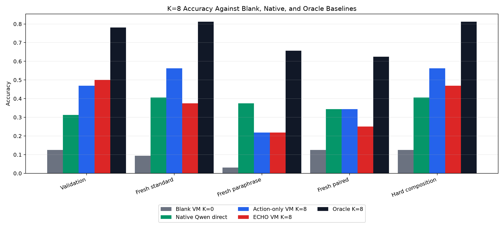
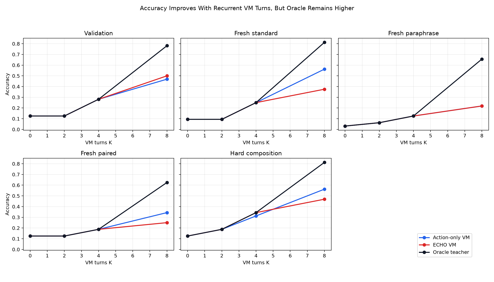
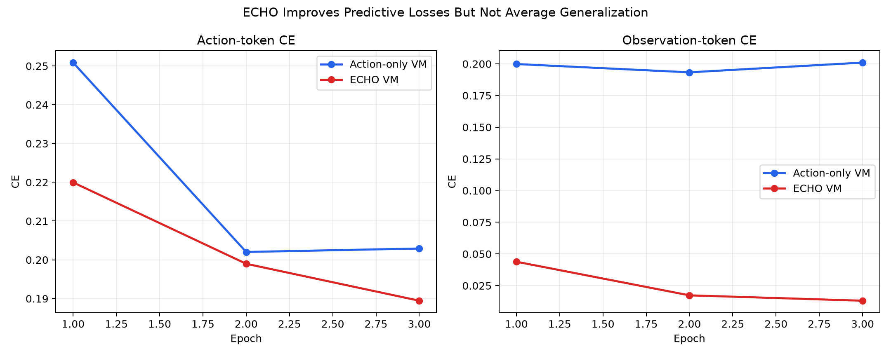
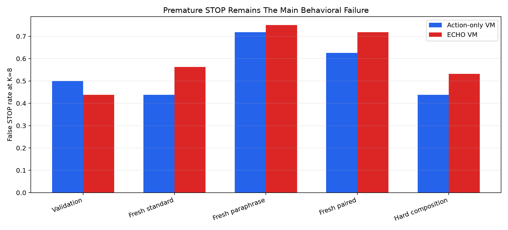

# VM-Agent ECHO QLoRA: Standalone Experiment Report

## Executive Summary

This experiment tested whether `Qwen/Qwen3-4B` can be post-trained into a recurrent program-editing agent over a small typed bytecode VM. At inference time, the model starts from a blank valid program, emits one edit action, receives the executed VM state as text, and repeats for up to K turns. The control trains only on edit-action tokens. The ECHO treatment also trains on the VM observation tokens with weight 0.05, so the model is explicitly trained to predict the consequences of its edits.

The core result is mixed. The VM-agent loop itself worked: the action-only model improved from a 10.0% blank-program baseline to 43.1% average K=8 accuracy, and it beat native direct-answer Qwen on average by 6.2%. But ECHO did not improve the scaled result. ECHO reached 36.2% average K=8 accuracy, -6.9% relative to action-only, despite better action-token and observation-token validation losses.

The main bottleneck is no longer syntax. Both trained VM-agent variants had 100% parse rate in the main run. The failures are policy failures: premature STOP, wrong constants, and incomplete multi-step programs. The oracle teacher reached 73.8% average K=8 accuracy, leaving a 30.6% gap for action-only and a 37.5% gap for ECHO.

## Setup

- Base model: `Qwen/Qwen3-4B`.
- Training method: 4-bit QLoRA with rank 8, alpha 16, 16.5M trainable parameters.
- Training data: 512 generated VM tasks.
- Evaluation: five 32-example splits: validation, fresh standard wording, fresh paraphrase, paired prompts, and hard composition.
- Initial program: `PUSH 0; END; PAD ...`.
- Actions: `OP <slot> <opcode>`, `ARG <slot> <0-96>`, or `STOP`.
- Inference budgets: K in {0, 2, 4, 8} VM turns.
- Baselines: blank VM at K=0, native direct-answer Qwen, and an oracle teacher that edits toward the reference bytecode.

## Main K=8 Results

| Split | Blank K=0 | Native Qwen | Action-only K=8 | ECHO K=8 | Oracle K=8 |
|---|---:|---:|---:|---:|---:|
| Validation | 12.5% | 31.2% | 46.9% | 50.0% | 78.1% |
| Fresh standard | 9.4% | 40.6% | 56.2% | 37.5% | 81.2% |
| Fresh paraphrase | 3.1% | 37.5% | 21.9% | 21.9% | 65.6% |
| Fresh paired | 12.5% | 34.4% | 34.4% | 25.0% | 62.5% |
| Hard composition | 12.5% | 40.6% | 56.2% | 46.9% | 81.2% |
| Average | 10.0% | 36.9% | 43.1% | 36.2% | 73.8% |

## K-Scaling

Both learned VM-agent policies benefit from more recurrent turns. The action-only model is monotonic across all five splits from K=0 to K=8. That matters: it means the model is not merely producing a one-shot answer in a different format; additional model-VM interaction is doing useful work.

## ECHO Result

ECHO clearly learned the observation channel. Final validation CE:

- Action-only action CE: 0.2029
- ECHO action CE: 0.1895
- Action-only observation CE: 0.2010
- ECHO observation CE: 0.0131

That did not translate into better average rollout accuracy. ECHO improved validation K=8 accuracy from 46.9% to 50.0%, but was worse on fresh standard, paired, and hard composition. The likely interpretation is that token-level observation prediction is too easy and too local: it teaches the model to model the textual VM state, but does not directly optimize the action policy needed to close the oracle gap.

## Failure Mode

Premature STOP remains the clearest behavioral problem. At K=8, action-only had 54.4% average false STOP rate, and ECHO had 60.0%. The parse rate was 100%, so this is not a grammar problem. It is a decision problem: the model often chooses to halt before it has built the correct executable program.

## Interpretation

The useful signal is that a 4B Qwen model can be post-trained to act as a recurrent compiler-like policy over a typed executable substrate. From a blank program, the action-only model reached 43.1% average K=8 accuracy and beat direct-answer Qwen on validation, fresh standard, and hard composition. This supports the broad direction of using the model as one iteration of a compute loop rather than trying to place the entire latent computation inside one forward pass.

The negative signal is equally important. ECHO, as implemented here, is not the missing ingredient. Its auxiliary observation-token loss improved CE but degraded average generalization. The next experiment should move the learning signal closer to executable success: reward the whole rollout, penalize false STOP, and train a verifier or value head over VM states instead of asking the LM to predict long observation strings.

## Recommended Next Experiment

Run a verifier-guided rollout optimization experiment:

1. Warm start from the action-only VM-agent policy.
2. Add a small value/verifier head over the final-token hidden state that predicts whether the current VM state solves the task.
3. Fine-tune with rollout-level reward: correct final VM answer, valid program, fewer edits, and a direct false-STOP penalty.
4. Compare supervised cloning, DPO on successful vs failed rollouts, and GRPO/REINFORCE with the VM reward.
5. Keep the same native Qwen, blank VM, action-only, and oracle baselines.

This attacks the observed bottleneck directly. The oracle gap shows that the substrate can solve many more examples within K=8; the current model simply does not learn the halting/action policy well enough from token imitation alone.
