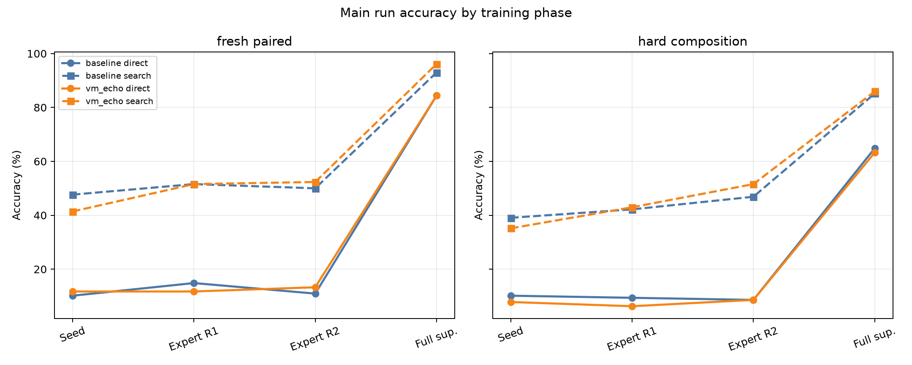
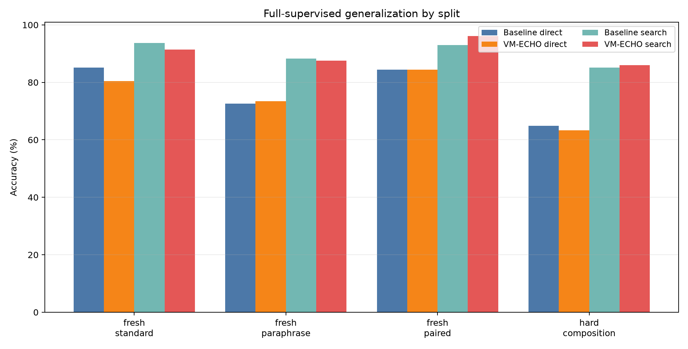
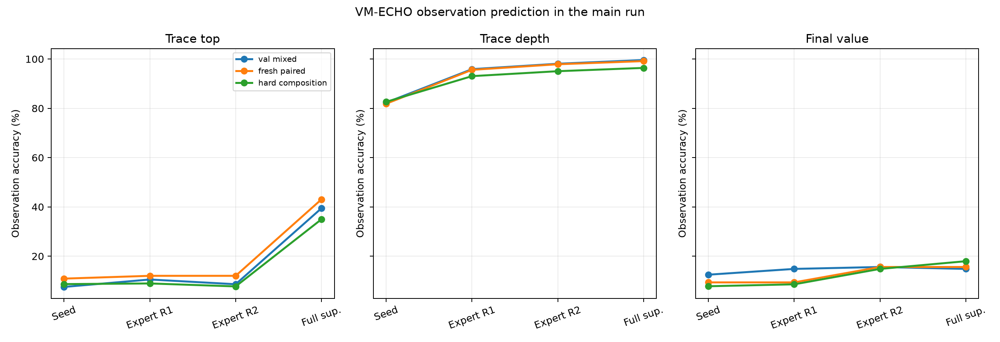
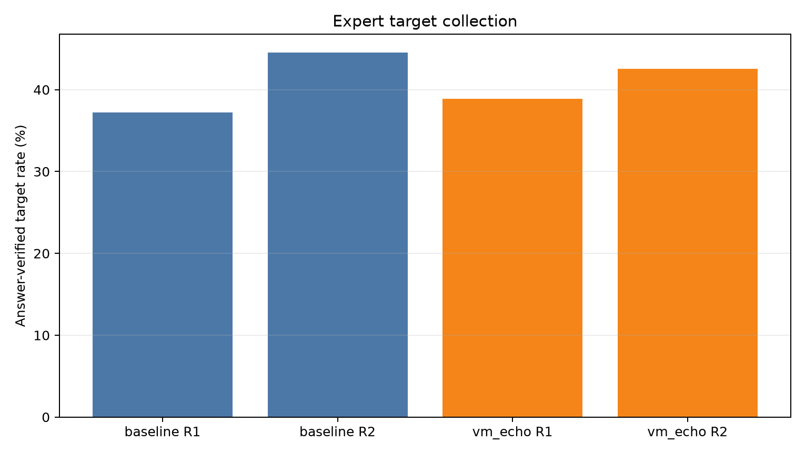
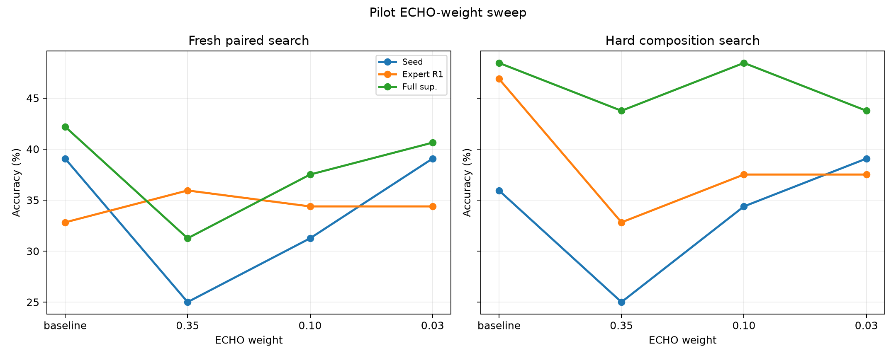

# VM-ECHO Trace Distillation for a Frozen-Qwen Bytecode Compiler

## Abstract

This standalone experiment tests whether a frozen-Qwen typed-bytecode compiler benefits from an auxiliary VM-observation objective. The baseline learns to emit bytecode and a final answer. The VM-ECHO arm gets the same program loss plus a low-weight loss for predicting execution observations: VM validity, final value, stack top after each active bytecode slot, and stack depth after each active bytecode slot.

The result is mixed. VM-ECHO clearly learns the VM observation channels: in the main full-supervised arm, fresh-paired trace-top prediction rises from 0.7% to 43.1%. That extra semantic signal does not translate into a broad direct-accuracy jump. It gives modest local gains in some search/oracle settings, for example hard-composition expert-round-2 search rises from 46.9% to 51.6%, and full-supervised fresh-paired search rises from 93.0% to 96.1%. But full-supervised fresh-standard direct accuracy falls from 85.2% to 80.5%. This is not a universal improvement.

## Setup

- Base model: `Qwen/Qwen3-4B`, used only as a frozen hidden-state feature extractor.
- Compiler: transformer-decoder slot head over Qwen hidden states.
- VM: typed stack bytecode with `192` seed examples, `1024` unlabeled expert-iteration prompts, `1024` full-supervised examples, and `128` examples per fresh split.
- Main ECHO weight: `0.03`. Pilot weights `0.35`, `0.10`, and `0.03` were used only to choose a non-destructive auxiliary-loss scale.
- Checkpoints: `large_artifacts/qwen_vm_echo_trace_distillation/checkpoints/main_vm_echo_s192_w003/`.

## Main Results

| Arm | Phase | Split | Direct | Search | Program exact | Trace-top acc. |
| --- | --- | --- | --- | --- | --- | --- |
| baseline | Expert R2 | fresh_paired | 10.9% | 50.0% | 0.8% | 1.1% |
| baseline | Expert R2 | fresh_paraphrase | 14.1% | 43.0% | 0.8% | 0.8% |
| baseline | Expert R2 | fresh_standard | 17.2% | 50.0% | 4.7% | 0.9% |
| baseline | Expert R2 | hard_composition | 8.6% | 46.9% | 3.1% | 0.8% |
| baseline | Full sup. | fresh_paired | 84.4% | 93.0% | 69.5% | 0.7% |
| baseline | Full sup. | fresh_paraphrase | 72.7% | 88.3% | 52.3% | 0.8% |
| baseline | Full sup. | fresh_standard | 85.2% | 93.8% | 63.3% | 1.1% |
| baseline | Full sup. | hard_composition | 64.8% | 85.2% | 47.7% | 1.5% |
| vm_echo | Expert R2 | fresh_paired | 13.3% | 52.3% | 3.1% | 12.0% |
| vm_echo | Expert R2 | fresh_paraphrase | 14.1% | 39.1% | 1.6% | 9.2% |
| vm_echo | Expert R2 | fresh_standard | 21.1% | 50.8% | 4.7% | 12.1% |
| vm_echo | Expert R2 | hard_composition | 8.6% | 51.6% | 3.1% | 7.7% |
| vm_echo | Full sup. | fresh_paired | 84.4% | 96.1% | 65.6% | 43.1% |
| vm_echo | Full sup. | fresh_paraphrase | 73.4% | 87.5% | 53.1% | 38.2% |
| vm_echo | Full sup. | fresh_standard | 80.5% | 91.4% | 58.6% | 41.9% |
| vm_echo | Full sup. | hard_composition | 63.3% | 85.9% | 46.1% | 35.0% |

## VM Observation Learning

The auxiliary heads learned the execution-observation task, especially stack depth. Trace-top accuracy also rose substantially in the full-supervised VM-ECHO arm, but final-value prediction stayed modest because it is a 97-way target and the main answer head already carries a separate final-answer signal.

## Expert Target Collection

VM-ECHO at weight `0.03` did not collapse the candidate set. It collected slightly more round-1 expert targets than the baseline and slightly fewer round-2 targets.

| arm | round | targets | found_rate | candidate_valid_rate |
| --- | --- | --- | --- | --- |
| baseline | 1 | 381 | 37.2% | 63.1% |
| baseline | 2 | 456 | 44.5% | 63.4% |
| vm_echo | 1 | 398 | 38.9% | 63.7% |
| vm_echo | 2 | 436 | 42.6% | 64.3% |

## Weight Sweep

The pilot sweep showed why the main run used a low weight. At `0.35`, VM-ECHO learned observations but damaged candidate search. At `0.03`, it preserved the search surface better.

## Interpretation

The useful finding is not that VM-ECHO is a breakthrough by itself. The useful finding is sharper: a consequence-prediction loss can be attached to a frozen-Qwen bytecode compiler without breaking typed decoding, and it can make the model learn nontrivial VM-state predictions. However, teacher-forced trace prediction is only weakly coupled to choosing better programs. The next version should condition the observation predictor on candidate programs sampled from the compiler, so the model learns consequences of its own actions rather than consequences of the gold target alone.

## Artifacts

- `experiments/qwen_vm_echo_trace_distillation/runs/main_vm_echo_s192_w003/metrics.csv`
- `experiments/qwen_vm_echo_trace_distillation/runs/main_vm_echo_s192_w003/train_log.csv`
- `experiments/qwen_vm_echo_trace_distillation/analysis/main_metrics.csv`
- `experiments/qwen_vm_echo_trace_distillation/reports/qwen_vm_echo_trace_distillation_report.md`
- `experiments/qwen_vm_echo_trace_distillation/reports/qwen_vm_echo_trace_distillation_report.html`
