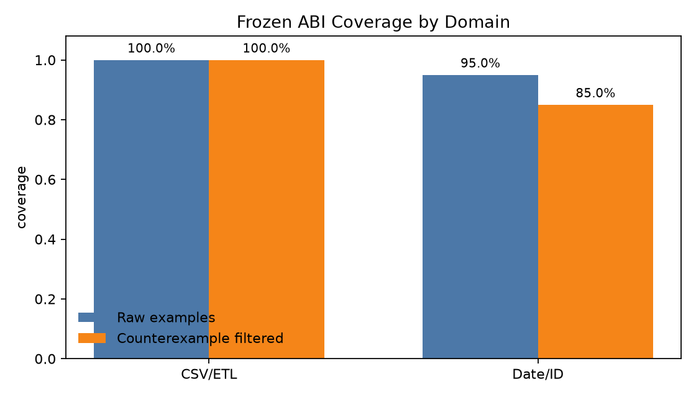
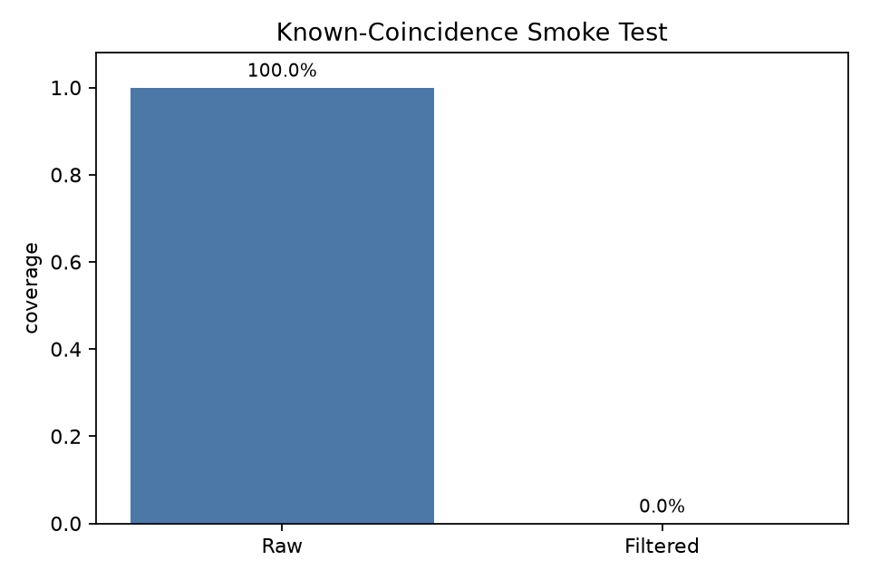
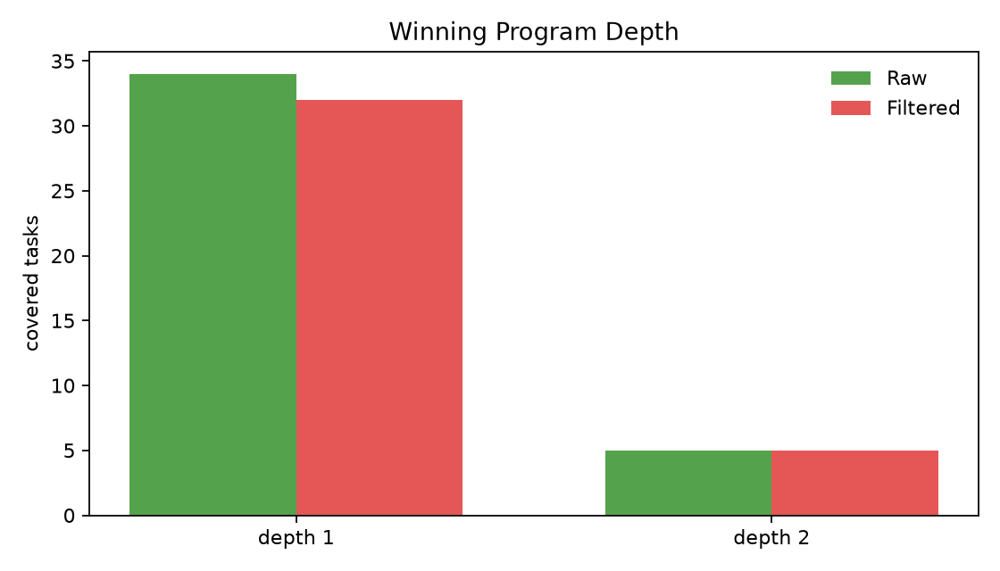
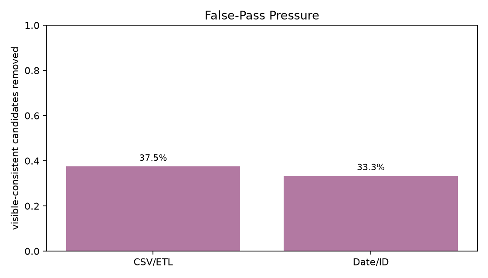

# Real Transformation ABI Gate With Counterexamples

## Summary

This no-training gate tested whether a frozen, generic transformation ABI covers two held-out-style deterministic transformation domains, and whether additional counterexamples remove thin-test coincidences.

Main result: the clean pipeline domain stayed fully covered after counterexample filtering, while the irregular date/ID/string domain lost coverage on edge cases. Overall filtered coverage was **37/40 (92.5%)**. The result supports the narrow claim that a generic ABI is useful for pipeline-shaped transformations, but it does not establish broad coverage of irregular transformation work.

The coincidence smoke test worked as intended: both known-wrong raw winners were removed by adversarial examples, so raw coverage alone is not a safe headline metric.

## Charts

## Method

- The ABI was frozen before evaluating the expanded 40-task suite.
- Coverage was measured twice: raw coverage on visible plus hidden examples, then filtered coverage after extra adversarial examples.
- The suite is curated and self-contained. It is not a public benchmark and should be treated as a gate for whether a larger benchmark build is worth doing.
- Counterexamples can refute a candidate program when expected behavior is available. They do not certify correctness in reference-free deployment.

## Domain Results

| Domain | n | Raw coverage | Filtered coverage | Raw removed | Visible false-pass rate |
| --- | --- | --- | --- | --- | --- |
| CSV/ETL clean pipeline | 20 | 20/20 (100.0%) | 20/20 (100.0%) | 0 | 37.5% |
| Date/ID irregular | 20 | 19/20 (95.0%) | 17/20 (85.0%) | 2 | 33.3% |

## Program Depth

- Raw covered depth counts: `{'1': 34, '2': 5}`
- Filtered covered depth counts: `{'1': 32, '2': 5}`

Most covered tasks were depth-1 single-primitive programs. Depth-2 coverage appeared mainly in aggregation and parsing transforms. This is useful but limits the composition claim: the gate mainly validates reusable operation selection in clean transformations, not deep program synthesis.

## Counterexample Smoke

| Smoke task | Raw | Filtered | Raw winning program |
| --- | --- | --- | --- |
| smoke_parentheses | yes | no | {"op": "all_distinct_chars"} |
| smoke_month_30 | yes | no | {"op": "all_distinct_chars"} |

The two smoke tasks were designed so a broad generic predicate can pass thin raw examples for the wrong reason. Counterexamples removed all raw smoke winners.

## Filtered Misses

| Task | Domain | Raw | Filtered | Raw winning program | Reason exposed by filter |
| --- | --- | --- | --- | --- | --- |
| id_03 | date_id_irregular | yes | no | {"op": "normalize_phone"} | Raw winner failed adversarial counterexample |
| id_11 | date_id_irregular | yes | no | {"op": "normalize_date_iso"} | Raw winner failed adversarial counterexample |
| id_18 | date_id_irregular | no | no | - | No ABI candidate passed raw examples |

The filtered misses are informative: they are irregular edge cases rather than broad pipeline failures. Examples include phone extensions, full month names, and hyphenated title casing. These are exactly the cases where a fixed generic ABI needs either richer primitives, task-specific logic, or a human/stronger-model expansion step.

## Interpretation

The gate gives a positive result for clean CSV/ETL-style transformations: filtered coverage was 100% on the curated clean domain. It gives a narrower result for irregular date/ID/string transformations: raw coverage was high, but counterexamples removed two tasks and one task had no raw ABI solution.

The practical takeaway is to split future work by domain shape:

- Clean row/column/filter/sort/group/normalize pipelines are a plausible target for a compiler-to-ABI system.
- Irregular extraction and formatting tasks need a stronger counterexample suite and a broader ABI before training a compiler would be justified.
- Any future model-training pilot should report depth-1 operation selection separately from depth-2+ composition, because this gate is dominated by single-primitive wins.
