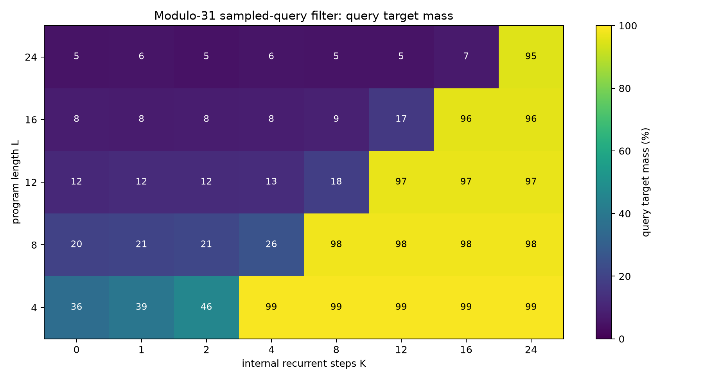
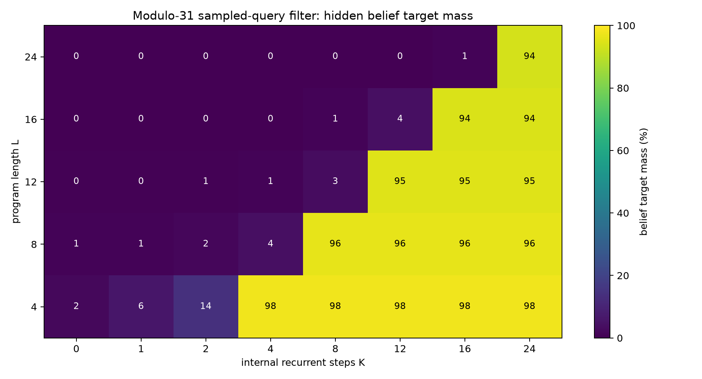
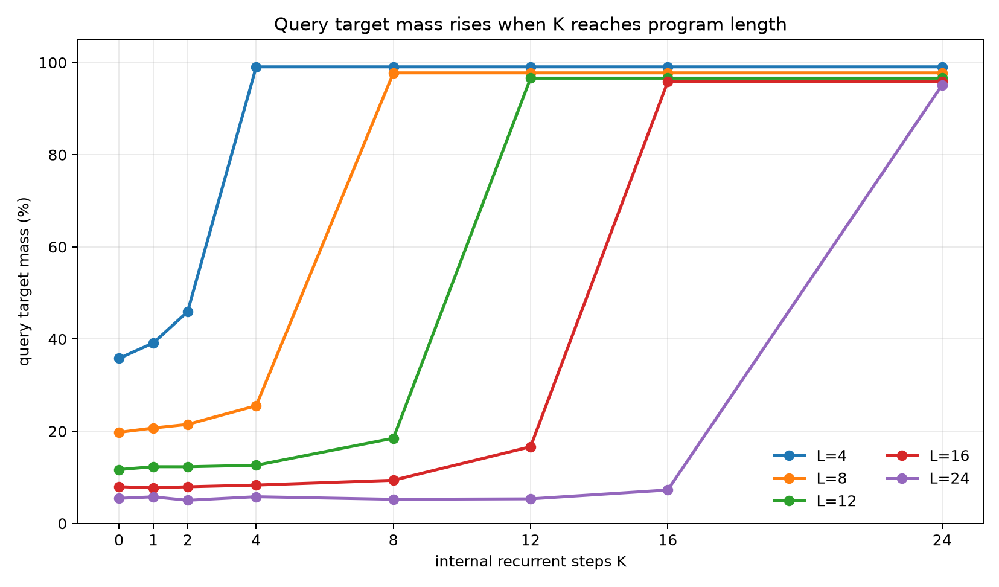
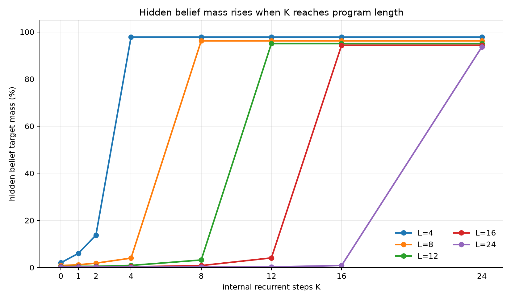
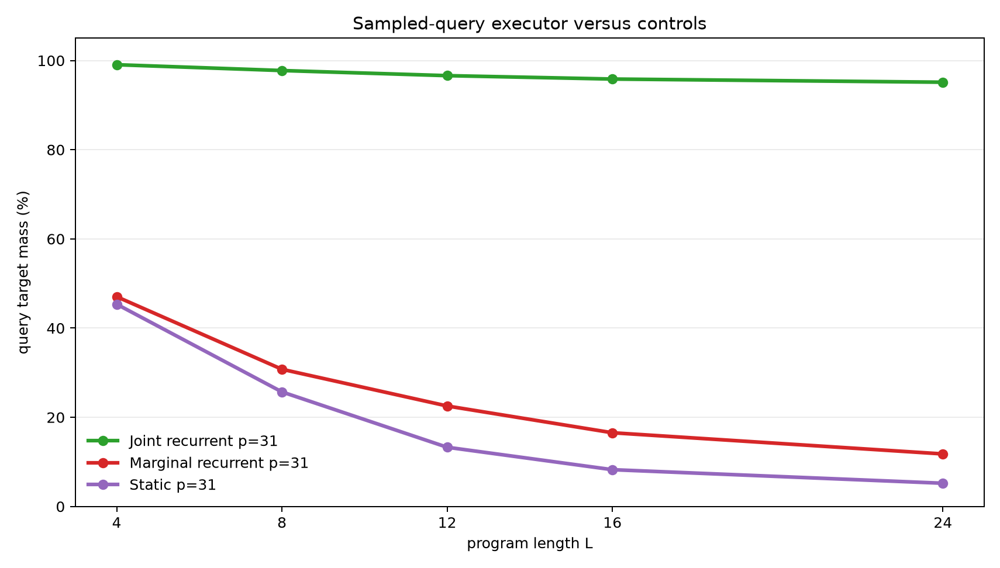
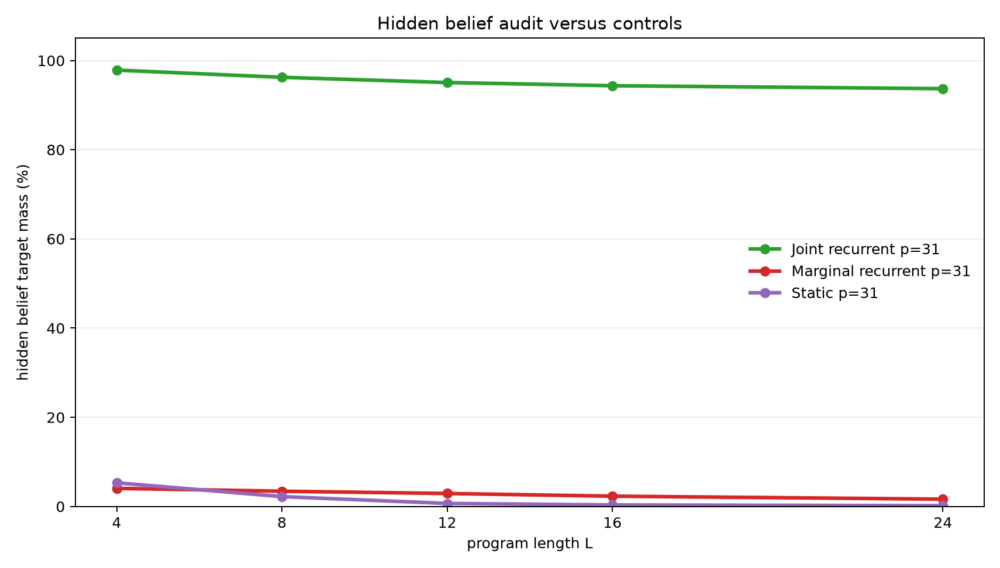

# Sampled-Answer Supervision for Latent Recurrent Belief Filtering

**A controlled experiment on whether one sampled final query value can train hidden-state execution**

## Abstract

This experiment tests whether a latent recurrent runtime can learn an internal belief-state executor when each training example provides only one sampled final query value. Each example starts with an unknown pair of modular registers constrained by `B=A+d (mod p)`. A program applies arithmetic updates and observation filters. The model receives a query type such as `A`, `B`, `A+B`, or `A-B`, and the loss is ordinary cross-entropy on one value sampled from the exact final query distribution.

The full final query distribution and the full final belief distribution over `(A,B)` pairs are withheld from the loss. They are used only for evaluation. On the scaled modulus-31 task, trained on program lengths 1-8 and evaluated on lengths 4, 8, 12, 16, and 24, the joint recurrent model shows a sharp compute threshold. Averaged across query types, exact query target mass at the first `K>=L` step is 99.1%, 97.8%, 96.6%, 95.8%, and 95.1% for lengths 4, 8, 12, 16, and 24. Hidden belief target mass is 97.8%, 96.2%, 95.1%, 94.4%, and 93.7%, despite never being directly supervised. Marginal recurrent and static one-shot controls remain far lower.

## Lay Summary

The model starts from partial knowledge:

```text
B = A + d (mod p)
```

This relation describes many possible worlds. A program then changes the registers and sometimes filters the possible worlds:

```text
A = A + 7
observe B % 5 = 3
B = B - A
query A + B
```

Training gives the model only one sampled answer value for the final query. It is not told the full answer distribution, and it is not told the full set of possible `(A,B)` pairs. The question is whether the model learns the hidden set anyway because that hidden set is the reusable structure needed to answer many sampled queries. In the joint recurrent model, it does.

## 1. Question

The experiment asks whether sampled-answer supervision can induce a latent recurrent belief-state executor.

The target evidence has five parts:

1. Query quality should depend on internal step budget `K`.
2. The threshold should align with program length `L`: weak when `K<L`, strong when `K>=L`.
3. The threshold should hold on lengths longer than training.
4. Hidden belief mass should rise even though the full belief state is not directly supervised.
5. Controls without joint state or without recurrent execution should fail on held-out lengths.

The setting is deliberately controlled. It is a mechanistic test of whether low-bandwidth final-answer supervision can train reusable latent execution.

## 2. Task

Programs operate over two registers modulo `p`.

Initial belief:

```text
{(A, B): B = A + d mod p}
```

For `p=31`, the full state space has 961 register pairs. The initial support contains 31 pairs.

Operations:

| Operation | Meaning |
|---|---|
| `A=A+c` | add a constant to `A` |
| `A=A-c` | subtract a constant from `A` |
| `B=B+c` | add a constant to `B` |
| `B=B-c` | subtract a constant from `B` |
| `A=A+B` | add `B` into `A` |
| `B=B+A` | add `A` into `B` |
| `A=A-B` | subtract `B` from `A` |
| `B=B-A` | subtract `A` from `B` |
| `OBS_A_BUCKET` | filter to states where `A % m = r` |
| `OBS_B_BUCKET` | filter to states where `B % m = r` |

Observation residues are sampled from the live support, so every target support is non-empty. For the scaled run, `p=31`, observation modulus is 5, and each instruction is an observation with probability 0.3.

Each example samples one final query type:

| Query | Distribution being sampled |
|---|---|
| `A` | final distribution of `A` |
| `B` | final distribution of `B` |
| `A_PLUS_B` | final distribution of `A+B mod p` |
| `A_MINUS_B` | final distribution of `A-B mod p` |

The training label is one value sampled from that exact query distribution. The model is trained with one-label cross-entropy. Evaluation still computes the exact final query distribution and exact final belief distribution.

Training used lengths 1-8. Evaluation used lengths 4, 8, 12, 16, and 24. Lengths 12, 16, and 24 test length generalization.

## 3. Models

### Joint Sampled-Query Filter

The primary model stores a categorical distribution over all `(A,B)` pairs. Each recurrent step reads the next instruction and applies a learned arithmetic transition or learned observation likelihood. The final pair distribution is projected into the selected query distribution, and the loss scores one sampled query value.

The full belief distribution is never used as a training target. It is measured afterward to test whether the model learned a coherent hidden state.

### Marginal Sampled-Query Control

The marginal control follows the same recurrent schedule but stores separate distributions over `A` and `B`. It can learn some sampled-query signal, but it cannot exactly represent pairwise correlations.

### Static Sampled-Query Compiler Control

The static control receives the initial relation and whole program, then predicts a final pair distribution in one pass with a small Transformer encoder. It has no recurrent execution axis.

## 4. Metrics

The primary metrics evaluate the exact final query distribution:

- `query_target_mass`: total probability assigned to the exact query support.
- `query_top1_on_support`: whether the most likely queried value is inside the exact query support.
- `query_target_nll`: cross-entropy against the exact query distribution.

The audit metrics evaluate the full hidden belief state:

- `belief_target_mass`: total pair probability assigned to the exact final `(A,B)` support.
- `belief_top1_on_support`: whether the most likely pair is inside the exact support.
- `belief_target_nll`: cross-entropy against the exact final pair distribution.

The hidden-belief metrics are not training objectives.

## 5. Main Result

The scaled modulus-31 joint recurrent sampled-query filter shows a clean execution threshold. Query mass is low when `K<L`, then jumps when `K` reaches program length.




The hidden belief audit shows the same threshold, even though the full belief state was not directly supervised.



The K curves show the threshold by length.





Numerically, averaged across query types:

| Program length | Best query mass when `K<L` | Best hidden belief mass when `K<L` | First `K>=L` | Query mass at first `K>=L` | Hidden belief mass at first `K>=L` | Query top-1 |
|---:|---:|---:|---:|---:|---:|---:|
| 4 | 45.9% | 13.8% | 4 | 99.1% | 97.8% | 100.0% |
| 8 | 25.5% | 4.0% | 8 | 97.8% | 96.2% | 100.0% |
| 12 | 18.5% | 3.2% | 12 | 96.6% | 95.1% | 100.0% |
| 16 | 16.6% | 4.1% | 16 | 95.8% | 94.4% | 100.0% |
| 24 | 7.3% | 0.8% | 24 | 95.1% | 93.7% | 100.0% |

The held-out lengths are the critical evidence. The model was trained only on lengths up to 8, but it executes lengths 12, 16, and 24 when given enough recurrent steps.

## 6. Query Types

All four query types work at the execution threshold. At length 24:

| Query | Query mass at `K=24` | Hidden belief mass at `K=24` |
|---|---:|---:|
| `A` | 95.6% | 93.7% |
| `A_MINUS_B` | 94.7% | 93.7% |
| `A_PLUS_B` | 94.8% | 93.8% |
| `B` | 95.6% | 93.6% |

Relational queries matter because they are harder to answer from independent marginals. The joint model solves them along with the direct `A` and `B` queries.

## 7. Controls

The scaled controls show that the result is not explained by shallow sampled-label fitting or one-shot compilation.





At modulus 31, averaged across query types:

| Model | L=4 query | L=8 query | L=12 query | L=16 query | L=24 query |
|---|---:|---:|---:|---:|---:|
| Joint recurrent | 99.1% | 97.8% | 96.6% | 95.8% | 95.1% |
| Marginal recurrent | 47.0% | 30.8% | 22.5% | 16.5% | 11.8% |
| Static compiler | 45.4% | 25.7% | 13.3% | 8.2% | 5.2% |

Hidden belief target mass separates the models even more sharply:

| Model | L=4 belief | L=8 belief | L=12 belief | L=16 belief | L=24 belief |
|---|---:|---:|---:|---:|---:|
| Joint recurrent | 97.8% | 96.2% | 95.1% | 94.4% | 93.7% |
| Marginal recurrent | 4.1% | 3.4% | 2.9% | 2.3% | 1.6% |
| Static compiler | 5.3% | 2.2% | 0.7% | 0.3% | 0.2% |

The marginal control has recurrence but lacks joint state. The static compiler sees the whole program but lacks recurrent execution. Neither recovers the executor signature.

## 8. Modulus-11 Diagnostic

A smaller modulus-11 diagnostic used training lengths 1-6 and evaluation lengths 3, 6, 9, and 12. The joint recurrent model reached 98.6-99.7% query mass and 98.2-99.3% hidden belief mass at `K=L`. The marginal and static controls stayed far lower, especially on held-out lengths. This diagnostic checks that the sampled-answer objective works before scaling the state space to modulus 31.

## 9. Interpretation

The result supports a specific mechanism claim:

> One sampled final query value per example can train a latent recurrent runtime to form and execute a coherent joint belief state when that state is the reusable structure needed to answer varied queries.

The strongest evidence is the combination of:

1. a sharp `K=L` threshold,
2. length generalization beyond the training range,
3. high hidden-belief mass without direct belief supervision,
4. failure of marginal and static controls.

The experiment is stronger than training directly on full belief states. The model is rewarded only for one sampled answer value, yet the audited hidden state becomes a high-quality approximation to the full final belief.

## 10. Limits

This is still a structured setting.

- The joint model stores an explicit categorical state over `(A,B)` pairs.
- The runtime uses a direct program counter.
- The operation family is modular arithmetic plus bucket observations.
- The largest completed state space has 961 pairs.
- Supervision is an exact sample from an exact query distribution, not noisy natural-language feedback.

The experiment shows that sampled-answer supervision can induce the intended latent state when the architecture can represent it. It does not show that an unstructured hidden vector would discover the same state without architectural support.

## 11. Next Tests

Useful next tests:

1. Replace the explicit categorical state with a dense latent state and probe how much belief structure remains.
2. Replace the direct program counter with attention over instruction tokens.
3. Add a learned halt/no-op policy so the model chooses its compute budget.
4. Train with noisy sampled labels and measure robustness.
5. Increase modulus and state size while tracking memory and runtime scaling.

## 12. Reproducibility

Primary files:

- Experiment script: `../src/sampled_query_filter_executor_experiment.py`
- Analysis script: `../src/analyze_sampled_query_filter_executor.py`
- Experiment log: `sampled_query_filter_executor_experiment_log.md`
- Results directory: `../runs/`
- Analysis directory: `../analysis/`
- Checkpoint manifest: `../checkpoint_manifest.csv`

Key run directories:

- `../runs/main_joint_mod31`
- `../runs/control_marginal_mod31`
- `../runs/control_static_mod31`
- `../runs/pilot_joint_mod11`
- `../runs/control_marginal_mod11`
- `../runs/control_static_mod11`

Large checkpoint files are stored outside the experiment bundle under:

```text
../../../large_artifacts/sampled_query_filter_executor/checkpoints/
```

Environment:

- Python 3.12.3
- PyTorch 2.8.0+cu128
- GPU: NVIDIA RTX 6000 Ada Generation

## 13. Bottom Line

The joint recurrent sampled-query filter learned to execute arithmetic and observation-filter programs from one sampled final answer value per example. It generalized from training lengths 1-8 to lengths 12, 16, and 24, with a sharp improvement when `K` reached `L`. The hidden belief state became accurate even though it was not directly supervised. The marginal and static controls failed on the scaled task.
