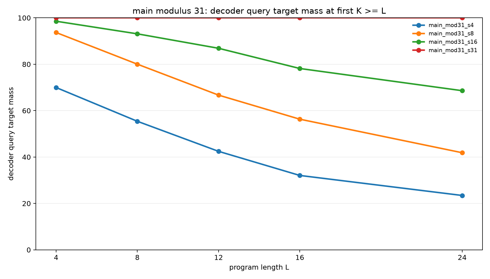
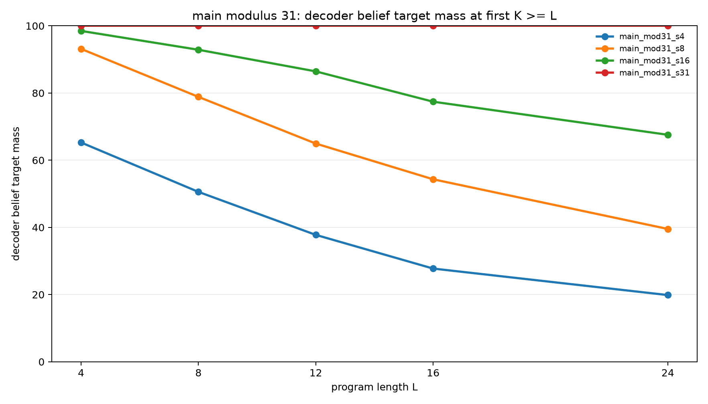
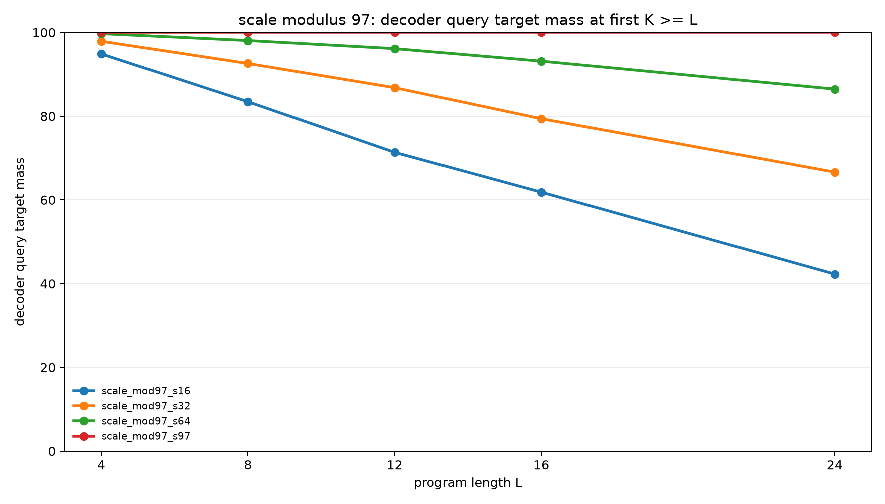
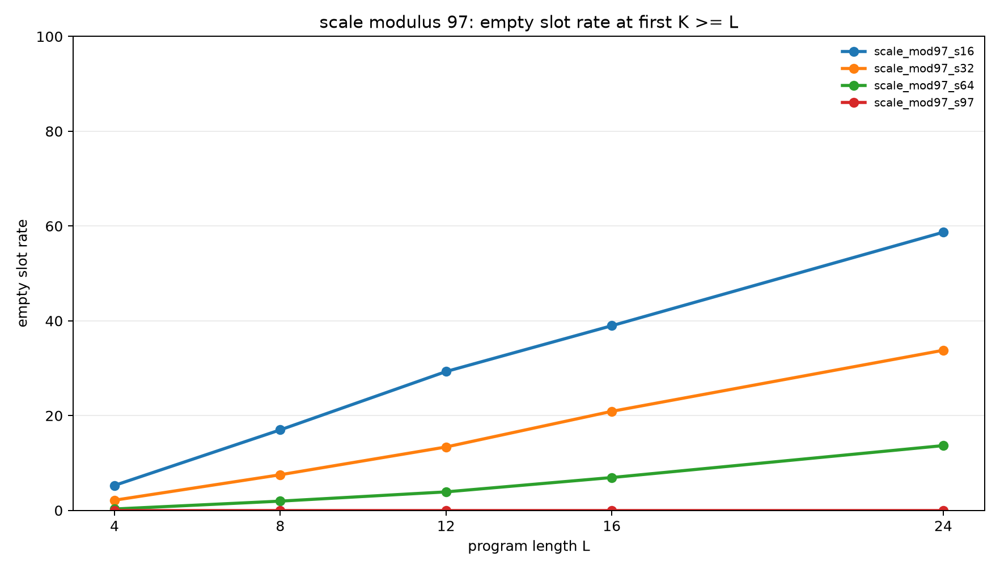

# Sparse Support Memory Enables Exact Modular Belief Execution

## Abstract

This experiment tests whether modular belief-state execution requires an
explicit support representation. Programs transform two hidden registers,
`A` and `B`, under modular arithmetic and observation filters. The runtime
state is a bounded sparse memory of weighted candidate `(A,B)` pairs. When the
slot budget equals the initial support size, `S=p`, the executor solves every
tested program exactly once the recurrent budget reaches the program length.
When `S<p`, performance degrades in proportion to lost support, and the failure
is directly visible through the empty-slot rate.

The main result is a sharp capacity threshold: at modulus 31, `S=31` reaches
100.0% query mass and 100.0% belief mass through length 24; `S=16` reaches
68.6% query mass and 67.6% belief mass at length 24. At modulus 97, the same
pattern holds: `S=97` is exact, while `S=64` reaches 86.5% query mass and
86.3% belief mass at length 24.

## Task

Each example starts from a hidden relation:

```text
B = A + d (mod p), with A unknown
```

The initial belief therefore contains exactly `p` possible `(A,B)` states.
Programs contain two kinds of operations:

- Arithmetic updates:
  `A=A+c`, `A=A-c`, `B=B+c`, `B=B-c`, `A=A+B`, `B=B+A`, `A=A-B`, `B=B-A`
- Observation filters:
  `A % m = r` or `B % m = r`

Observation residues are sampled from the current support, so the target belief
is never empty. The final query asks for one distribution over `A`, `B`,
`A+B mod p`, or `A-B mod p`.

## Executor

The executor keeps `S` weighted support slots. Each active slot stores one
concrete `(A,B)` pair. Arithmetic operations update every active slot exactly.
Observation filters delete slots that violate the observed residue. The output
belief is the normalized distribution represented by the active slots.

If `S>=p`, initialization stores all initial support states. If `S<p`,
initialization stores a deterministic stride subset of the initial support.
When all represented slots are deleted by later observations, the executor
falls back to a uniform pair distribution and records an `empty_slot_rate`
event.

## Protocol

The experiment evaluates four phases:

| Phase | Modulus | Slot capacities | Lengths | Examples per query type |
|---|---:|---:|---:|---:|
| Smoke | 7 | 2, 4, 7 | 2, 3 | 64 |
| Pilot | 11 | 4, 8, 11 | 3, 6, 9, 12 | 512 |
| Main | 31 | 4, 8, 16, 31 | 4, 8, 12, 16, 24 | 512 |
| Scale | 97 | 16, 32, 64, 97 | 4, 8, 12, 16, 24 | 256 |

For each length `L`, the executor is evaluated at several recurrent budgets
`K`. The headline rows report the first `K` such that `K>=L`.

Metrics:

- `decoder_query_target_mass`: probability assigned to the exact final query
  support.
- `decoder_belief_target_mass`: probability assigned to the exact final
  `(A,B)` support.
- `empty_slot_rate`: fraction of examples where all represented slots were
  deleted and the executor fell back to uniform.
- `mean_active_slots`: mean active slots at the selected recurrent budget.

## Main Results

At modulus 31, exact execution appears exactly at `S=p`.

| Slot capacity | L=4 query | L=8 query | L=12 query | L=16 query | L=24 query | L=24 empty |
|---:|---:|---:|---:|---:|---:|---:|
| 4 | 70.0% | 55.4% | 42.5% | 32.1% | 23.4% | 80.3% |
| 8 | 93.7% | 80.0% | 66.7% | 56.3% | 41.9% | 60.5% |
| 16 | 98.5% | 93.1% | 86.9% | 78.2% | 68.6% | 32.5% |
| 31 | 100.0% | 100.0% | 100.0% | 100.0% | 100.0% | 0.0% |

Strict belief mass follows the same pattern.

| Slot capacity | L=4 belief | L=8 belief | L=12 belief | L=16 belief | L=24 belief |
|---:|---:|---:|---:|---:|---:|
| 4 | 65.3% | 50.6% | 37.8% | 27.7% | 19.9% |
| 8 | 93.1% | 78.9% | 65.0% | 54.3% | 39.5% |
| 16 | 98.5% | 92.9% | 86.4% | 77.4% | 67.6% |
| 31 | 100.0% | 100.0% | 100.0% | 100.0% | 100.0% |





## Scale Results

The same capacity threshold appears at modulus 97.

| Slot capacity | L=4 query | L=8 query | L=12 query | L=16 query | L=24 query | L=24 empty |
|---:|---:|---:|---:|---:|---:|---:|
| 16 | 94.9% | 83.5% | 71.4% | 61.8% | 42.3% | 58.7% |
| 32 | 97.9% | 92.6% | 86.8% | 79.4% | 66.6% | 33.8% |
| 64 | 99.7% | 98.1% | 96.1% | 93.1% | 86.5% | 13.7% |
| 97 | 100.0% | 100.0% | 100.0% | 100.0% | 100.0% | 0.0% |

Strict belief mass again tracks query mass closely.

| Slot capacity | L=4 belief | L=8 belief | L=12 belief | L=16 belief | L=24 belief |
|---:|---:|---:|---:|---:|---:|
| 16 | 94.7% | 83.0% | 70.7% | 61.0% | 41.3% |
| 32 | 97.9% | 92.5% | 86.6% | 79.1% | 66.2% |
| 64 | 99.7% | 98.0% | 96.1% | 93.1% | 86.3% |
| 97 | 100.0% | 100.0% | 100.0% | 100.0% | 100.0% |





## Interpretation

The task is exactly solvable with a compact structured state: one slot per
initial support element. The arithmetic operations are bijections over the
support, so they do not increase the number of represented states. Observation
filters only remove states. Therefore a memory with `S=p` slots can preserve
the exact belief distribution indefinitely under this program family.

Sub-capacity memories fail for a concrete reason. They do not store the whole
initial relation, so later observations can delete every represented slot even
when the true target support is nonempty. The empty-slot rate grows with length
and predicts the drop in both query mass and belief mass.

The result supports a precise design claim: for this class of symbolic latent
execution tasks, the critical missing state is not a larger dense vector by
itself. The executor needs an addressable support representation whose capacity
matches the number of live hypotheses that the program may need to preserve.

## Limitations

This executor is not a learned neural model. The arithmetic and observation
updates are hand-coded, and initialization is deterministic. The experiment
therefore isolates representational sufficiency, not learnability.

The program family also has a bounded-support property: support never grows
above the initial `p` states. A different task with branching uncertainty would
need a larger or dynamically allocated memory.

## Reproducibility

Run files are in `experiments/sparse_support_memory_executor/runs/`.
Aggregated analysis files are in `experiments/sparse_support_memory_executor/analysis/`.
No model checkpoints are required for this sweep.

Example main run:

```bash
PYTHONDONTWRITEBYTECODE=1 python experiments/sparse_support_memory_executor/src/sparse_support_memory_experiment.py \
  --variant_name main_mod31_s31 \
  --modulus 31 \
  --observe_mod 5 \
  --observe_prob 0.3 \
  --slot_capacity 31 \
  --eval_lengths 4,8,12,16,24 \
  --eval_k 0,1,2,4,8,12,16,24 \
  --eval_examples 512 \
  --eval_batch_size 256 \
  --output_dir experiments/sparse_support_memory_executor/runs/main_mod31_s31
```

Regenerate analysis:

```bash
PYTHONDONTWRITEBYTECODE=1 python experiments/sparse_support_memory_executor/src/analyze_sparse_support_memory.py
```
