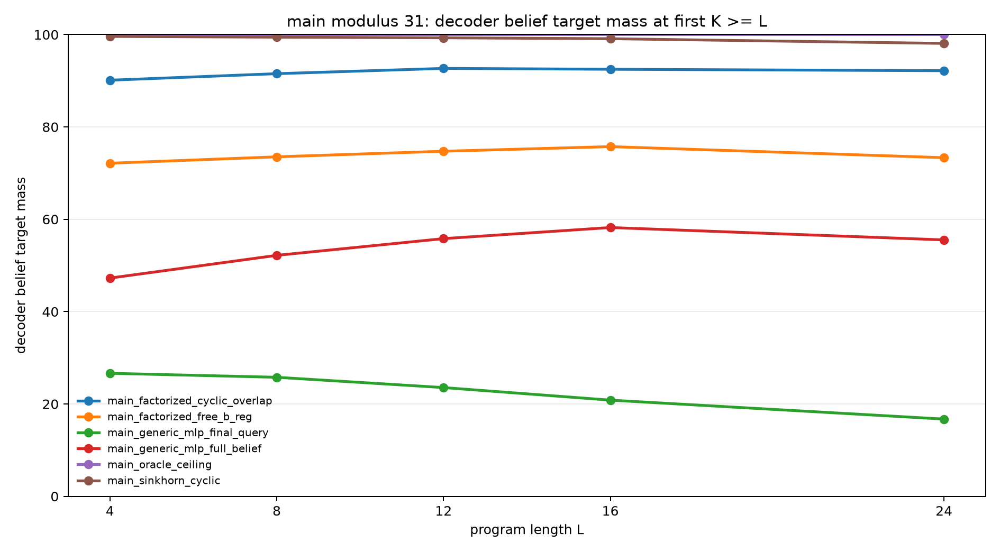
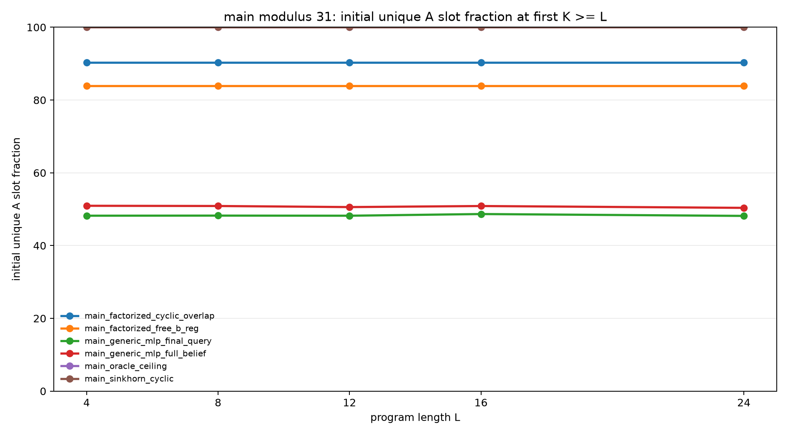
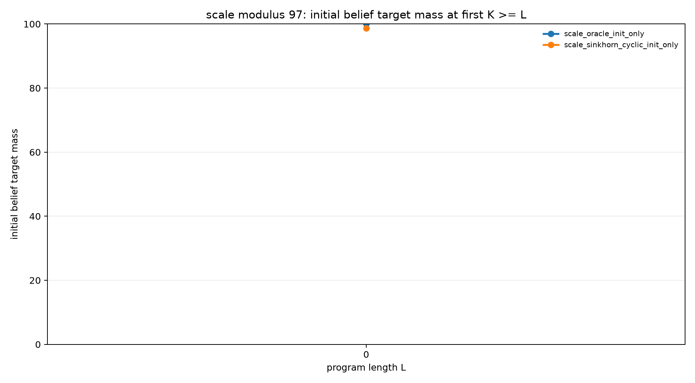

# Structured Slot Initialization for Modular Belief Execution

## Abstract

This experiment studies a narrow failure mode in recurrent slot execution:
forming the initial sparse belief support. Each example begins with an unknown
register `A` and a known modular relation `B=A+d (mod p)`. A slot model must
place that support into weighted slots, then an exact recurrent transition
executes arithmetic and observation programs. Because the transition is exact,
final errors isolate initializer quality.

At modulus 31 with held-out program length 24, a generic MLP initializer reaches
55.5% strict final belief mass under full-belief supervision. A free-B
factorized initializer reaches 73.3%. A cyclic initializer with soft overlap
regularization reaches 92.2% but leaves some residues duplicated. Replacing the
soft overlap penalty with Sinkhorn-normalized slot assignment reaches 98.1%
strict final belief mass and 98.6% query mass, with 100% measured slot coverage.
An initializer-only modulus-97 scale check reaches 98.7% strict initial belief
mass.

## Task

Each example starts from the support

```text
{(A, B): B = A + d (mod p)}
```

where `d` is observed and `A` is unknown. Programs then apply modular register
updates and observation filters:

- `A=A+c`, `A=A-c`, `B=B+c`, `B=B-c`
- `A=A+B`, `B=B+A`, `A=A-B`, `B=B-A`
- observations on `A mod m` or `B mod m`

The decoded belief is a weighted mixture of slot-local `A` and `B`
distributions. Evaluation reports strict probability mass on the exact final
`(A,B)` support at the first evaluated `K >= L`, where `L` is program length.

## Initializers

- `oracle`: exact slot support, used as a ceiling.
- `generic_mlp`: delta and slot-id embeddings passed through an MLP that emits
  `A`, `B`, and weight logits.
- `factorized_free_b`: learned slot-to-`A` logits, with a free
  delta-conditioned MLP for `B`.
- `factorized_cyclic`: learned slot-to-`A` logits, with `B` produced by the
  exact cyclic shift `A+d`.
- `sinkhorn_cyclic`: learned slot-to-`A` logits normalized by Sinkhorn
  iterations, then shifted by `d` to produce `B`.

The decisive diagnostic metrics are initial belief mass, relation accuracy
`B=A+d`, unique `A` slot coverage, and slot overlap.

## Main Result

Modulus 31, training lengths 1-8, evaluation lengths 4, 8, 12, 16, and 24:

| Initializer | L=24 query mass | L=24 belief mass | Initial belief | Relation acc | Unique A slots |
|---|---:|---:|---:|---:|---:|
| oracle | 100.0% | 100.0% | 100.0% | 100.0% | 100.0% |
| sinkhorn_cyclic | 98.6% | 98.1% | 99.7% | 100.0% | 100.0% |
| factorized_cyclic | 93.6% | 92.2% | 90.0% | 100.0% | 90.3% |
| factorized_free_b | 78.9% | 73.3% | 74.2% | 89.0% | 83.9% |
| generic_mlp, full belief | 62.8% | 55.5% | 46.4% | 84.5% | 50.4% |
| generic_mlp, final query | 30.5% | 16.7% | 29.4% | 52.6% | 48.2% |

The generic MLP does not reliably form the sparse support at modulus 31. It can
learn partial relation structure, but it duplicates many slots and leaves about
half of the residue set uncovered. The free-B factorized model improves
coverage but still must learn the relation. The cyclic factorization fixes the
relation exactly, but a soft overlap penalty is not enough to guarantee full
assignment coverage. Sinkhorn normalization supplies that missing assignment
constraint.





## Scale Check

The modulus-97 check isolates initialization at `K=0`; it does not execute
full p=97 programs. It tests whether the slot assignment mechanism itself
scales to a larger residue set.

| Initializer | Initial query mass | Initial belief mass | Relation acc | Unique A slots |
|---|---:|---:|---:|---:|
| oracle | 100.0% | 100.0% | 100.0% | 100.0% |
| sinkhorn_cyclic | 99.7% | 98.7% | 100.0% | 100.0% |



## Interpretation

The initializer problem is not just learning the modular relation. A model can
learn `B=A+d` and still fail by assigning multiple slots to the same residue.
The successful ingredient is a coverage-aware assignment mechanism: the
Sinkhorn initializer makes each slot choose a residue while also making each
residue receive a slot.

With exact transition fixed, final execution quality closely tracks initial
support quality. This makes strict initial belief mass a useful mechanistic
predictor: when initial mass and unique coverage are high, held-out program
execution remains high; when either is low, the exact transition preserves that
initial error rather than repairing it.

## Limitations

The recurrent transition is exact by construction, so this experiment does not
claim that a neural transition and a learned initializer jointly solve the full
problem. The modulus-97 row is initializer-only, not full program execution.
The Sinkhorn initializer also uses strong structure: it assumes one slot per
residue and hard-wires the cyclic relation.

## Conclusion

For modular sparse belief execution, the most important initializer structure
is not a larger MLP. It is a constrained assignment from slots to residues plus
the exact cyclic relation. Under that structure, a learned initializer reaches
near-oracle final execution at modulus 31 and forms near-exact initial support
at modulus 97.
